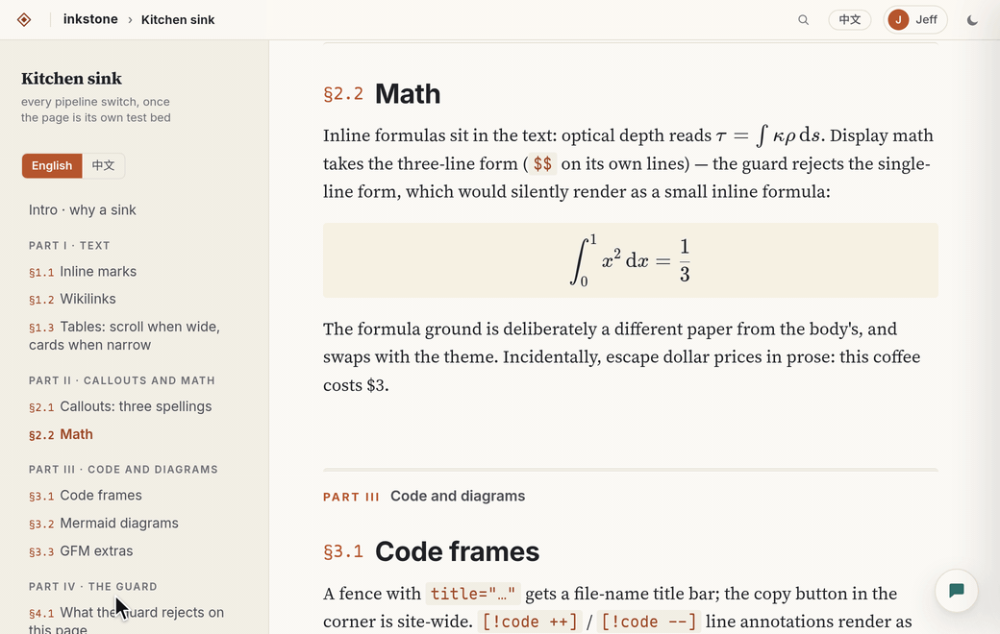
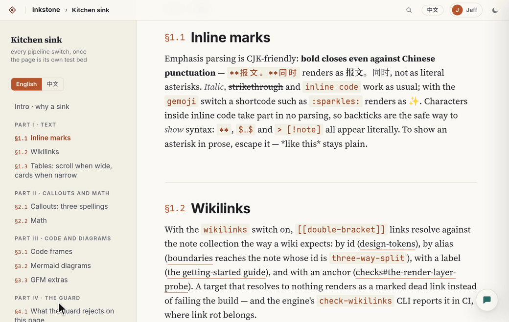
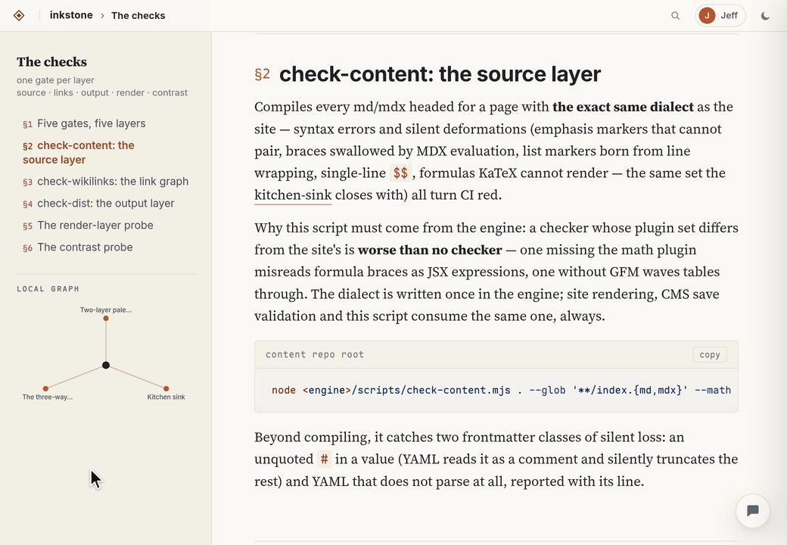
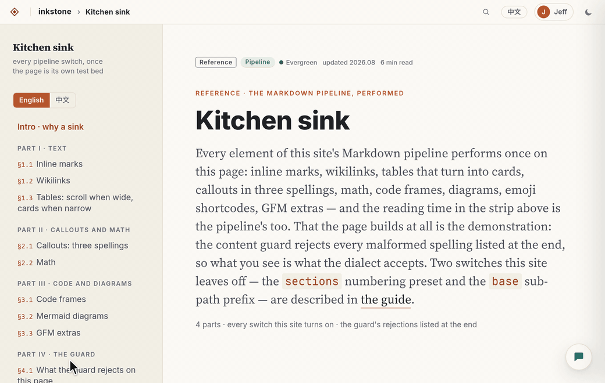
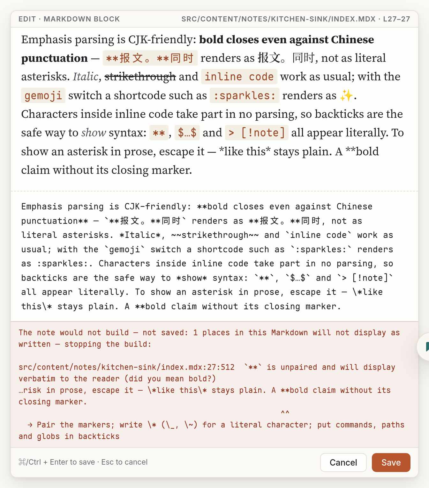
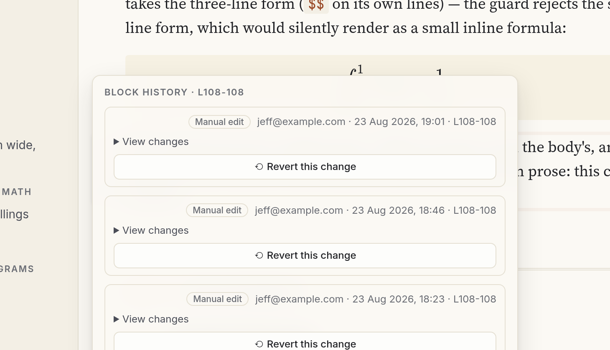

<h1 align="center">astro-inkstone</h1>

<p align="center"><b>The Astro wiki you can write in.</b><br>
Paper-and-ink typography for docs, wikis and digital gardens — paired with Inkbrush, its editing
engine, for in-place, what-you-see-is-what-you-get editing. Markdown stays the source. Git stays the history.</p>

<p align="center">
  <a href="https://github.com/ventusff/astro-inkstone/actions/workflows/ci.yml"></a>
  <a href="LICENSE"></a>
  
  <a href="https://ventusff.github.io/astro-inkstone/kitchen-sink/"></a>
</p>

<p align="center">
  <a href="https://ventusff.github.io/astro-inkstone/kitchen-sink/"><b>✎ Try editing in your browser&nbsp;→</b></a>
  &nbsp;·&nbsp;
  <a href="https://ventusff.github.io/astro-inkstone/">Demo &amp; manual</a>
  &nbsp;·&nbsp;
  <a href="https://github.com/ventusff/astro-inkbrush">The engine</a>
  &nbsp;·&nbsp;
  <a href="README.zh-CN.md">简体中文</a>
</p>

<p align="center">
  
</p>

Hover over any block, click **✎**, and write Markdown. The preview underneath is rendered by
your site's own pipeline — formulas, tables, callouts, Mermaid, `[[wikilinks]]` — so it matches
the published page exactly. Save, and the page re-renders where you stand; with `autocommit`
on, every save is a git commit. No database, no admin panel, no second authoring app: your
content files stay the single source of truth.

**Inkstone** (砚, the ink stone) is the design layer — tokens, content styles, components and a
one-line Markdown pipeline. [**Inkbrush**](https://github.com/ventusff/astro-inkbrush) (笔,
the brush) is the in-place editing engine. Use them together for a wiki you write *in*; use
Inkstone alone for a static site that simply reads beautifully.

## Why you'll like it

- ✎ **Edit in place — what you see is what you get.** Every block is editable from the page,
  including paragraphs, headings, tables, code, math, and the frontmatter in YAML. The live
  preview runs your site's own plugins, and `[[` autocompletes your note titles. Before a save
  is written, the whole file is validated and the block is checked against concurrent edits —
  then it's a commit.
- 🧪 **What-you-see-is-what-you-get editing — try it right now.** The
  [live demo](https://ventusff.github.io/astro-inkstone/kitchen-sink/) has a *✎ Try editing*
  button: the same block editor on the static site, every edit kept in your own browser, nothing
  to install.
- ✦ **AI assist, sandboxed.** Hover over a block and click ✦ to polish or tighten the text, fix
  its formulas, or give your own instruction. Claude, run through the `claude` CLI, edits a
  throwaway copy of the note; its file tools are confined to that copy, with no shell and no
  network, and its progress streams into the popover. The result must pass the same build gate
  as a manual save. A chat panel answers questions about the note, and one button translates
  the whole note into another locale.
- ⟲ **Every save is journaled — one click to revert.** Block-level revision history records who
  changed which lines, and when, with a diff and a one-click revert for every save. Whole-file
  operations (imports, translations) are audited and undone through git.
- 📥 **Obsidian inbox.** Point it at a vault folder and new notes are converted and imported
  automatically: embeds are copied next to the note, `[[wikilinks]]` are resolved by the same
  parser the pages use, and highlights are preserved.
- 🔐 **Sign-in and permissions for a team.** Dev login locally; Google OAuth or Google Workspace
  SAML for your domain, with fail-closed allowlists and an optional member registry (only members
  edit, only admins manage). Comments under every note; password-gated sharing of a single note
  as a static snapshot.
- 📜 **Typography for long reading sessions.** Note pages use a cool-paper reading column with a
  single accent; landing and facet pages use a warm-paper browse shelf; real serifs, tuned code
  blocks, and tables that reflow into cards on narrow containers. Light is the default identity
  and the dark theme is complete — every text color is measured for WCAG AA against the pixels
  it actually sits on.
- 🧰 **And the rest.** A digital garden proper: kinds, domains, tags and status, hub notes with
  numbered chapters, linked mentions, a local link graph, ⌘K search and locale mirrors. CJK-first
  typography: bold that survives Chinese punctuation, a zh UI, and Hanzi two cells wide in code.
  Broken Markdown doesn't ship: a content guard refuses the save and fails the build on silent
  deformations, and two headless Chrome probes fail CI on overflow, dead anchors and contrast
  below AA. No separate build step and no production footprint: your site consumes the
  TypeScript and CSS straight from the git submodule, and the CMS runs only in `astro dev`, so
  readers get a purely static site.

## See it in action

**✦ Ask Claude to tighten a block.** Pick an intent, let it work — its tool calls stream into the
popover while it edits a sandboxed copy — and the block comes back shorter, already validated.

<p align="center"></p>

**`[[wikilinks]]` complete as you type — and backlinks follow.** The new link appears in the
preview; after you save, the target note lists the mention with its snippet and the sidebar
graph gains the new edge.

<p align="center"></p>

**The frontmatter is a block too.** The meta strip opens the note's YAML; change a status, a
tag or a date, and the page header re-renders from the updated frontmatter.

<p align="center"></p>

**The guard says no.** An unpaired `**` would have rendered as two literal asterisks — the
save is refused, with the exact spot and the fix. The same guard fails the build in CI.

<p align="center"></p>

**⟲ Block history.** Every save on this block, who made it and when; open the diff, revert with one click.

<p align="center"></p>

**Paper and ink, on purpose.** The warm-paper landing shelf with its facets, and a note
page in the dark theme — the same tokens, measured for contrast in both.

<p align="center">
  
</p>

## Quick start

The demo doubles as the manual: a digital garden organized by taxonomy, built with the package
itself and editable in place:

```bash
git clone --recurse-submodules https://github.com/ventusff/astro-inkstone
cd astro-inkstone && npm install
cd demo && npm install
npm run wiki      # WIKI=1 astro dev → sign in (dev login), hover a paragraph, click ✎
npm run build     # the static site readers get — zero CMS bytes, checked by postbuild
```

## Add it to your site

Inkstone and the engine are vendored as git submodules and imported as source — exact commit
pinning, readable code in your editor, no publish lag:

```bash
git submodule add https://github.com/ventusff/astro-inkstone.git packages/astro-inkstone
git submodule add https://github.com/ventusff/astro-inkbrush.git packages/astro-inkbrush
```

```ts
// astro.config.ts — the whole Markdown pipeline, one line
import { defineConfig } from 'astro/config';
import { siteMarkdown } from 'astro-inkstone/markdown-preset';

export default defineConfig({
  markdown: siteMarkdown({ math: true, callouts: true, mermaid: true, codeFrame: true }),
});
```

```css
/* your global stylesheet: tokens, the reading column, then (for a wiki) the browse shelf */
@import 'astro-inkstone/styles/tokens.css';
@import 'astro-inkstone/styles/base.css';
@import 'astro-inkstone/styles/browse.css';

/* identity: override the raw pigments (day + night twin), or re-map the semantic tokens */
:root { --p-shi: #8a4baf; --p-shi-n: #b98fd6; }
```

Declare both packages in your `package.json` (pnpm `workspace:*` or npm `file:`), wrap your
rendered Markdown in `<main class="note-main"><div class="col">…</div></main>`, and you have
the reading column. Enabling the editing mode takes three more Astro config changes, all gated
on `WIKI=1`. Everything else — layout, navigation, routing, deployment — stays yours; the demo
is a complete reference implementation.

→ **[Getting started](https://ventusff.github.io/astro-inkstone/getting-started/)** (install,
styles, the pipeline switches, running the editor) ·
[Two-layer palette & themes](https://ventusff.github.io/astro-inkstone/design-tokens/) ·
[Kitchen sink](https://ventusff.github.io/astro-inkstone/kitchen-sink/) (every pipeline feature,
performed) · [The component set](https://ventusff.github.io/astro-inkstone/components/) ·
[The checks](https://ventusff.github.io/astro-inkstone/checks/) ·
[Engine manual](https://github.com/ventusff/astro-inkbrush/blob/main/docs/manual.md) (sign-in,
AI assist, inbox, sharing, deployment shape)

## Who does what

```
astro-inkbrush   the brush — editing: in-place block CMS, revision history, comments,
                 AI assist, Obsidian inbox, Markdown dialect + content guard
astro-inkstone   the stone — appearance: tokens, content styles, components,
                 pipeline preset, fonts, render checks
your site        the hand — identity: brand palette, layout chrome, routing,
                 content, deployment
```

The one grammar rule: the Markdown the editor accepts and the Markdown the page renders are
the same dialect, defined once in the engine and consumed by the preset — so "saves fine,
renders wrong" cannot happen.

<details>
<summary><b>Everything in the box</b></summary>

- **Two-tier design tokens, two contexts** — a raw palette of papers and painter's pigments
  (`--p-*`: 朱 wine, 石 burnt orange, 赭 ochre, 黛 teal, 紫 violet) feeding the *reading column*
  (`--color-*`) and the *browse shelf* (`--wb-*`). Re-skin the whole site by overriding either tier.
- **Deliberate theming** — light is the identity; dark activates only via `[data-theme='dark']`,
  so your toggle owns the decision.
- **`base.css`** — serif body, chapter rules, code frames (title bar, copy button, collapse,
  line annotations, diff / focus / word highlight), tables that reflow into cards with pure CSS
  container queries, callouts (folding included), figure groups, academic paper cards, hub cards
  and reading paths, reference lists, reduced-motion handling, a print stylesheet that turns any
  page into a clean PDF. **`browse.css`** — masthead, ruled shelves, card grid, status legend,
  instant filters, tag cloud.
- **25 Astro components** — `Hero`, `Part`, `PartHero`, `Callout`, `Steps`, `Grid`, `PaperCard`,
  `HubCard`, `Stats`, `LocalToc`, `Backlinks`, `SearchPalette` (the ⌘K overlay), `LocalGraph`,
  the faceted wiki set (`NoteCard`, `FacetNav`, `TaxonomyLine`, …) and more — presentational
  and token-driven.
- **Digital-garden machinery** — a taxonomy factory (kinds / domains / tags / status, hub notes
  with numbered chapters, locale mirrors) and a backlink-index builder with context snippets,
  both bound to your vocabulary in a three-line site module.
- **`siteMarkdown()`** — GFM, CJK-friendly emphasis, KaTeX (dual-theme), Mermaid, Obsidian-style
  callouts, `[[wikilinks]]`, reading time, auto-numbered headings with ToC extraction,
  base-prefix link rewriting, and the build-time content guard.
- **CJK-first typography** — emphasis that survives Chinese punctuation, CJK-aware reading time,
  a tuned Maple Mono CN subset where Hanzi sit exactly two cells wide; the display serif and UI
  sans are named `@fontsource` families the demo self-hosts.
- **Search** — a build-time index endpoint factory plus a tiny dependency-free client.
- **Render-layer probes** — `ui_probe` (every page at four widths: overflow, unstyled classes,
  dead anchors, missing alt text, skipped headings, duplicate ids, dangling `aria-controls`) and
  `contrast_probe` (every rendered text run, both themes, sampled from pixels). Unit tests cover
  the library.
- **No separate build step** — plain TypeScript and CSS, consumed as source by your site's Vite
  and pinned by commit like the rest of your site.
- **The engine's side** — block editing with live preview and `[[` completion, the frontmatter
  as a YAML block, block-level revision history and revert, comments, and an Obsidian inbox. AI
  assist rewrites, answers and translates in a throwaway workspace with its file tools confined
  to it. The engine also provides the shared wikilink resolver, dev / Google OAuth / SAML sign-in
  with a member registry, password-gated sharing, three check CLIs (`check-content`,
  `check-wikilinks`, `check-dist`), and a browser-local playground for demo sites. It has zero
  production footprint: the integration does nothing outside `astro dev`, and `check-dist` fails
  a build that carries any of its bytes.

</details>

## FAQ

**Why no npm package?** — Inkstone is designed to evolve in lockstep with the sites that use
it. Submodules give exact commit pinning, transparent source and instant local patching.
Vendoring a tagged commit works just as well.

**Can I use it without the CMS engine?** — Yes for tokens, styles and components. The pipeline
preset imports the engine's dialect, so keep the engine submodule for `siteMarkdown()`; your
build never ships any editing code — the CMS activates only in dev mode.

**How do I update?** — `git submodule update --remote packages/astro-inkstone`, review the
diff, commit the pointer. Your site pins exactly what it tested.

## License

[MIT](LICENSE) © Jianfei Guo. Code font: a subset of
[Maple Mono](https://github.com/subframe7536/maple-font), released under the
[SIL OFL 1.1](fonts/OFL.txt) — see [`fonts/README.md`](fonts/README.md).

<p align="center"><sub>If Inkstone makes your notes nicer to read and easier to write, a ⭐ helps others find it.</sub></p>
