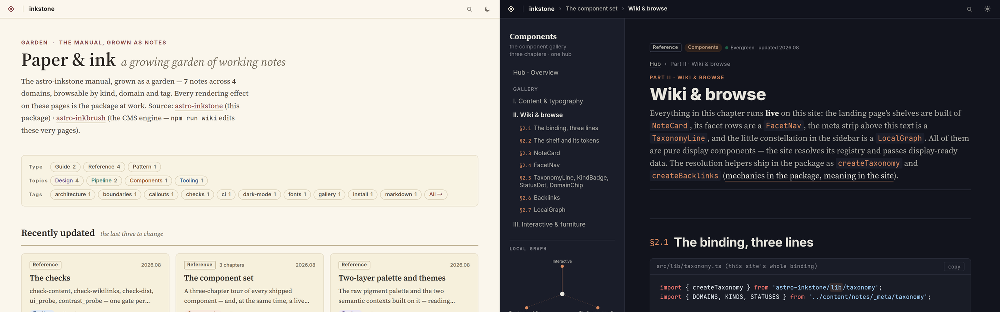

<h1 align="center">astro-inkstone</h1>

<p align="center"><b>纸墨质感的 Astro 文档 / wiki / 数字花园设计层。</b></p>

<p align="center">
  <a href="https://github.com/ventusff/astro-inkstone/actions/workflows/ci.yml"></a>
  <a href="LICENSE"></a>
  
</p>

<p align="center">
  <a href="https://ventusff.github.io/astro-inkstone/"><b>在线示范站 · 使用手册&nbsp;→</b></a>
  &nbsp;·&nbsp;
  <a href="README.md">English</a>
</p>

<p align="center">
  
</p>

**Inkstone(砚)**把文档站 / wiki 站的「观感」整体打包:设计 token、久经真实站点
打磨的内容样式、一套组件、一行接入的 Markdown 管线。属于你自己的部分——品牌色、
布局、路由——依然完全归你,其余的一切拿来即用。

它与 [**astro-inkbrush**](https://github.com/ventusff/astro-inkbrush)(笔)配套:
一个极小的、以 git 为底的 CMS,让你在页面上原地编辑同一份内容。两者合用,得到一个
「能直接往里写」的 wiki;单用 Inkstone,得到一个好看耐读的静态站。

## 特性

- 🎨 **两层设计 token、两套语境** —— 纸张与颜料盒的裸色板(`--p-*`:朱、石、
  赭、黛、紫)喂给两套语义语境:**阅读列**(`--color-*`,偏冷的纸、一种强调色,
  为一小时的阅读而设)与**导览书架**(`--wb-*`,暖纸、展示衬线、酒红字标,
  给落地页与分类页)。覆盖任意一层即可整站换肤;每一种文字色都在它**实际渲染
  的底**上实测 WCAG AA(`scripts/contrast_probe.mjs`,双主题)。
- 🌗 **克制的主题机制** —— 浅色是身份;深色完整内置,但只经
  `[data-theme='dark']` 激活,切换权完全在你的开关手里(不读
  `prefers-color-scheme`,不会被系统抢答)。
- 📖 **见过世面的内容样式表** —— 长文 wiki 的阅读列:衬线正文、章节横线、
  代码框(标题栏 / 复制 / 折叠 / 行标注 / diff·focus·词高亮)、窄容器下自动折成
  卡片的表格(纯 CSS 容器查询)、callout、图组、学术论文卡、hub 卡片与阅读路径、
  文献列表,以及一键 Ctrl+P 出干净 PDF 的打印样式。另有 `browse.css`:书架——
  版头、带横线的书架、卡片栅格、状态图例、即时过滤、标签云。
- 🧩 **23 个 Astro 组件** —— `Hero`、`Part`、`PartHero`、`Callout`、`Steps`、
  `Grid`、`PaperCard`、`HubCard`、`Stats`、`LocalToc`、`Backlinks`、
  `LocalGraph`(侧栏里本篇的一跳链接邻域)、wiki 多维导览组件(`NoteCard`、
  `FacetNav`、`TaxonomyLine`……)等。纯展示、token 驱动:自动跟随你的色板。
- 🌱 **数字花园机械** —— taxonomy 工厂(形式/方向/标签/状态、带编号章节的
  hub 笔记、语言镜像)与带上下文摘录的反链索引构建器,三行站点代码绑定到
  你自己的词表。示范园地整个跑在它们上面。
- ⚙️ **一行接入的 Markdown 管线** —— `siteMarkdown()` 装配 GFM、CJK 友好的
  强调解析、KaTeX(双主题)、Mermaid、Obsidian 风格 callout、`[[双链]]`、
  阅读时长、标题自动编号与 ToC 提取、子路径链接改写,以及一道构建期
  **内容守门**:凡「写的和渲染的不一致」的静默变形,直接让构建失败,而不是
  悄悄上线。
- 🀄 **CJK 优先的排版** —— 中文标点旁的强调照常生效(`**报文。**同时`正确加粗)、
  中西文混排的阅读时长统计、代码字体子集(Maple Mono CN)里汉字恰占两格。
- 🔍 **搜索内置** —— 构建期索引端点工厂 + 零依赖的轻量客户端。
- 🩺 **渲染层体检(两道)** —— `ui_probe` 用无头 Chrome 加载构建产物的每一页、
  四种视口宽度,横向溢出 / 无样式类 / 死锚点 / 缺 alt / 标题跳级,任一命中即
  CI 红灯;`contrast_probe` 对每段文字采样它实际渲染的底色、双主题逐一算
  WCAG 对比度,低于 AA 即红灯。
- 🪶 **零构建** —— 纯 TypeScript 与 CSS 源码,由站点自己的 Vite 直接消费,
  像站点其余部分一样按 commit 锁定。

## 快速开始

先跑起示范站(它同时就是使用手册——用本包自己写成):

```bash
git clone --recurse-submodules https://github.com/ventusff/astro-inkstone
cd astro-inkstone && npm install
cd demo && npm install && npm run dev
```

## 接入你的站点

Inkstone 不发 npm——它按设计以 **git submodule** 引入、以源码形式 import:
按 commit 精确锁定、编辑器里直接可读、改动零发布延迟:

```bash
git submodule add https://github.com/ventusff/astro-inkstone.git packages/astro-inkstone
git submodule add https://github.com/ventusff/astro-inkbrush.git packages/astro-inkbrush
```

在站点 `package.json` 里声明依赖——pnpm workspace
(`"astro-inkstone": "workspace:*"` 配 `pnpm-workspace.yaml` 的
`packages/*`)或 npm 的 `file:` 链接皆可。

```ts
// astro.config.ts —— 全站 Markdown 管线,一行接入
import { siteMarkdown } from 'astro-inkstone/markdown-preset';

export default defineConfig({
  markdown: siteMarkdown({ math: true, callouts: true, mermaid: true, codeFrame: true }),
});
```

```css
/* 站点全局样式:先 token,再阅读列,有导览页的站再加书架 */
@import 'astro-inkstone/styles/tokens.css';
@import 'astro-inkstone/styles/base.css';
@import 'astro-inkstone/styles/browse.css'; /* 落地页 / 分类页,挂在 body.wb-root 上 */

/* 身份定制:覆盖裸颜料…… */
:root { --p-shi: #8a4baf; --p-zhu: #3b4a7a; }
/* ……或把语义 token(--color-* / --wb-*)映射到你自己的色板——两条路都是正路 */
```

书架的展示衬线(`--font-display`:Source Serif 4 + 思源宋体)与界面无衬线
(Inter)由示范站经 `@fontsource` 自托管;装同样的包、导入它们的 CSS,就能看到
与示范站一模一样的版面——不装则回退到系统字体。

布局、导航、路由与部署归站点自己——示范站给出一套完整参考实现
(暖纸落地书架与分类页、带章节栏的 hub 笔记、跟随阅读位置的侧栏目录与其下的
本篇链接小图、⌘K 搜索、中文镜像路由,以及 `deploy/` 下的静态站 + 编辑机双形态
部署骨架)。

## 三者分工

```
astro-inkbrush   笔——编辑:原地块编辑 CMS、修订史、评论、AI 协作、
                 Obsidian 收件箱、Markdown 方言与内容守门
astro-inkstone   砚——观感:token、内容样式、组件、管线预设、字体、渲染体检
你的站点         手——身份:品牌色板、布局、路由、内容、部署
```

Markdown 预设建立在 inkbrush 的方言之上(编辑器接受的和页面渲染的必须是同一套
语法)——像示范站一样,两个 submodule 都挂上。token / 样式 / 组件层则不依赖引擎。

## 文档

[示范站](https://ventusff.github.io/astro-inkstone/)是一座多笔记 taxonomy
园地,笔记本身就是手册:按形式/方向/标签导览,带编号章节的 hub 笔记,互相
双链、带反链面板的笔记,以及安装接入、token 架构、全要素页与检查工具各篇。
站上的每一页都由本包构建,所以每一页同时也是一条活的测试。

## 常见问题

**为什么不发 npm?** —— 设计层与用它的站点是同步演化的。submodule 给你精确的
commit 锁定、透明的源码,以及即时的本地修补。偏好 registry 工作流的话,
按 tag 引入同样可行。

**能不带 CMS 引擎单用吗?** —— token、样式、组件:可以。`siteMarkdown()`
引用引擎的方言,想用管线预设就把引擎 submodule 一并挂上(构建产物不含任何
编辑代码——CMS 只在 dev 模式激活)。

**怎么升级?** —— `git submodule update --remote packages/astro-inkstone`,
看一眼 diff,提交指针。站点锁定的永远是它验证过的那个版本。

## 许可

[MIT](LICENSE) © Jianfei Guo。代码字体为
[Maple Mono](https://github.com/subframe7536/maple-font) 的子集,
以 [SIL OFL 1.1](fonts/OFL.txt) 发放——详见 [`fonts/README.md`](fonts/README.md)。
