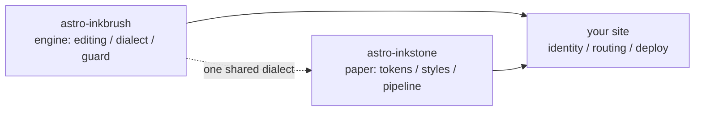

import Callout from 'astro-inkstone/components/Callout.astro';

## Inline marks

Emphasis parsing is CJK-friendly: **bold closes even against Chinese punctuation** — `**报文。**同时` renders as **报文。**同时, not as literal asterisks. *Italic*, ~~strikethrough~~ and `inline code` work as usual. Characters inside inline code take part in no parsing, so backticks are the safe way to *show* syntax: `**`, `$…$` and `> [!note]` all appear literally. To show an asterisk in prose, escape it — \*like this\* stays plain.

## Tables: scroll when wide, cards when narrow

A table of six or more columns should reflow one row per card in a narrow container, instead of squeezing each cell to two characters. This seven-column table is both the callout-variant cheat sheet and a live test of that reflow (shrink the window to phone width):

| Variant | Class | Quote-syntax keywords | Border | Ground | Default title | Typical use |
| --- | --- | --- | --- | --- | --- | --- |
| note | `callout` | `note` `info` | ochre `--color-accent3` | note `--color-math-bg` | Note | neutral side notes |
| intuition | `callout intuition` | `tip` `intuition` `hint` | indigo `--color-accent2` | note | Intuition | analogies that build intuition |
| warn | `callout warn` | `warn` `warning` `caution` `danger` | vermilion `--color-accent` | 8% vermilion mix | Warning | heads-up before risky steps |
| system | `callout system` | `important` `system` | violet `--color-accent4` | 8% violet mix | Important | system-level conventions |
| abstract | `callout abstract` | `abstract` `summary` `quote` | faint ink `--color-ink-faint` | silk `--color-bg-soft` | Abstract | chapter-opening summaries |
| bad | `callout bad` | (raw HTML only) | vermilion | 10% vermilion mix | — | recorded mistakes, rejected designs |

Default titles are English; a site swaps the whole set through `siteMarkdown`'s `calloutLabels` option, e.g. `calloutLabels: { tip: '直觉 · Intuition' }`. A title written in the quote syntax (`> [!tip] My title`) always wins.

## Callouts: three spellings

First, the Obsidian/GitHub quote syntax (available with `callouts: true`, works in plain Markdown files too):

> [!tip] Why three spellings
> The quote syntax serves plain Markdown and inbox-imported notes; the component serves MDX; raw HTML is the shared substrate beneath both — all three render the same CSS classes and are visually identical.

Second, the package component in MDX (`astro-inkstone/components/Callout.astro`, imported by path):

<Callout variant="warn" title="Component props do not render markdown">
  The title prop is a plain string — no asterisks or dollar signs in there. The content guard's renderedProps whitelist exists precisely to police this.
</Callout>

Third, raw HTML, all six variants in one pass (matching `base.css`'s `.callout` rules one-to-one):

<div class="callout">
  <div class="callout-title">Note</div>
  A neutral aside. The unmodified <code>.callout</code> class is exactly this.
</div>

<div class="callout intuition">
  <div class="callout-title">Intuition</div>
  Indigo left edge, for paragraphs about <em>how to think of it</em> rather than <em>what it is</em>.
</div>

<div class="callout warn">
  <div class="callout-title">Warning</div>
  Vermilion left edge over an 8% vermilion ground — appears before the step that can go wrong.
</div>

<div class="callout system">
  <div class="callout-title">System</div>
  Violet left edge, for system-level conventions: understand why it exists before changing it.
</div>

<div class="callout abstract">
  <div class="callout-title">Abstract</div>
  Faint-ink edge on a silk ground, for the quick overview at a chapter's head.
</div>

<div class="callout bad">
  <div class="callout-title">Bad</div>
  Records mistakes and rejected implementations. Without this variant, the fact that something is wrong gets lost silently.
</div>

## Math

Inline formulas sit in the text: optical depth reads $\tau = \int \kappa \rho \, \mathrm{d}s$. Display math takes the three-line form (`$$` on its own lines) — the guard rejects the single-line form, which would silently render as a small inline formula:

$$
\int_0^1 x^2 \, \mathrm{d}x = \frac{1}{3}
$$

The formula ground (note paper) is deliberately distinct from the body paper, and swaps with the theme. Incidentally, escape dollar prices in prose: this coffee costs \$3.

## Code frames

A fence with `title="…"` gets a file-name title bar; the copy button in the corner is site-wide. `[!code ++]` / `[!code --]` line annotations render as diff grounds:

```python title="pipeline.py"
def build_pipeline(opts):
    plugins = [remark_math]  # [!code --]
    plugins = [remark_gemoji, remark_math]  # [!code ++]
    return assemble(plugins, guard=opts.guard)
```

A frame marked `collapse` starts folded and only takes space when opened — right for long config files:

```yaml title="inkstone.example.yaml" collapse
site:
  markdown:
    numbering: sections
    math: true
    codeFrame: true
    mermaid: true
    callouts: true
  styles:
    - astro-inkstone/styles/tokens.css
    - astro-inkstone/styles/base.css
```

Dual-theme highlighting comes from shiki emitting both color sets at once; `base.css` picks one by `data-theme` in a single place — no specificity tug-of-war.

## Mermaid diagrams

A ` ```mermaid ` fence leaves only a placeholder at build time; the renderer loads dynamically only on pages that carry a diagram (pages without one pay nothing), and re-renders when the theme flips:



## GFM extras

Task lists and footnotes ride along with GFM:

- [x] tokens imported
- [x] base.css imported
- [ ] identity palette overridden

A claim worth sourcing gets a footnote.[^src]

[^src]: Footnotes render at the page foot with back-links, styled by the content layer.

## What the guard rejects on this page

That this page builds is itself the demonstration that everything above is well-formed. These spellings would fail the build on the spot (try one, then `npm run build`):

- an emphasis marker that cannot pair, like a `**` left unclosed at a line's end;
- single-line `$$x$$` (use the three-line form);
- hand-numbered headings — writing this section's heading as `## 8. What the guard…` would collide with the build-time numbering and get flagged;
- MDX evaluating your prose braces: `{0,1,2,3}` would render as just `3`, so the guard demands the escaped form \{0,1,2,3\};
- a formula KaTeX cannot render (the guard re-renders every formula in strict mode instead of letting red error text ship).
