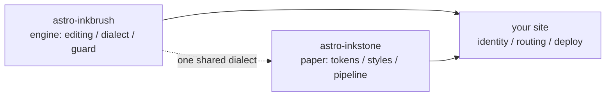

import Callout from 'astro-inkstone/components/Callout.astro';
import Hero from 'astro-inkstone/components/Hero.astro';
import Part from 'astro-inkstone/components/Part.astro';

<Hero kicker="Referenz · die Markdown-Pipeline, vorgeführt" title="Das volle Programm" tocLabel="Intro · wozu diese Seite" meta="4 Teile · jeder Schalter, den diese Site einschaltet · am Schluss die Abweisungen des Wächters">
  Jedes Element der Markdown-Pipeline dieser Site tritt auf dieser Seite genau einmal auf: Inline-Auszeichnungen, Wikilinks, Tabellen, die zu Karten werden, Callouts in drei Schreibweisen, Mathe, Code-Rahmen, Diagramme, Emoji-Shortcodes, die GFM-Extras – und auch die Lesezeit in der Leiste darüber kommt aus der Pipeline. Dass die Seite überhaupt baut, ist die eigentliche Vorführung: Der Inhaltswächter weist jede der am Schluss gelisteten missgebildeten Schreibweisen ab, du siehst also genau das, was der Dialekt akzeptiert. Zwei Schalter, die diese Site auslässt – das Nummerierungspreset `sections` und das Unterpfad-Präfix `base` –, beschreibt [[getting-started|der Leitfaden]].
</Hero>

<Part title="Text" />

## Inline-Auszeichnungen

Die Hervorhebungs-Erkennung ist CJK-freundlich: **Fett schließt auch gegen chinesische Interpunktion** – `**报文。**同时` rendert als **报文。**同时, nicht als wörtliche Sternchen. *Kursiv*, ~~durchgestrichen~~ und `Inline-Code` funktionieren wie gewohnt; mit dem Schalter `gemoji` rendert ein Shortcode wie `:sparkles:` als :sparkles:. Zeichen in Inline-Code nehmen an keinerlei Parsing teil, Backticks sind darum der sichere Weg, Syntax zu *zeigen*: `**`, `$…$` und `> [!note]` erscheinen alle wörtlich. Ein Sternchen im Fließtext bekommt einen Backslash – \*so\* bleibt es einfacher Text.

## Wikilinks

Mit eingeschaltetem `wikilinks`-Schalter lösen sich `[[Doppelklammer]]`-Links gegen die Notizsammlung auf, wie man es von einem Wiki erwartet: per id ([[design-tokens]] – von einer deutschen Spiegelseite aus landet der Link zuerst auf dem Spiegel derselben Sprache und erst dann, wenn es keinen gibt, auf dem englischen Original), per Alias ([[boundaries]] erreicht die Notiz mit der id `three-way-split`) und mit Beschriftung ([[getting-started|der Einstiegs-Leitfaden]]). Ein Ziel, das sich zu nichts auflöst, rendert als markierter toter Link, statt den Build scheitern zu lassen – das CLI `check-wikilinks` der Engine meldet ihn in der CI, wo Linkfäule hingehört.

## Tabellen: scrollen, wenn breit; Karten, wenn schmal

Eine Tabelle mit sechs oder mehr Spalten soll in einem schmalen Container zeilenweise zu Karten umbrechen, statt jede Zelle auf zwei Zeichen zu quetschen. Diese siebenspaltige Tabelle ist zugleich der Spickzettel der Callout-Varianten und ein Live-Test genau dieses Umbruchs (zieh das Fenster auf Handybreite zusammen):

| Variante | Klasse | Schlüsselwörter der Quote-Syntax | Rand | Grund | Standardtitel | Typischer Einsatz |
| --- | --- | --- | --- | --- | --- | --- |
| note | `callout` | `note` `info` | 赭 Ocker `--color-accent3` | Mathegrund `--color-math-bg` | Note | neutrale Randbemerkungen |
| intuition | `callout intuition` | `tip` `intuition` `hint` | 黛 Petrol `--color-accent2` | Mathegrund | Intuition | Analogien, die Anschauung aufbauen |
| warn | `callout warn` | `warn` `warning` `caution` `danger` | 石 Brandorange `--color-accent` | 8 % Akzent-Mischung | Warning | Warnung vor riskanten Schritten |
| system | `callout system` | `important` `system` | 紫 Violett `--color-accent4` | 8 % Violett-Mischung | Important | Konventionen auf Systemebene |
| abstract | `callout abstract` | `abstract` `summary` `quote` | blasse Tusche `--color-ink-faint` | weiche Oberfläche `--color-bg-soft` | Abstract | Überblicke am Kapitelanfang |
| bad | `callout bad` | (nur rohes HTML) | 石 Brandorange | 10 % Akzent-Mischung | — | festgehaltene Fehler, verworfene Entwürfe |

Die Standardtitel sind Englisch; eine Site tauscht den ganzen Satz über die Option `calloutLabels` von `siteMarkdown`, z. B. `calloutLabels: { warn: 'Achtung' }`. Ein Titel in der Quote-Syntax (`> [!tip] Mein Titel`) gewinnt immer.

<Part title="Callouts und Mathe" />

## Callouts: drei Schreibweisen

Erstens die Obsidian-/GitHub-Quote-Syntax (verfügbar mit `callouts: true`, funktioniert auch in reinen Markdown-Dateien):

> [!tip] Wozu drei Schreibweisen
> Die Quote-Syntax bedient reines Markdown und über die Inbox importierte Notizen; die Komponente bedient MDX; rohes HTML ist das gemeinsame Substrat unter beiden – alle drei rendern dasselbe Markup `<aside class="callout …">`.

Obsidians Faltmarke wird respektiert – `> [!note]-` rendert eingeklappt, `> [!note]+` offen:

> [!note]- Eine eingeklappte Notiz
> Klick auf den Titel, um sie zu öffnen. Eingeklappte Callouts rendern als `<details>` mit dem Titel als `<summary>`.

Zweitens die Paketkomponente in MDX (`astro-inkstone/components/Callout.astro`, per Pfad importiert). Ohne `title` zeigt sie das Standardlabel der Variante, dasselbe wie in der Quote-Syntax:

<Callout variant="warn" title="Komponenten-Props rendern kein Markdown">
  Die title-Prop ist ein schlichter String – keine Sternchen, keine Dollarzeichen darin. Genau um das durchzusetzen, gibt es die renderedProps-Whitelist des Inhaltswächters.
</Callout>

Drittens rohes HTML, alle sechs Varianten in einem Durchgang (eins zu eins die `.callout`-Regeln aus `base.css`):

<div class="callout">
  <div class="callout-title">Hinweis</div>
  Eine neutrale Randbemerkung. Die unmodifizierte Klasse <code>.callout</code> ist genau das.
</div>

<div class="callout intuition">
  <div class="callout-title">Intuition</div>
  Petrolfarbene linke Kante, für Absätze darüber, <em>wie man es sich vorstellt</em>, statt darüber, <em>was es ist</em>.
</div>

<div class="callout warn">
  <div class="callout-title">Warnung</div>
  Brandorange linke Kante über einem Grund aus 8 % Akzent – steht vor dem Schritt, der schiefgehen kann.
</div>

<div class="callout system">
  <div class="callout-title">System</div>
  Violette linke Kante, für Konventionen auf Systemebene: erst verstehen, warum es sie gibt, dann ändern.
</div>

<div class="callout abstract">
  <div class="callout-title">Zusammenfassung</div>
  Kante in blasser Tusche auf der weichen Oberfläche, für den schnellen Überblick am Kopf eines Kapitels.
</div>

<div class="callout bad">
  <div class="callout-title">Verworfen</div>
  Hält Fehler und verworfene Implementierungen fest. Ohne diese Variante geht die Tatsache, dass etwas falsch ist, stillschweigend verloren.
</div>

## Mathe

Inline-Formeln sitzen im Text: Die optische Tiefe liest sich $\tau = \int \kappa \rho \, \mathrm{d}s$. Display-Mathe nimmt die dreizeilige Form (`$$` auf eigenen Zeilen) – die einzeilige weist der Wächter ab, denn sie würde stillschweigend als kleine Inline-Formel rendern:

$$
\int_0^1 x^2 \, \mathrm{d}x = \frac{1}{3}
$$

Der Formelgrund ist mit Absicht ein anderes Papier als das des Fließtexts und wechselt mit dem Theme. Übrigens: Dollarpreise im Fließtext werden escapet – dieser Kaffee kostet \$3.

<Part title="Code und Diagramme" />

## Code-Rahmen

Ein Fence mit `title="…"` bekommt eine Titelleiste mit Dateinamen; der Kopierknopf in der Ecke gilt sitewide. `[!code ++]`- / `[!code --]`-Zeilenannotationen rendern als Diff-Gründe:

```python title="pipeline.py"
def build_pipeline(opts):
    plugins = [remark_math]  # [!code --]
    plugins = [remark_gemoji, remark_math]  # [!code ++]
    return assemble(plugins, guard=opts.guard)
```

Ein Rahmen mit `collapse` startet eingeklappt und nimmt erst Platz ein, wenn man ihn öffnet – richtig für lange Konfigurationsdateien:

```yaml title="inkstone.example.yaml" collapse
site:
  markdown:
    numbering: chapters
    math: true
    codeFrame: true
    mermaid: true
    callouts: true
    wikilinks: true
  styles:
    - astro-inkstone/styles/tokens.css
    - astro-inkstone/styles/base.css
```

Das Highlighting für beide Themes kommt daher, dass shiki beide Farbsätze auf einmal ausgibt; `base.css` wählt per `data-theme` an einer einzigen Stelle – kein Spezifitäts-Tauziehen.

## Mermaid-Diagramme

Ein ` ```mermaid `-Fence hinterlässt beim Build nur einen Platzhalter; der Renderer lädt dynamisch und nur auf Seiten, die ein Diagramm tragen (Seiten ohne zahlen nichts), und rendert neu, wenn das Theme umschlägt:



## GFM-Extras

Task-Listen und Fußnoten reisen mit GFM mit:

- [x] Tokens importiert
- [x] base.css importiert
- [ ] Identitätspalette überschrieben

Eine Behauptung, die eine Quelle verdient, bekommt eine Fußnote.[^src]

[^src]: Fußnoten rendern am Fuß der Seite mit Rücksprunglinks, gestylt von der Inhaltsschicht.

<Part title="Der Wächter" />

## Was der Wächter auf dieser Seite abweist

Dass diese Seite baut, ist selbst der Beleg, dass alles oben wohlgeformt ist. Diese Schreibweisen würden den Build auf der Stelle scheitern lassen (probier eine aus, dann `npm run build`):

- eine Hervorhebungsmarke, die kein Paar findet, etwa ein am Zeilenende offen gelassenes `**`;
- einzeiliges `$$x$$` (nimm die dreizeilige Form);
- handnummerierte Überschriften – die Überschrift dieses Abschnitts als `## 9. Was der Wächter …` zu schreiben, würde mit der Nummerierung zur Build-Zeit kollidieren und wird angestrichen;
- MDX, das deine Fließtext-Klammern auswertet: `{0,1,2,3}` würde als bloßes `3` rendern, der Wächter verlangt darum die escapte Form \{0,1,2,3\};
- eine Formel, die KaTeX nicht rendern kann (der Wächter rendert jede Formel im Strict-Modus nach, statt roten Fehlertext ausliefern zu lassen).
