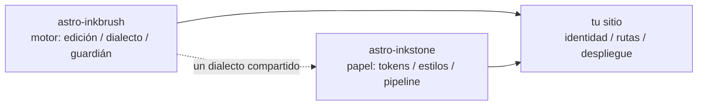

import Callout from 'astro-inkstone/components/Callout.astro';
import Hero from 'astro-inkstone/components/Hero.astro';
import Part from 'astro-inkstone/components/Part.astro';

<Hero kicker="Referencia · el pipeline de Markdown, en escena" title="El muestrario" tocLabel="Introducción · por qué un muestrario" meta="4 partes · cada interruptor que este sitio enciende · la lista de rechazos del guardián al final">
  Cada elemento del pipeline de Markdown de este sitio actúa una vez en esta página: marcas inline, wikilinks, tablas que se convierten en tarjetas, callouts en tres escrituras, matemáticas, marcos de código, diagramas, atajos de emoji, extras de GFM — y el tiempo de lectura de la franja de arriba también sale del pipeline. Que la página compile es en sí la demostración: el guardián de contenido rechaza todas las escrituras malformadas listadas al final, así que lo que ves es lo que el dialecto acepta. Dos interruptores que este sitio deja apagados — el preset de numeración `sections` y el prefijo de subruta `base` — están descritos en [[getting-started|la guía de primeros pasos]].
</Hero>

<Part title="Texto" />

## Marcas inline

El análisis del énfasis es amigable con el CJK: **la negrita cierra incluso pegada a puntuación china** — `**报文。**同时` se renderiza como **报文。**同时, y no como asteriscos literales. La *cursiva*, el ~~tachado~~ y el `código inline` funcionan como siempre; con el interruptor `gemoji`, un atajo como `:sparkles:` se renderiza como :sparkles:. Los caracteres dentro del código inline no participan en ningún análisis, así que las comillas invertidas son la manera segura de *mostrar* sintaxis: `**`, `$…$` y `> [!note]` aparecen tal cual. Para mostrar un asterisco en la prosa, escápalo — \*así\* se queda plano.

## Wikilinks

Con el interruptor `wikilinks` encendido, los enlaces `[[de doble corchete]]` se resuelven contra la colección de notas como una wiki espera: por id ([[design-tokens]] — desde una página del espejo español, el enlace prefiere el espejo del mismo idioma y solo cae en el original inglés si la nota no existe aquí), por alias ([[boundaries]] llega a la nota cuyo id es `three-way-split`) y con rótulo ([[getting-started|la guía de primeros pasos]]). Un destino que no resuelve a nada se renderiza como enlace muerto marcado en lugar de tumbar el build — y la CLI `check-wikilinks` del motor lo reporta en CI, que es donde la podredumbre de enlaces pertenece.

## Tablas: scroll cuando son anchas, tarjetas cuando el hueco es estrecho

Una tabla de seis columnas o más debería refluir a una tarjeta por fila en un contenedor estrecho, en lugar de estrujar cada celda a dos caracteres. Esta tabla de siete columnas es a la vez la chuleta de variantes de callout y una prueba en vivo de ese reflujo (encoge la ventana al ancho de un teléfono):

| Variante | Clase | Palabras clave en la sintaxis de cita | Borde | Fondo | Título por defecto | Uso típico |
| --- | --- | --- | --- | --- | --- | --- |
| note | `callout` | `note` `info` | 赭 ocre `--color-accent3` | fondo de fórmulas `--color-math-bg` | Note | apuntes laterales neutros |
| intuition | `callout intuition` | `tip` `intuition` `hint` | 黛 verde azulado `--color-accent2` | fondo de fórmulas | Intuition | analogías que construyen intuición |
| warn | `callout warn` | `warn` `warning` `caution` `danger` | 石 naranja tostado `--color-accent` | mezcla de acento al 8% | Warning | aviso antes de pasos arriesgados |
| system | `callout system` | `important` `system` | 紫 violeta `--color-accent4` | mezcla de violeta al 8% | Important | convenciones a nivel de sistema |
| abstract | `callout abstract` | `abstract` `summary` `quote` | tinta tenue `--color-ink-faint` | superficie suave `--color-bg-soft` | Abstract | resúmenes de apertura de capítulo |
| bad | `callout bad` | (solo HTML crudo) | 石 naranja tostado | mezcla de acento al 10% | — | errores registrados, diseños descartados |

Los títulos por defecto están en inglés; un sitio cambia el juego entero con la opción `calloutLabels` de `siteMarkdown`, p. ej. `calloutLabels: { tip: 'Intuición · Intuition' }`. Un título escrito en la sintaxis de cita (`> [!tip] Mi título`) siempre gana.

<Part title="Callouts y matemáticas" />

## Callouts: tres escrituras

Primero, la sintaxis de cita de Obsidian/GitHub (disponible con `callouts: true`; funciona también en archivos de Markdown plano):

> [!tip] Por qué tres escrituras
> La sintaxis de cita sirve al Markdown plano y a las notas importadas desde la bandeja de entrada; el componente sirve al MDX; el HTML crudo es el sustrato compartido bajo ambos — las tres renderizan el mismo marcado `<aside class="callout …">`.

El marcador de plegado de Obsidian se respeta — `> [!note]-` se renderiza plegado, `> [!note]+` abierto:

> [!note]- Una nota plegada
> Haz clic en el título para abrirla. Los callouts plegados se renderizan como `<details>` con el título como su `<summary>`.

Segundo, el componente del paquete en MDX (`astro-inkstone/components/Callout.astro`, importado por ruta). Sin `title` muestra el rótulo por defecto de la variante, el mismo que usa la sintaxis de cita:

<Callout variant="warn" title="Las props de los componentes no renderizan markdown">
  La prop title es una cadena plana — nada de asteriscos ni signos de dólar ahí dentro. La lista blanca renderedProps del guardián de contenido existe precisamente para vigilar esto.
</Callout>

Tercero, HTML crudo, las seis variantes de una pasada (en correspondencia una a una con las reglas `.callout` de `base.css`):

<div class="callout">
  <div class="callout-title">Nota</div>
  Un apunte lateral neutro. La clase <code>.callout</code> sin modificar es exactamente esto.
</div>

<div class="callout intuition">
  <div class="callout-title">Intuición</div>
  Filete izquierdo verde azulado, para párrafos sobre <em>cómo pensarlo</em> más que sobre <em>qué es</em>.
</div>

<div class="callout warn">
  <div class="callout-title">Aviso</div>
  Filete izquierdo naranja tostado sobre un fondo de acento al 8% — aparece antes del paso que puede salir mal.
</div>

<div class="callout system">
  <div class="callout-title">Sistema</div>
  Filete izquierdo violeta, para convenciones a nivel de sistema: entiende por qué existe antes de cambiarla.
</div>

<div class="callout abstract">
  <div class="callout-title">Resumen</div>
  Filete de tinta tenue sobre la superficie suave, para el repaso rápido a la cabeza de un capítulo.
</div>

<div class="callout bad">
  <div class="callout-title">Malo</div>
  Registra errores e implementaciones descartadas. Sin esta variante, el hecho de que algo está mal se pierde en silencio.
</div>

## Matemáticas

Las fórmulas inline se asientan en el texto: la profundidad óptica se lee $\tau = \int \kappa \rho \, \mathrm{d}s$. Las fórmulas en display toman la forma de tres líneas (`$$` en líneas propias) — el guardián rechaza la forma de una sola línea, que se renderizaría en silencio como una fórmula inline pequeña:

$$
\int_0^1 x^2 \, \mathrm{d}x = \frac{1}{3}
$$

El fondo de las fórmulas es a propósito un papel distinto del cuerpo, y cambia con el tema. Y de paso: escapa los precios en dólares en la prosa — este café cuesta \$3.

<Part title="Código y diagramas" />

## Marcos de código

Un bloque con `title="…"` recibe una barra de título con el nombre del archivo; el botón de copiar de la esquina es de todo el sitio. Las anotaciones de línea `[!code ++]` / `[!code --]` se renderizan como fondos de diff:

```python title="pipeline.py"
def build_pipeline(opts):
    plugins = [remark_math]  # [!code --]
    plugins = [remark_gemoji, remark_math]  # [!code ++]
    return assemble(plugins, guard=opts.guard)
```

Un marco con la marca `collapse` empieza plegado y solo ocupa espacio al abrirse — ideal para archivos de configuración largos:

```yaml title="inkstone.example.yaml" collapse
site:
  markdown:
    numbering: chapters
    math: true
    codeFrame: true
    mermaid: true
    callouts: true
    wikilinks: true
  styles:
    - astro-inkstone/styles/tokens.css
    - astro-inkstone/styles/base.css
```

El resaltado de doble tema viene de shiki, que emite ambos juegos de color a la vez; `base.css` elige uno por `data-theme` en un único lugar — sin tira y afloja de especificidad.

## Diagramas mermaid

Un bloque ` ```mermaid ` deja solo un marcador de posición en tiempo de build; el renderizador se carga dinámicamente solo en las páginas que llevan un diagrama (las que no llevan ninguno no pagan nada) y vuelve a renderizar cuando el tema cambia:



## Extras de GFM

Las listas de tareas y las notas al pie llegan con GFM:

- [x] tokens importados
- [x] base.css importado
- [ ] paleta de identidad sobrescrita

Una afirmación que merece fuente lleva su nota al pie.[^src]

[^src]: Las notas al pie se renderizan al pie de la página con enlaces de vuelta, estilizadas por la capa de contenido.

<Part title="El guardián" />

## Lo que el guardián rechaza en esta página

Que esta página compile es en sí la demostración de que todo lo anterior está bien formado. Estas escrituras harían fallar el build en el acto (prueba una y luego `npm run build`):

- un marcador de énfasis sin pareja posible, como un `**` abierto al final de una línea;
- `$$x$$` en una sola línea (usa la forma de tres líneas);
- títulos numerados a mano — escribir el título de esta sección como `## 9. Lo que el guardián…` chocaría con la numeración de build y quedaría señalado;
- MDX evaluando las llaves de tu prosa: `{0,1,2,3}` se renderizaría como un simple `3`, así que el guardián exige la forma escapada \{0,1,2,3\};
- una fórmula que KaTeX no puede renderizar (el guardián vuelve a renderizar cada fórmula en modo estricto en lugar de dejar que el texto rojo de error llegue a producción).
