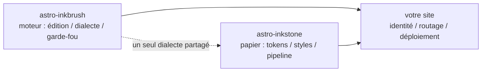

import Callout from 'astro-inkstone/components/Callout.astro';
import Hero from 'astro-inkstone/components/Hero.astro';
import Part from 'astro-inkstone/components/Part.astro';

<Hero kicker="Référence · la chaîne Markdown en représentation" title="La démonstration intégrale" tocLabel="Intro · pourquoi cette page" meta="4 parties · chaque option que ce site active · la liste des refus du garde-fou en fin de page">
  Chaque élément de la chaîne Markdown de ce site se produit une fois sur cette page : marques en ligne, wikiliens, tableaux qui se replient en cartes, callouts en trois écritures, mathématiques, cadres de code, diagrammes, émojis en raccourci, extras GFM — et le temps de lecture du bandeau ci-dessus sort lui aussi du pipeline. Que la page se construise est en soi la démonstration : le garde-fou du contenu rejette chacune des écritures malformées listées en fin de page, et ce que vous voyez est donc ce que le dialecte accepte. Deux options que ce site laisse éteintes — le préréglage de numérotation `sections` et le préfixe de sous-chemin `base` — sont décrites dans [[getting-started|le guide]].
</Hero>

<Part title="Texte" />

## Marques en ligne

L’analyse de l’emphase est compatible CJK : **le gras se referme même contre une ponctuation chinoise** — `**报文。**同时` se rend **报文。**同时, et non comme des astérisques littéraux. L’*italique*, le ~~barré~~ et le `code en ligne` fonctionnent comme d’habitude ; avec l’option `gemoji`, un raccourci tel que `:sparkles:` se rend :sparkles:. Les caractères à l’intérieur du code en ligne ne participent à aucune analyse : les accents graves sont donc la voie sûre pour *montrer* de la syntaxe — `**`, `$…$` et `> [!note]` s’affichent tous littéralement. Pour montrer un astérisque dans la prose, échappez-le — \*comme ceci\* reste tel quel.

## Wikiliens

Avec l’option `wikilinks` activée, les liens `[[à doubles crochets]]` se résolvent contre la collection de notes comme un wiki s’y attend : par id ([[design-tokens]]), par alias ([[boundaries]] atteint la note dont l’id est `three-way-split`), avec un libellé ([[getting-started|le guide Premiers pas]]). Une cible qui ne se résout à rien se rend comme un lien mort marqué au lieu de faire échouer le build — et la CLI `check-wikilinks` du moteur la signale en CI, là où la pourriture des liens doit se voir.

## Tableaux : défilement en large, cartes en étroit

Un tableau de six colonnes ou plus doit se replier, une ligne par carte, dans un conteneur étroit, au lieu d’écraser chaque cellule sur deux caractères. Ce tableau de sept colonnes est à la fois l’aide-mémoire des variantes de callout et un test en direct de ce repli (réduisez la fenêtre à une largeur de téléphone) :

| Variante | Classe | Mots-clés de la syntaxe de citation | Bordure | Fond | Titre par défaut | Usage typique |
| --- | --- | --- | --- | --- | --- | --- |
| note | `callout` | `note` `info` | 赭 ocre `--color-accent3` | fond des formules `--color-math-bg` | Note | apartés neutres |
| intuition | `callout intuition` | `tip` `intuition` `hint` | 黛 bleu-vert `--color-accent2` | fond des formules | Intuition | analogies qui bâtissent l’intuition |
| warn | `callout warn` | `warn` `warning` `caution` `danger` | 石 orange brûlé `--color-accent` | mélange à 8 % d’accent | Warning | mise en garde avant l’étape risquée |
| system | `callout system` | `important` `system` | 紫 violet `--color-accent4` | mélange violet à 8 % | Important | conventions de niveau système |
| abstract | `callout abstract` | `abstract` `summary` `quote` | encre estompée `--color-ink-faint` | surface feutrée `--color-bg-soft` | Abstract | résumés d’ouverture de chapitre |
| bad | `callout bad` | (HTML brut seulement) | 石 orange brûlé | mélange à 10 % d’accent | — | erreurs consignées, conceptions écartées |

Les titres par défaut sont en anglais ; un site remplace le jeu entier par l’option `calloutLabels` de `siteMarkdown`, par exemple `calloutLabels: { tip: 'Intuition', warn: 'Avertissement' }`. Un titre écrit dans la syntaxe de citation (`> [!tip] Mon titre`) a toujours le dernier mot.

<Part title="Callouts et mathématiques" />

## Callouts : trois écritures

D’abord, la syntaxe de citation à la Obsidian/GitHub (disponible avec `callouts: true`, y compris dans les fichiers Markdown purs) :

> [!tip] Pourquoi trois écritures
> La syntaxe de citation sert le Markdown pur et les notes importées de la boîte de réception ; le composant sert MDX ; le HTML brut est le substrat commun sous les deux — les trois rendent le même balisage `<aside class="callout …">`.

Le marqueur de repli d’Obsidian est honoré — `> [!note]-` se rend replié, `> [!note]+` déplié :

> [!note]- Une note repliée
> Cliquez le titre pour l’ouvrir. Les callouts repliés se rendent en `<details>`, leur titre servant de `<summary>`.

Deuxième écriture, le composant du paquet en MDX (`astro-inkstone/components/Callout.astro`, importé par chemin). Sans `title`, il affiche le libellé par défaut de sa variante — le même que celui de la syntaxe de citation :

<Callout variant="warn" title="Les props de composant ne rendent pas de Markdown">
  La prop title est une chaîne brute — pas d’astérisques ni de signes dollar là-dedans. La liste blanche renderedProps du garde-fou du contenu existe précisément pour surveiller cela.
</Callout>

Troisième écriture, le HTML brut, les six variantes d’un seul tenant (en correspondance une à une avec les règles `.callout` de `base.css`) :

<div class="callout">
  <div class="callout-title">Note</div>
  Un aparté neutre. La classe <code>.callout</code> sans modificateur, c’est exactement cela.
</div>

<div class="callout intuition">
  <div class="callout-title">Intuition</div>
  Bord gauche bleu-vert, pour les paragraphes qui disent <em>comment y penser</em> plutôt que <em>ce que c’est</em>.
</div>

<div class="callout warn">
  <div class="callout-title">Avertissement</div>
  Bord gauche orange brûlé sur un fond mêlé à 8 % d’accent — il précède l’étape qui peut mal tourner.
</div>

<div class="callout system">
  <div class="callout-title">Système</div>
  Bord gauche violet, pour les conventions de niveau système : comprenez pourquoi elles existent avant d’y toucher.
</div>

<div class="callout abstract">
  <div class="callout-title">Résumé</div>
  Bord d’encre estompée sur la surface feutrée, pour le survol rapide en tête de chapitre.
</div>

<div class="callout bad">
  <div class="callout-title">Contre-exemple</div>
  Consigne les erreurs et les implémentations écartées. Sans cette variante, le fait qu’une chose soit fausse se perd en silence.
</div>

## Mathématiques

Les formules en ligne se glissent dans le texte : la profondeur optique s’écrit $\tau = \int \kappa \rho \, \mathrm{d}s$. Les formules hors texte prennent la forme à trois lignes (`$$` seuls sur leur ligne) — le garde-fou rejette la forme sur une seule ligne, qui se rendrait silencieusement comme une petite formule en ligne :

$$
\int_0^1 x^2 \, \mathrm{d}x = \frac{1}{3}
$$

Le fond des formules est délibérément un autre papier que celui du corps, et il change avec le thème. Au passage, échappez les prix en dollars dans la prose : ce café coûte \$3.

<Part title="Code et diagrammes" />

## Cadres de code

Une clôture avec `title="…"` reçoit une barre de titre au nom du fichier ; le bouton de copie dans le coin vaut pour tout le site. Les annotations de ligne `[!code ++]` / `[!code --]` se rendent en fonds de diff :

```python title="pipeline.py"
def build_pipeline(opts):
    plugins = [remark_math]  # [!code --]
    plugins = [remark_gemoji, remark_math]  # [!code ++]
    return assemble(plugins, guard=opts.guard)
```

Un cadre marqué `collapse` démarre replié et ne prend de place qu’une fois ouvert — parfait pour les longs fichiers de configuration :

```yaml title="inkstone.example.yaml" collapse
site:
  markdown:
    numbering: chapters
    math: true
    codeFrame: true
    mermaid: true
    callouts: true
    wikilinks: true
  styles:
    - astro-inkstone/styles/tokens.css
    - astro-inkstone/styles/base.css
```

La coloration bi-thème vient de shiki, qui émet les deux jeux de couleurs d’un coup ; `base.css` en choisit un par `data-theme`, en un seul endroit — aucun bras de fer de spécificité.

## Diagrammes mermaid

Une clôture ` ```mermaid ` ne laisse qu’un emplacement réservé au moment du build ; le moteur de rendu ne se charge dynamiquement que sur les pages qui portent un diagramme (les autres ne paient rien), et il re-rend quand le thème bascule :



## Les extras GFM

Les listes de tâches et les notes de bas de page arrivent avec GFM :

- [x] tokens importés
- [x] base.css importé
- [ ] palette d’identité surchargée

Une affirmation qui mérite sa source reçoit une note de bas de page.[^src]

[^src]: Les notes de bas de page se rendent au pied de la page, avec liens de retour, stylées par la couche de contenu.

<Part title="Le garde-fou" />

## Ce que le garde-fou rejette sur cette page

Que cette page se construise démontre en soi que tout ce qui précède est bien formé. Les écritures suivantes feraient échouer le build sur-le-champ (essayez-en une, puis `npm run build`) :

- une marque d’emphase qui ne peut pas s’apparier, comme un `**` laissé ouvert en fin de ligne ;
- le `$$x$$` sur une seule ligne (employez la forme à trois lignes) ;
- les titres numérotés à la main — écrire le titre de cette section `## 9. Ce que le garde-fou…` entrerait en collision avec la numérotation faite au build, et serait signalé ;
- MDX évaluant les accolades de votre prose : `{0,1,2,3}` se rendrait comme un simple 3, le garde-fou exige donc la forme échappée \{0,1,2,3\} ;
- une formule que KaTeX ne sait pas rendre (le garde-fou re-rend chaque formule en mode strict au lieu de laisser partir du texte d’erreur rouge).
