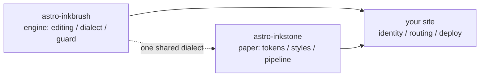

import Callout from 'astro-inkstone/components/Callout.astro';
import Hero from 'astro-inkstone/components/Hero.astro';
import Part from 'astro-inkstone/components/Part.astro';

<Hero kicker="संदर्भ · Markdown पाइपलाइन, मंच पर" title="पूरा पिटारा" tocLabel="भूमिका · पिटारा क्यों" meta="4 भाग · इस साइट के सभी चालू स्विच · अंत में रक्षक की अस्वीकृतियों की सूची">
  इस साइट की Markdown पाइपलाइन का हर तत्व इस पन्ने पर एक-एक बार प्रदर्शन करता है: इनलाइन चिह्न, विकीलिंक, कार्ड बन जाने वाली टेबलें, तीन वर्तनियों में callout, गणित, कोड फ़्रेम, आरेख, इमोजी शॉर्टकोड, GFM के अतिरिक्त — और ऊपर की पट्टी में पढ़ने का समय भी पाइपलाइन का ही है। यह पन्ना बनता है, यही प्रदर्शन है: अंत में सूचीबद्ध हर बिगड़ी वर्तनी को सामग्री-रक्षक अस्वीकार कर देता है, इसलिए जो आप देख रहे हैं वही बोली स्वीकारती है। दो स्विच जिन्हें यह साइट बंद रखती है — `sections` क्रमांकन-प्रीसेट और `base` सब-पाथ उपसर्ग — [[getting-started|गाइड]] में बताए गए हैं।
</Hero>

<Part title="पाठ" />

## इनलाइन चिह्न

Emphasis-पार्सिंग CJK-फ़्रेंडली है: **चीनी विराम-चिह्न से सटा bold भी ठीक बंद होता है** — `**报文。**同时` दो नंगे तारांकनों की तरह नहीं, **报文。**同时 की तरह रेंडर होता है। *इटैलिक*, ~~स्ट्राइकथ्रू~~ और `inline code` हमेशा की तरह चलते हैं; `gemoji` स्विच के साथ `:sparkles:` जैसा शॉर्टकोड :sparkles: बन जाता है। inline code के भीतर के अक्षर किसी पार्सिंग में हिस्सा नहीं लेते, इसलिए सिंटैक्स *दिखाने* का सुरक्षित रास्ता backtick ही है: `**`, `$…$` और `> [!note]` — तीनों ज्यों के त्यों दिखते हैं। गद्य में तारांकन दिखाना हो तो escape कीजिए — \*इस तरह\* सादा रह जाता है।

## विकीलिंक

`wikilinks` स्विच चालू हो, तो `[[दोहरे-कोष्ठक]]` वाले लिंक विकी की रीति से नोट-संग्रह के विरुद्ध हल होते हैं: id से ([[design-tokens]]), उपनाम से ([[boundaries]] उस नोट तक पहुँचता है जिसकी id `three-way-split` है), लेबल के साथ ([[getting-started|शुरुआती गाइड]])। जो लक्ष्य किसी नोट पर न बैठे, वह बिल्ड बिगाड़ने की जगह चिह्नित मृत-लिंक बनकर रेंडर होता है — और इंजन की `check-wikilinks` CLI उसे CI में रिपोर्ट करती है, जहाँ लिंक-सड़न की असली जगह है।

## टेबल: चौड़ी हो तो स्क्रॉल, सँकरी हो तो कार्ड

छह या ज़्यादा कॉलमों वाली टेबल को सँकरे कंटेनर में हर पंक्ति एक कार्ड बनकर फिर से जमना चाहिए — हर सेल को दो अक्षरों में निचोड़ना नहीं। यह सात-कॉलम टेबल callout-वेरिएंटों की चीट-शीट भी है और उसी reflow की जीवित परीक्षा भी (खिड़की फ़ोन जितनी सँकरी करके देखिए):

| वेरिएंट | क्लास | quote-सिंटैक्स के कीवर्ड | बॉर्डर | ज़मीन | डिफ़ॉल्ट शीर्षक | कहाँ काम आता है |
| --- | --- | --- | --- | --- | --- | --- |
| note | `callout` | `note` `info` | 赭 गेरुआ `--color-accent3` | गणित की ज़मीन `--color-math-bg` | Note | तटस्थ पार्श्व-टिप्पणियाँ |
| intuition | `callout intuition` | `tip` `intuition` `hint` | 黛 टील `--color-accent2` | गणित की ज़मीन | Intuition | समझ बनाने वाली उपमाएँ |
| warn | `callout warn` | `warn` `warning` `caution` `danger` | 石 जला हुआ नारंगी `--color-accent` | 8% accent मिश्रण | Warning | जोखिम-भरे क़दम से पहले की चेतावनी |
| system | `callout system` | `important` `system` | 紫 बैंगनी `--color-accent4` | 8% बैंगनी मिश्रण | Important | सिस्टम-स्तर की परिपाटियाँ |
| abstract | `callout abstract` | `abstract` `summary` `quote` | धुँधली स्याही `--color-ink-faint` | मुलायम सतह `--color-bg-soft` | Abstract | अध्याय-आरंभ के सार |
| bad | `callout bad` | (सिर्फ़ raw HTML) | 石 जला हुआ नारंगी | 10% accent मिश्रण | — | दर्ज ग़लतियाँ, नकारे गए डिज़ाइन |

डिफ़ॉल्ट शीर्षक अंग्रेज़ी हैं; साइट `siteMarkdown` के `calloutLabels` विकल्प से पूरा सेट बदल देती है, जैसे `calloutLabels: { tip: 'अंतर्दृष्टि · Intuition' }`। quote-सिंटैक्स में लिखा शीर्षक (`> [!tip] मेरा शीर्षक`) हमेशा जीतता है।

<Part title="Callout और गणित" />

## Callout: तीन वर्तनियाँ

पहली, Obsidian/GitHub वाली quote-सिंटैक्स (`callouts: true` से उपलब्ध; सादे Markdown में भी चलती है):

> [!tip] तीन वर्तनियाँ क्यों
> quote-सिंटैक्स सादे Markdown और inbox से आयातित नोटों के काम आती है; कंपोनेंट MDX के; raw HTML दोनों के नीचे का साझा आधार है — तीनों एक ही `<aside class="callout …">` मार्कअप रेंडर करते हैं।

Obsidian का fold-चिह्न माना जाता है — `> [!note]-` मुड़ा हुआ रेंडर होता है, `> [!note]+` खुला:

> [!note]- एक मुड़ा हुआ नोट
> खोलने के लिए शीर्षक पर क्लिक कीजिए। मुड़े हुए callout `<details>` बनकर रेंडर होते हैं, शीर्षक उनकी `<summary>` होता है।

दूसरी, MDX में पैकेज का कंपोनेंट (`astro-inkstone/components/Callout.astro`, पाथ से import)। `title` के बिना यह वेरिएंट का वही डिफ़ॉल्ट लेबल दिखाता है जो quote-सिंटैक्स दिखाती है:

<Callout variant="warn" title="कंपोनेंट props markdown रेंडर नहीं करते">
  title prop सीधी-सादी string है — उसमें न तारांकन चलेंगे, न डॉलर-चिह्न। सामग्री-रक्षक की renderedProps श्वेतसूची ठीक इसी पर पहरा देने के लिए है।
</Callout>

तीसरी, raw HTML — छहों वेरिएंट एक साथ (`base.css` के `.callout` नियमों से एक-एक कर मिलान करते हुए):

<div class="callout">
  <div class="callout-title">नोट</div>
  एक तटस्थ पार्श्व-टिप्पणी। बिना कुछ जोड़े <code>.callout</code> क्लास ठीक यही है।
</div>

<div class="callout intuition">
  <div class="callout-title">अंतर्दृष्टि</div>
  टील बायाँ किनारा — उन अनुच्छेदों के लिए जो बताते हैं कि <em>इसे कैसे सोचा जाए</em>, न कि <em>यह क्या है</em>।
</div>

<div class="callout warn">
  <div class="callout-title">चेतावनी</div>
  8% accent ज़मीन पर जले-नारंगी रंग का बायाँ किनारा — उस क़दम से पहले आता है जो बिगड़ सकता है।
</div>

<div class="callout system">
  <div class="callout-title">सिस्टम</div>
  बैंगनी बायाँ किनारा, सिस्टम-स्तर की परिपाटियों के लिए: बदलने से पहले समझिए कि यह क्यों है।
</div>

<div class="callout abstract">
  <div class="callout-title">सार</div>
  मुलायम सतह पर धुँधली स्याही का किनारा — अध्याय के सिर पर झटपट अवलोकन के लिए।
</div>

<div class="callout bad">
  <div class="callout-title">ग़लत</div>
  ग़लतियाँ और नकारे गए अमल दर्ज करता है। यह वेरिएंट न हो, तो "कुछ ग़लत है" की जानकारी चुपचाप खो जाती है।
</div>

## गणित

इनलाइन सूत्र पाठ में बैठते हैं: प्रकाशीय गहराई पढ़िए $\tau = \int \kappa \rho \, \mathrm{d}s$। डिस्प्ले-गणित तीन-लाइन रूप में लिखा जाता है (`$$` अपनी-अपनी लाइन पर) — एक-लाइन रूप को रक्षक अस्वीकार करता है, क्योंकि वह चुपचाप छोटे इनलाइन सूत्र के रूप में छप जाता:

$$
\int_0^1 x^2 \, \mathrm{d}x = \frac{1}{3}
$$

सूत्र की ज़मीन जान-बूझकर मुख्य पाठ से अलग काग़ज़ है, और थीम के साथ बदलती है। और हाँ — गद्य में डॉलर-भाव escape कीजिए: इस कॉफ़ी का दाम \$3 है।

<Part title="कोड और आरेख" />

## कोड फ़्रेम

`title="…"` वाले फ़ेंस को फ़ाइल-नाम की टाइटल-बार मिलती है; कोने का कॉपी-बटन साइट-भर में है। `[!code ++]` / `[!code --]` लाइन-एनोटेशन diff-ज़मीनों के रूप में रेंडर होते हैं:

```python title="pipeline.py"
def build_pipeline(opts):
    plugins = [remark_math]  # [!code --]
    plugins = [remark_gemoji, remark_math]  # [!code ++]
    return assemble(plugins, guard=opts.guard)
```

`collapse` चिह्नित फ़्रेम मुड़ा हुआ शुरू होता है और खोलने पर ही जगह लेता है — लंबी कॉन्फ़िग-फ़ाइलों के लिए सही:

```yaml title="inkstone.example.yaml" collapse
site:
  markdown:
    numbering: chapters
    math: true
    codeFrame: true
    mermaid: true
    callouts: true
    wikilinks: true
  styles:
    - astro-inkstone/styles/tokens.css
    - astro-inkstone/styles/base.css
```

दोहरी-थीम हाइलाइटिंग shiki से आती है, जो दोनों रंग-सेट एक साथ निकालता है; `base.css` एक ही जगह `data-theme` देखकर एक चुन लेती है — specificity की कोई रस्साकशी नहीं।

## Mermaid आरेख

` ```mermaid ` फ़ेंस बिल्ड के समय सिर्फ़ एक प्लेसहोल्डर छोड़ता है; रेंडरर सिर्फ़ उन्हीं पन्नों पर dynamic import से लदता है जिन पर कोई आरेख है (बिना आरेख वाले पन्ने कुछ नहीं चुकाते), और थीम पलटने पर फिर से रेंडर करता है:



## GFM के अतिरिक्त

टास्क-सूचियाँ और पाद-टिप्पणियाँ GFM के साथ-साथ चलती हैं:

- [x] टोकन import हो गए
- [x] base.css import हो गई
- [ ] पहचान का पैलेट override होना बाक़ी

जिस दावे का स्रोत देना बनता हो, उसे पाद-टिप्पणी मिलती है।[^src]

[^src]: पाद-टिप्पणियाँ पन्ने के पैर में वापसी-लिंकों के साथ रेंडर होती हैं, सजावट सामग्री-परत की।

<Part title="रक्षक" />

## इस पन्ने पर रक्षक क्या-क्या अस्वीकारता है

यह पन्ना बनता है — यही इस बात का प्रदर्शन है कि ऊपर की हर चीज़ सही-सलामत लिखी है। नीचे की वर्तनियाँ बिल्ड को वहीं-के-वहीं गिरा देतीं (एक आज़माइए, फिर `npm run build`):

- ऐसा emphasis-चिह्न जिसका जोड़ा न बैठे, जैसे लाइन के अंत में खुला छूटा `**`;
- एक-लाइन `$$x$$` (तीन-लाइन रूप लिखिए);
- हाथ से क्रमांकित शीर्षक — इस अनुभाग का शीर्षक `## 9. रक्षक क्या-क्या…` लिखते ही वह बिल्ड-समय के क्रमांकन से टकराता और पकड़ा जाता;
- MDX का आपके गद्य के braces निगल जाना: `{0,1,2,3}` सिर्फ़ `3` बनकर छपता, इसलिए रक्षक escape किया रूप \{0,1,2,3\} माँगता है;
- ऐसा सूत्र जो KaTeX से न बने (रक्षक हर सूत्र को strict मोड में दोबारा रेंडर करता है — लाल error-टेक्स्ट को शिप नहीं होने देता)।
