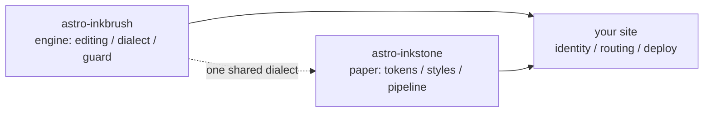

import Callout from 'astro-inkstone/components/Callout.astro';
import Hero from 'astro-inkstone/components/Hero.astro';
import Part from 'astro-inkstone/components/Part.astro';

<Hero kicker="Referensi · pipeline Markdown, dipentaskan" title="Serba ada" tocLabel="Pembuka · untuk apa halaman ini" meta="4 bagian · setiap sakelar yang dinyalakan situs ini · daftar tolakan penjaga di ujung halaman">
  Setiap elemen pipeline Markdown situs ini tampil satu kali di halaman ini: tanda sebaris, tautan wiki, tabel yang menjelma kartu, callout dalam tiga ejaan, matematika, bingkai kode, diagram, shortcode emoji, ekstra GFM — dan waktu baca di strip atas itu pun keluaran pipeline yang sama. Bahwa halaman ini bisa dibangun sama sekali, itulah demonstrasinya: penjaga konten menolak setiap ejaan cacat yang terdaftar di bagian akhir, jadi yang Anda lihat adalah persis yang diterima dialek. Dua sakelar yang dibiarkan mati oleh situs ini — preset penomoran `sections` dan prefiks sub-path `base` — dijelaskan di [[getting-started|panduan memulai]].
</Hero>

<Part title="Teks" />

## Tanda sebaris

Penguraian emphasis-nya ramah CJK: **tebal tetap menutup meski menempel tanda baca Tionghoa** — `**报文。**同时` dirender sebagai **报文。**同时, bukan sebagai asterisk mentah. *Miring*, ~~coretan~~, dan `kode sebaris` bekerja seperti biasa; dengan sakelar `gemoji`, shortcode seperti `:sparkles:` dirender sebagai :sparkles:. Karakter di dalam kode sebaris tidak ikut penguraian apa pun, jadi backtick adalah cara aman untuk *memperlihatkan* sintaks: `**`, `$…$`, dan `> [!note]` semuanya tampil apa adanya. Untuk menampilkan asterisk di tubuh kalimat, lepaskan dengan garis miring terbalik — \*seperti ini\* tetap polos.

## Tautan wiki

Dengan sakelar `wikilinks` menyala, tautan `[[kurung-ganda]]` diresolusi terhadap koleksi catatan sebagaimana lazimnya wiki: per id ([[design-tokens]] — dan dari halaman cermin seperti ini, tautan mendarat lebih dulu di cermin sebahasa bila ada, baru jatuh ke catatan Inggris kanonisnya), per alias ([[boundaries]] sampai ke catatan yang id-nya `three-way-split`), dan dengan label ([[getting-started|panduan memulai]]). Target yang tak teresolusi dirender sebagai tautan mati yang ditandai, bukan menggagalkan build — dan CLI `check-wikilinks` milik mesin melaporkannya di CI, tempat pembusukan tautan seharusnya ketahuan.

## Tabel: menggulir saat lebar, jadi kartu saat sempit

Tabel dengan enam kolom atau lebih semestinya mengalir ulang menjadi satu baris per kartu di wadah sempit, alih-alih memeras tiap sel jadi dua karakter. Tabel tujuh kolom ini sekaligus contekan varian callout dan uji langsung reflow itu (ciutkan jendela ke lebar ponsel):

| Varian | Kelas | Kata kunci sintaks kutip | Bingkai | Dasar | Judul bawaan | Pemakaian lazim |
| --- | --- | --- | --- | --- | --- | --- |
| note | `callout` | `note` `info` | 赭 oker `--color-accent3` | dasar matematika `--color-math-bg` | Note | catatan samping yang netral |
| intuition | `callout intuition` | `tip` `intuition` `hint` | 黛 teal `--color-accent2` | dasar matematika | Intuition | analogi pembangun intuisi |
| warn | `callout warn` | `warn` `warning` `caution` `danger` | 石 jingga bakar `--color-accent` | campuran aksen 8% | Warning | peringatan sebelum langkah berisiko |
| system | `callout system` | `important` `system` | 紫 ungu `--color-accent4` | campuran ungu 8% | Important | konvensi tingkat sistem |
| abstract | `callout abstract` | `abstract` `summary` `quote` | tinta pudar `--color-ink-faint` | permukaan lembut `--color-bg-soft` | Abstract | rangkuman pembuka bab |
| bad | `callout bad` | (hanya HTML mentah) | 石 jingga bakar | campuran aksen 10% | — | kesalahan terdokumentasi, desain yang ditolak |

Judul bawaannya bahasa Inggris; sebuah situs menukar seluruh setnya lewat opsi `calloutLabels` milik `siteMarkdown`, mis. `calloutLabels: { tip: 'Intuisi' }`. Judul yang ditulis dalam sintaks kutip (`> [!tip] Judul saya`) selalu menang.

<Part title="Callout dan matematika" />

## Callout: tiga ejaan

Pertama, sintaks kutip gaya Obsidian/GitHub (tersedia dengan `callouts: true`, jalan juga di berkas Markdown polos):

> [!tip] Mengapa tiga ejaan
> Sintaks kutip melayani Markdown polos dan catatan hasil impor kotak masuk; komponennya melayani MDX; HTML mentah adalah lapisan dasar yang dipakai keduanya — ketiganya merender markup `<aside class="callout …">` yang sama.

Penanda lipat Obsidian dihormati — `> [!note]-` dirender terlipat, `> [!note]+` terbuka:

> [!note]- Catatan yang terlipat
> Klik judulnya untuk membuka. Callout terlipat dirender sebagai `<details>` dengan judul sebagai `<summary>`-nya.

Kedua, komponen paketnya di MDX (`astro-inkstone/components/Callout.astro`, diimpor per jalur). Tanpa `title` ia menampilkan label bawaan variannya, label yang sama dengan yang dipakai sintaks kutip:

<Callout variant="warn" title="Prop komponen tidak merender markdown">
  Prop title adalah string polos — jangan taruh asterisk atau tanda dolar di sana. Daftar putih renderedProps milik penjaga konten ada persis untuk mengawasi ini.
</Callout>

Ketiga, HTML mentah, keenam varian sekali jalan (berpadanan satu-satu dengan aturan `.callout` di `base.css`):

<div class="callout">
  <div class="callout-title">Note</div>
  Catatan samping yang netral. Kelas <code>.callout</code> tanpa imbuhan ya persis ini.
</div>

<div class="callout intuition">
  <div class="callout-title">Intuition</div>
  Tepi kiri teal, untuk paragraf tentang <em>cara membayangkannya</em>, bukan <em>apa itu</em>.
</div>

<div class="callout warn">
  <div class="callout-title">Warning</div>
  Tepi kiri jingga bakar di atas dasar campuran aksen 8% — muncul sebelum langkah yang bisa salah.
</div>

<div class="callout system">
  <div class="callout-title">System</div>
  Tepi kiri ungu, untuk konvensi tingkat sistem: pahami dulu mengapa ia ada sebelum mengubahnya.
</div>

<div class="callout abstract">
  <div class="callout-title">Abstract</div>
  Tepi tinta pudar di atas permukaan lembut, untuk ikhtisar singkat di kepala bab.
</div>

<div class="callout bad">
  <div class="callout-title">Bad</div>
  Mendokumentasikan kesalahan dan implementasi yang ditolak. Tanpa varian ini, fakta bahwa sesuatu itu keliru hilang tanpa suara.
</div>

## Matematika

Rumus sebaris duduk di dalam teks: kedalaman optis terbaca $\tau = \int \kappa \rho \, \mathrm{d}s$. Matematika blok memakai bentuk tiga baris (`$$` di barisnya sendiri) — penjaga menolak bentuk satu-baris, yang akan diam-diam dirender sebagai rumus sebaris kecil:

$$
\int_0^1 x^2 \, \mathrm{d}x = \frac{1}{3}
$$

Dasar rumus sengaja dibuat dari kertas yang berbeda dari tubuh teks, dan berganti mengikuti tema. Omong-omong, lepaskan harga berlambang dolar di tubuh kalimat: kopi ini harganya \$3.

<Part title="Kode dan diagram" />

## Bingkai kode

Blok berpagar dengan `title="…"` mendapat bilah judul bernama berkas; tombol salin di pojoknya berlaku seluruh situs. Anotasi baris `[!code ++]` / `[!code --]` dirender sebagai dasar diff:

```python title="pipeline.py"
def build_pipeline(opts):
    plugins = [remark_math]  # [!code --]
    plugins = [remark_gemoji, remark_math]  # [!code ++]
    return assemble(plugins, guard=opts.guard)
```

Bingkai bertanda `collapse` mulai dalam keadaan terlipat dan baru memakan tempat saat dibuka — pas untuk berkas konfigurasi panjang:

```yaml title="inkstone.example.yaml" collapse
site:
  markdown:
    numbering: chapters
    math: true
    codeFrame: true
    mermaid: true
    callouts: true
    wikilinks: true
  styles:
    - astro-inkstone/styles/tokens.css
    - astro-inkstone/styles/base.css
```

Pewarnaan dwi-tema datang dari shiki yang memancarkan kedua set warna sekaligus; `base.css` memilih salah satunya lewat `data-theme` di satu tempat saja — tanpa tarik-menarik spesifisitas.

## Diagram mermaid

Blok berpagar ` ```mermaid ` hanya meninggalkan placeholder saat build; perendernya dimuat dinamis hanya di halaman yang membawa diagram (halaman tanpa diagram tak membayar apa pun), dan merender ulang saat tema dibalik:



## Ekstra GFM

Daftar tugas dan catatan kaki ikut serta bersama GFM:

- [x] token sudah diimpor
- [x] base.css sudah diimpor
- [ ] palet identitas sudah ditimpa

Klaim yang layak diberi sumber mendapat catatan kaki.[^src]

[^src]: Catatan kaki dirender di kaki halaman dengan tautan kembali, ditata oleh lapisan konten.

<Part title="Penjaga" />

## Apa yang ditolak penjaga di halaman ini

Bahwa halaman ini terbangun sudah menjadi bukti bahwa semua di atas well-formed. Ejaan-ejaan berikut akan menggagalkan build di tempat (coba salah satunya, lalu `npm run build`):

- penanda emphasis yang tak bisa berpasangan, seperti `**` yang dibiarkan terbuka di ujung baris;
- `$$x$$` satu-baris (pakai bentuk tiga baris);
- judul bernomor tangan — menulis judul bagian ini sebagai `## 9. Apa yang ditolak penjaga…` akan bertabrakan dengan penomoran saat build dan ditandai;
- kurung kurawal prosa yang dievaluasi MDX: `{0,1,2,3}` akan dirender sebagai sekadar `3`, maka penjaga menuntut bentuk lepasnya \{0,1,2,3\};
- rumus yang tak bisa dirender KaTeX (penjaga merender ulang setiap rumus dalam mode ketat alih-alih membiarkan teks galat merah terkirim).
