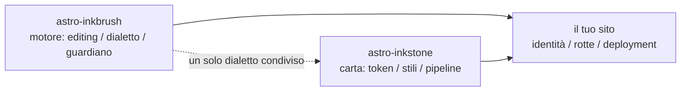

import Callout from 'astro-inkstone/components/Callout.astro';
import Hero from 'astro-inkstone/components/Hero.astro';
import Part from 'astro-inkstone/components/Part.astro';

<Hero kicker="Riferimento · la pipeline Markdown, in scena" title="Il campionario" tocLabel="Intro · perché un campionario" meta="4 parti · ogni interruttore che questo sito accende · in coda, l’elenco di ciò che il guardiano respinge">
  Ogni elemento della pipeline Markdown di questo sito si esibisce una volta in questa pagina: segni in linea, wikilink, tabelle che diventano carte, callout in tre grafie, matematica, cornici di codice, diagrammi, shortcode emoji, gli extra di GFM — e anche il tempo di lettura nella striscia qui sopra è opera della pipeline. Che la pagina compili è già di per sé la dimostrazione: il guardiano dei contenuti respinge ogni grafia malformata elencata in coda, quindi ciò che vedi è ciò che il dialetto accetta. Due interruttori che questo sito lascia spenti — il preset di numerazione `sections` e il prefisso di sottopercorso `base` — sono descritti nella [[getting-started|guida]].
</Hero>

<Part title="Testo" />

## Segni in linea

L’analisi dell’enfasi è amichevole col CJK: **il grassetto si chiude anche contro la punteggiatura cinese** — `**报文。**同时` rende **报文。**同时, e non asterischi letterali. *Il corsivo*, il ~~barrato~~ e il `codice in linea` funzionano come al solito; con l’interruttore `gemoji` uno shortcode come `:sparkles:` rende :sparkles:. I caratteri dentro il codice in linea non partecipano ad alcuna analisi, perciò i backtick sono il modo sicuro di *mostrare* la sintassi: `**`, `$…$` e `> [!note]` compaiono tutti alla lettera. Per mostrare un asterisco nel discorso, fai l’escape — \*così\* resta testo semplice.

## Wikilink

Con l’interruttore `wikilinks` acceso, i link `[[a doppie parentesi]]` si risolvono sulla collezione di note come un wiki si aspetta: per id ([[design-tokens]] — partendo da una pagina mirror italiana si atterra prima sul mirror nella stessa lingua, e solo in sua assenza sull’originale inglese), per alias ([[boundaries]] raggiunge la nota il cui id è `three-way-split`), con un’etichetta ([[getting-started|la guida dei primi passi]]). Un bersaglio che non si risolve rende come link morto marcato invece di far fallire la build — e la CLI `check-wikilinks` del motore lo riporta in CI, dove la ruggine dei link appartiene.

## Tabelle: scorrono da larghe, si fanno carte da strette

Una tabella con sei o più colonne dovrebbe, in un contenitore stretto, ridisporsi una riga per carta invece di strizzare ogni cella a due caratteri. Questa tabella a sette colonne è insieme il promemoria delle varianti di callout e una verifica dal vivo di quel reflow (stringi la finestra a larghezza di telefono):

| Variante | Classe | Parole chiave della sintassi a citazione | Bordo | Fondo | Titolo predefinito | Uso tipico |
| --- | --- | --- | --- | --- | --- | --- |
| note | `callout` | `note` `info` | 赭 ocra `--color-accent3` | fondo formule `--color-math-bg` | Note | note a margine neutre |
| intuition | `callout intuition` | `tip` `intuition` `hint` | 黛 verde acqua `--color-accent2` | fondo formule | Intuition | analogie che costruiscono intuizione |
| warn | `callout warn` | `warn` `warning` `caution` `danger` | 石 arancio bruciato `--color-accent` | miscela d’accento all’8% | Warning | avvisi prima dei passi rischiosi |
| system | `callout system` | `important` `system` | 紫 violetto `--color-accent4` | miscela di violetto all’8% | Important | convenzioni a livello di sistema |
| abstract | `callout abstract` | `abstract` `summary` `quote` | inchiostro tenue `--color-ink-faint` | superficie morbida `--color-bg-soft` | Abstract | riassunti in apertura di capitolo |
| bad | `callout bad` | (solo HTML a crudo) | 石 arancio bruciato | miscela d’accento al 10% | — | errori messi a verbale, design scartati |

I titoli predefiniti sono in inglese; un sito sostituisce l’intera serie con l’opzione `calloutLabels` di `siteMarkdown`, per esempio `calloutLabels: { tip: 'Intuizione' }`. Un titolo scritto nella sintassi a citazione (`> [!tip] Il mio titolo`) vince sempre.

<Part title="Callout e matematica" />

## Callout: tre grafie

Prima, la sintassi a citazione di Obsidian/GitHub (disponibile con `callouts: true`, funziona anche nei file Markdown semplici):

> [!tip] Perché tre grafie
> La sintassi a citazione serve il Markdown semplice e le note importate dalla inbox; il componente serve MDX; l’HTML a crudo è il substrato comune sotto entrambi — tutte e tre rendono lo stesso markup `<aside class="callout …">`.

Il segno di ripiegatura di Obsidian è rispettato — `> [!note]-` rende chiuso, `> [!note]+` aperto:

> [!note]- Una nota ripiegata
> Fai clic sul titolo per aprirla. I callout ripiegati rendono come `<details>` con il titolo come `<summary>`.

Poi, il componente del pacchetto in MDX (`astro-inkstone/components/Callout.astro`, importato per percorso). Senza `title` mostra l’etichetta predefinita della variante, la stessa che usa la sintassi a citazione:

<Callout variant="warn" title="Le props dei componenti non rendono markdown">
  La prop del titolo è una semplice stringa — niente asterischi né simboli del dollaro lì dentro. La whitelist renderedProps del guardiano dei contenuti esiste precisamente per farlo rispettare.
</Callout>

Terza, l’HTML a crudo, tutte e sei le varianti in un colpo (in corrispondenza uno-a-uno con le regole `.callout` di `base.css`):

<div class="callout">
  <div class="callout-title">Nota</div>
  Un inciso neutro. La classe <code>.callout</code> senza aggettivi è esattamente questo.
</div>

<div class="callout intuition">
  <div class="callout-title">Intuizione</div>
  Bordo sinistro verde acqua, per i paragrafi su <em>come pensarla</em> più che su <em>che cosa è</em>.
</div>

<div class="callout warn">
  <div class="callout-title">Avvertenza</div>
  Bordo sinistro arancio bruciato su un fondo d’accento all’8% — compare prima del passo che può andare storto.
</div>

<div class="callout system">
  <div class="callout-title">Sistema</div>
  Bordo sinistro violetto, per le convenzioni a livello di sistema: capisci perché esiste prima di cambiarla.
</div>

<div class="callout abstract">
  <div class="callout-title">Riassunto</div>
  Bordo d’inchiostro tenue sulla superficie morbida, per la panoramica rapida in testa a un capitolo.
</div>

<div class="callout bad">
  <div class="callout-title">Da non fare</div>
  Mette a verbale errori e implementazioni scartate. Senza questa variante, il fatto che qualcosa sia sbagliato si perde in silenzio.
</div>

## Matematica

Le formule in linea siedono nel testo: la profondità ottica si legge $\tau = \int \kappa \rho \, \mathrm{d}s$. La matematica in display prende la forma su tre righe (`$$` su righe proprie) — il guardiano respinge la forma su riga singola, che renderebbe in silenzio come una piccola formula in linea:

$$
\int_0^1 x^2 \, \mathrm{d}x = \frac{1}{3}
$$

Il fondo delle formule è di proposito una carta diversa da quella del corpo, e cambia col tema. Già che ci siamo: nel discorso, ai prezzi in dollari serve l’escape — questo caffè costa \$3.

<Part title="Codice e diagrammi" />

## Cornici di codice

Un blocco con `title="…"` riceve una barra del titolo col nome del file; il pulsante di copia nell’angolo c’è in tutto il sito. Le annotazioni di riga `[!code ++]` / `[!code --]` rendono come fondi diff:

```python title="pipeline.py"
def build_pipeline(opts):
    plugins = [remark_math]  # [!code --]
    plugins = [remark_gemoji, remark_math]  # [!code ++]
    return assemble(plugins, guard=opts.guard)
```

Una cornice marcata `collapse` parte ripiegata e occupa spazio solo da aperta — giusta per i file di configurazione lunghi:

```yaml title="inkstone.example.yaml" collapse
site:
  markdown:
    numbering: chapters
    math: true
    codeFrame: true
    mermaid: true
    callouts: true
    wikilinks: true
  styles:
    - astro-inkstone/styles/tokens.css
    - astro-inkstone/styles/base.css
```

L’evidenziazione a doppio tema viene da shiki, che emette entrambe le serie di colori in un colpo solo; `base.css` ne sceglie una in base a `data-theme`, in un punto solo — nessun braccio di ferro di specificità.

## Diagrammi Mermaid

Un blocco ` ```mermaid ` lascia al momento della build solo un segnaposto; il renderer si carica dinamicamente solo sulle pagine che portano un diagramma (le pagine senza non pagano nulla) e ridisegna quando il tema cambia:



## Gli extra di GFM

Gli elenchi di attività e le note a piè di pagina viaggiano con GFM:

- [x] token importati
- [x] base.css importato
- [ ] tavolozza d’identità sovrascritta

Un’affermazione che merita una fonte riceve una nota a piè di pagina.[^src]

[^src]: Le note a piè di pagina rendono in fondo alla pagina con link di ritorno, nello stile del livello dei contenuti.

<Part title="Il guardiano" />

## Che cosa respinge il guardiano su questa pagina

Che questa pagina compili è di per sé la dimostrazione che tutto quanto sopra è ben formato. Queste grafie farebbero fallire la build sul posto (provane una, poi `npm run build`):

- un segno di enfasi che non può accoppiarsi, come un `**` lasciato aperto a fine riga;
- `$$x$$` su riga singola (usa la forma su tre righe);
- titoli numerati a mano — scrivere il titolo di questa sezione come `## 9. Che cosa respinge…` colliderebbe con la numerazione a tempo di build e verrebbe segnalato;
- MDX che valuta le graffe del tuo discorso: `{0,1,2,3}` renderebbe come un semplice `3`, quindi il guardiano esige la forma protetta \{0,1,2,3\};
- una formula che KaTeX non sa rendere (il guardiano ri-rende ogni formula in modalità strict invece di lasciar salpare testo rosso d’errore).
