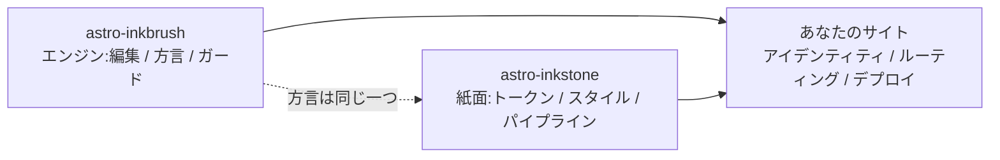

import Callout from 'astro-inkstone/components/Callout.astro';
import Hero from 'astro-inkstone/components/Hero.astro';
import Part from 'astro-inkstone/components/Part.astro';

<Hero kicker="リファレンス · Markdown パイプラインの実演" title="全部入りデモ" tocLabel="導入 · なぜ全部入りか" meta="4 部 · このサイトが入れている全スイッチ · ガードの拒否リストは巻末に">
  このサイトの Markdown パイプラインの全要素が、このページで一度ずつ演じられます:インライン記法、ウィキリンク、カードに変わるテーブル、三通りの書き方のコールアウト、数式、コードフレーム、図、絵文字ショートコード、GFM の追加機能——上の帯にある読了目安もパイプラインの仕事です。このページがそもそもビルドを通ること自体が実演です:コンテンツガードは巻末に列挙した壊れた書き方をすべて拒むので、いま見えているものは方言が受理したものだけです。このサイトが切っている二つのスイッチ——番号付けプリセット `sections` とサブパスの `base` 接頭辞——は[[getting-started|ガイド]]に説明があります。
</Hero>

<Part title="テキスト" />

## インライン記法

強調の解析は CJK フレンドリーです:**太字は中国語の句読点に接しても閉じます**——`**报文。**同时` は **报文。**同时 と描画され、生のアスタリスクにはなりません。*斜体*、~~打ち消し線~~、`インラインコード` は通常どおり。`gemoji` スイッチを入れれば、`:sparkles:` のようなショートコードが :sparkles: に描画されます。インラインコードの中の文字は一切の解析に参加しないので、構文を*見せる*ときはバッククォートが安全です:`**` も `$…$` も `> [!note]` も、字面のまま現れます。本文中でアスタリスクそのものを見せたいときはエスケープを——\*こう書けば\*ただの文字のままです。

## ウィキリンク

`wikilinks` スイッチが入っていると、`[[二重ブラケット]]` のリンクは wiki の流儀でノート集に対して解決されます:id で([[design-tokens]]——日本語ミラーのページから辿れば同じ言語のミラーが先に解決され、無いときだけ英語の原本に落ちます)、別名で([[boundaries]] は id が `three-way-split` のノートに届きます)、ラベル付きで([[getting-started|はじめにガイド]])。`[[id#見出し]]` の形でアンカーも指せます。解決できないターゲットはビルドを落とさず、死リンクの印付きで描画されます——リンクの腐敗は CI の `check-wikilinks` が報告します。それが本来の持ち場です。

## テーブル:広ければスクロール、狭ければカード

6 列以上のテーブルは、狭いコンテナでは各セルを 2 文字幅に潰すのではなく、1 行を 1 枚のカードに流し直すべきです。この 7 列のテーブルはコールアウトのバリアント早見表であると同時に、その変形の生きたテストでもあります(ウィンドウをスマホ幅まで縮めてみてください):

| バリアント | クラス | 引用構文のキーワード | 枠線 | 地 | 既定タイトル | 典型的な用途 |
| --- | --- | --- | --- | --- | --- | --- |
| note | `callout` | `note` `info` | 赭(オーカー)`--color-accent3` | 数式の地 `--color-math-bg` | Note | 中立な補足 |
| intuition | `callout intuition` | `tip` `intuition` `hint` | 黛(ティール)`--color-accent2` | 数式の地 | Intuition | 直感を育てる類比 |
| warn | `callout warn` | `warn` `warning` `caution` `danger` | 石(バーントオレンジ)`--color-accent` | アクセント 8% 混色 | Warning | 危ない手順の前の注意 |
| system | `callout system` | `important` `system` | 紫(バイオレット)`--color-accent4` | 紫 8% 混色 | Important | システムレベルの約束事 |
| abstract | `callout abstract` | `abstract` `summary` `quote` | 淡墨 `--color-ink-faint` | 柔らかい面 `--color-bg-soft` | Abstract | 章頭の要約 |
| bad | `callout bad` | (生 HTML のみ) | 石(バーントオレンジ) | アクセント 10% 混色 | — | 記録された失敗、退けられた設計 |

既定タイトルは英語です。サイトは `siteMarkdown` の `calloutLabels` オプションで一式まるごと差し替えます。たとえば `calloutLabels: { tip: '直感 · Intuition' }`。引用構文で書いたタイトル(`> [!tip] 自分のタイトル`)が常に優先されます。

<Part title="コールアウトと数式" />

## コールアウト:三通りの書き方

第一は、Obsidian/GitHub の引用構文(`callouts: true` で使え、純 Markdown ファイルでも書けます):

> [!tip] なぜ三通りあるのか
> 引用構文は純 Markdown とインボックス取り込みのノートのため。コンポーネントは MDX のため。生 HTML は両者の下に敷かれた共通基盤——三つとも同じ `<aside class="callout …">` マークアップに描画されます。

Obsidian の折りたたみ記号も効きます——`> [!note]-` は畳んだ状態で、`> [!note]+` は開いた状態で描画されます:

> [!note]- 畳まれたノート
> タイトルをクリックすると開きます。畳まれたコールアウトは `<details>` として描画され、タイトルがその `<summary>` になります。

第二は、MDX でのパッケージコンポーネント(`astro-inkstone/components/Callout.astro`、パスで import)。`title` を渡さなければ、バリアント既定のラベル——引用構文と同じもの——が出ます:

<Callout variant="warn" title="コンポーネントの props は markdown を描画しません">
  title プロップは素の文字列です——アスタリスクやドル記号を入れないでください。コンテンツガードの renderedProps ホワイトリストは、まさにこれを取り締まるためにあります。
</Callout>

第三は生 HTML、六つのバリアントを一気に(`base.css` の `.callout` 規則と一対一対応):

<div class="callout">
  <div class="callout-title">Note</div>
  中立の傍注。無修飾の <code>.callout</code> クラスがちょうどこれです。
</div>

<div class="callout intuition">
  <div class="callout-title">直感 · Intuition</div>
  黛(ティール)の左端。<em>それが何か</em>ではなく<em>どう考えればよいか</em>を語る段落に。
</div>

<div class="callout warn">
  <div class="callout-title">注意 · Warning</div>
  バーントオレンジの左端、アクセント 8% の地——失敗しうる手順の前に現れます。
</div>

<div class="callout system">
  <div class="callout-title">システム · System</div>
  バイオレットの左端。システムレベルの約束事に:変える前に、それがなぜあるのかを理解してください。
</div>

<div class="callout abstract">
  <div class="callout-title">要旨 · Abstract</div>
  柔らかい面の上に淡墨の縁。章の頭に置く素早い見取り図に。
</div>

<div class="callout bad">
  <div class="callout-title">反例 · Bad</div>
  失敗と退けられた実装の記録。このバリアントがなければ、「これは間違いだ」という事実は音もなく失われます。
</div>

## 数式

インライン数式は本文に座ります:光学的厚みは $\tau = \int \kappa \rho \, \mathrm{d}s$ と読めます。ディスプレイ数式は三行形(`$$` をそれぞれ単独の行に)——一行形はガードが拒みます。小さなインライン数式として音もなく描画されてしまうからです:

$$
\int_0^1 x^2 \, \mathrm{d}x = \frac{1}{3}
$$

数式の地は本文の紙とは意図的に別の紙で、テーマとともに切り替わります。ついでに、本文中のドル価格はエスケープを:このコーヒーは \$3 です。

<Part title="コードと図" />

## コードフレーム

`title="…"` を付けたフェンスにはファイル名のタイトルバーが付きます。隅のコピーボタンはサイト全体で共通。`[!code ++]` / `[!code --]` の行アノテーションは diff の地として描画されます:

```python title="pipeline.py"
def build_pipeline(opts):
    plugins = [remark_math]  # [!code --]
    plugins = [remark_gemoji, remark_math]  # [!code ++]
    return assemble(plugins, guard=opts.guard)
```

`collapse` と印を付けたフレームは畳まれた状態で始まり、開いたときだけ場所を取ります——長い設定ファイルにちょうどいい:

```yaml title="inkstone.example.yaml" collapse
site:
  markdown:
    numbering: chapters
    math: true
    codeFrame: true
    mermaid: true
    callouts: true
    wikilinks: true
  styles:
    - astro-inkstone/styles/tokens.css
    - astro-inkstone/styles/base.css
```

二重テーマのハイライトは、shiki が両方の色セットを一度に出力することで得ています。`base.css` が `data-theme` を見て一箇所で選ぶだけ——詳細度の綱引きはありません。

## mermaid の図

` ```mermaid ` フェンスは、ビルド時にはプレースホルダだけを残します。レンダラは図を載せたページでだけ動的に読み込まれ(図のないページは何も払いません)、テーマが切り替われば描き直します:



## GFM の追加機能

タスクリストと脚注は GFM と一緒に付いてきます:

- [x] tokens をインポートした
- [x] base.css をインポートした
- [ ] アイデンティティのパレットを上書きした

出典を付ける価値のある主張には脚注を。[^src]

[^src]: 脚注はページの足元に、戻りリンク付きで描画されます。スタイルは本文レイヤーのものです。

<Part title="ガード" />

## このページでガードが拒むもの

このページがビルドを通ること自体が、上のすべてが整形式であることの証明です。次の書き方は、その場でビルドを落とします(試すなら、書き換えてから `npm run build` を):

- 対を作れない強調マーカー。たとえば行末で閉じ損ねた `**`。
- 一行の `$$x$$`(三行形を使うこと)。
- 見出しへの手書き番号——本節の見出しを `## 9. このページで…` と書けば、ビルド時の自動番号と衝突して検出されます。
- MDX に本文の波括弧を評価されること:`{0,1,2,3}` はページ上ではただの 3 になるので、ガードはエスケープ形 \{0,1,2,3\} を要求します。
- KaTeX が描画できない数式(ガードは赤いエラーテキストを出荷せず、全数式を strict モードで実際に描画し直して確かめます)。
