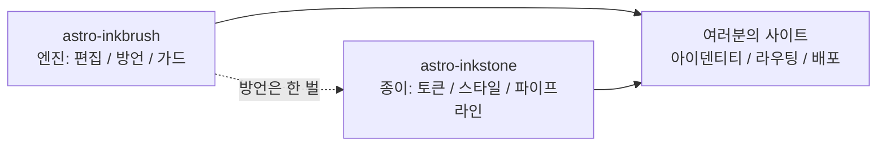

import Callout from 'astro-inkstone/components/Callout.astro';
import Hero from 'astro-inkstone/components/Hero.astro';
import Part from 'astro-inkstone/components/Part.astro';

<Hero kicker="레퍼런스 · Markdown 파이프라인 총공연" title="전 요소 시연" tocLabel="도입 · 왜 이 페이지인가" meta="4부 구성 · 이 사이트가 켠 스위치 전부 · 가드의 거부 목록은 맨 끝에">
  이 사이트 Markdown 파이프라인의 모든 요소가 이 페이지에서 한 번씩 공연합니다: 인라인 마크, 위키링크, 카드로 변하는 표, 세 가지 표기의 콜아웃, 수식, 코드 프레임, 다이어그램, 이모지 숏코드, GFM 부가 기능 — 위 스트립의 읽기 시간도 파이프라인의 작품입니다. 이 페이지가 빌드된다는 사실 자체가 시연입니다: 콘텐츠 가드는 맨 끝에 나열한 모든 잘못된 표기를 거부하므로, 지금 보이는 것이 곧 방언이 받아들이는 것입니다. 이 사이트가 꺼 둔 두 스위치 — `sections` 번호 매기기 프리셋과 `base` 하위 경로 접두사 — 는 [[getting-started|시작하기 가이드]]에 설명이 있습니다.
</Hero>

<Part title="텍스트" />

## 인라인 마크

강조 해석은 CJK 친화적입니다: **굵은 표시가 한중일 문장 부호에 붙어도 닫힙니다** — 소스에 `**报文。**同时`라고 쓰면 별표가 그대로 남는 대신 이렇게 렌더링됩니다: **报文。**同时. *기울임*, ~~취소선~~, `인라인 코드`는 평소대로 동작하고, `gemoji` 스위치를 켜면 `:sparkles:` 같은 숏코드가 이렇게 렌더링됩니다: :sparkles:. 인라인 코드 안의 문자는 어떤 해석에도 참여하지 않으므로, 구문을 *보여 줄* 때는 백틱이 안전한 길입니다: `**`, `$…$`, `> [!note]` 모두 글자 그대로 나타납니다. 본문에 별표 자체를 보이려면 이스케이프하면 됩니다 — \*이렇게\* 쓰면 평문으로 남습니다.

## 위키링크

`wikilinks` 스위치를 켜면 `[[겹대괄호]]` 링크가 위키의 관례대로 노트 컬렉션을 상대로 해석됩니다: id로([[design-tokens]] — 한국어 미러 페이지에서 출발하면 같은 언어의 미러에 먼저 내려앉고, 미러가 없을 때만 영어 원본으로 갑니다), 별칭으로([[boundaries]] 링크는 id가 `three-way-split`인 노트에 닿습니다), 라벨을 달아([[getting-started|시작하기 가이드]]). 해석되지 않는 대상은 빌드를 깨는 대신 죽은 링크 표시로 렌더링됩니다 — 링크 부패는 CI의 `check-wikilinks` 도구가 보고합니다. 링크 부패가 있어야 할 곳은 거기니까요.

## 표: 넓으면 스크롤, 좁으면 카드

여섯 열 이상의 표는, 좁은 컨테이너에서 셀마다 두 글자씩 짜부라뜨리는 대신 한 행을 카드 한 장으로 다시 흘려야 합니다. 아래 일곱 열짜리 표는 콜아웃 변형 치트 시트인 동시에 그 카드 변환의 라이브 시험입니다(창을 휴대폰 너비로 줄여 보십시오):

| 변형 | 클래스 | 인용 구문 키워드 | 테두리 | 바탕 | 기본 제목 | 전형적 용도 |
| --- | --- | --- | --- | --- | --- | --- |
| note | `callout` | `note` `info` | 赭 오커 `--color-accent3` | 수식 바탕 `--color-math-bg` | Note | 중립적 보충 설명 |
| intuition | `callout intuition` | `tip` `intuition` `hint` | 黛 틸 `--color-accent2` | 수식 바탕 | Intuition | 직관을 세워 주는 비유 |
| warn | `callout warn` | `warn` `warning` `caution` `danger` | 石 번트 오렌지 `--color-accent` | 강조색 8% 혼합 | Warning | 위험한 단계 앞의 주의 환기 |
| system | `callout system` | `important` `system` | 紫 바이올렛 `--color-accent4` | 바이올렛 8% 혼합 | Important | 시스템 수준의 규약 |
| abstract | `callout abstract` | `abstract` `summary` `quote` | 옅은 먹 `--color-ink-faint` | 부드러운 표면 `--color-bg-soft` | Abstract | 장 서두의 요약 |
| bad | `callout bad` | (원시 HTML 전용) | 石 번트 오렌지 | 강조색 10% 혼합 | — | 기록해 둔 실수, 기각된 설계 |

기본 제목은 영어입니다. 사이트는 `siteMarkdown`의 `calloutLabels` 옵션으로 한 벌을 통째로 바꿉니다. 예: `calloutLabels: { tip: '직관 · Intuition' }`. 인용 구문에 직접 쓴 제목(`> [!tip] 내 제목`)이 언제나 이깁니다.

<Part title="콜아웃과 수식" />

## 콜아웃: 세 가지 표기

첫째, Obsidian/GitHub식 인용 구문(`callouts: true`일 때 사용할 수 있고, 순수 Markdown 파일에서도 동작합니다):

> [!tip] 왜 표기가 셋인가
> 인용 구문은 순수 Markdown과 수신함으로 들여온 노트를 맡고, 컴포넌트는 MDX를 맡으며, 원시 HTML은 그 둘 밑에 깔린 공통 기반입니다 — 셋 모두 같은 `<aside class="callout …">` 마크업으로 렌더링됩니다.

Obsidian의 접기 표시도 존중됩니다 — `> [!note]-` 표기는 접힌 채로, `> [!note]+` 표기는 펼쳐진 채로 렌더링됩니다:

> [!note]- 접힌 노트
> 제목을 클릭하면 열립니다. 접힌 콜아웃은 `<details>` 요소로 렌더링되고, 제목이 그 `<summary>`가 됩니다.

둘째, MDX에서 쓰는 패키지 컴포넌트(`astro-inkstone/components/Callout.astro`, 경로로 임포트). `title` prop이 없으면 변형의 기본 라벨 — 인용 구문이 쓰는 것과 같은 라벨 — 을 보여 줍니다:

<Callout variant="warn" title="컴포넌트 prop은 Markdown을 렌더링하지 않습니다">
  title prop은 순수 문자열입니다 — 별표나 달러 기호를 넣지 마십시오. 콘텐츠 가드의 renderedProps 화이트리스트가 단속하는 것이 정확히 이 지점입니다.
</Callout>

셋째, 원시 HTML로 여섯 변형 전부(`base.css`의 `.callout` 규칙과 일대일 대응):

<div class="callout">
  <div class="callout-title">노트</div>
  중립적 보충. 수식어 없는 <code>.callout</code> 클래스가 정확히 이것입니다.
</div>

<div class="callout intuition">
  <div class="callout-title">직관</div>
  틸색 왼 모서리 — <em>무엇인가</em>보다 <em>어떻게 이해할까</em>를 말하는 단락에 씁니다.
</div>

<div class="callout warn">
  <div class="callout-title">경고</div>
  강조색 8% 바탕 위의 번트 오렌지 왼 모서리 — 일이 틀어질 수 있는 단계 앞에 나타납니다.
</div>

<div class="callout system">
  <div class="callout-title">시스템</div>
  바이올렛 왼 모서리, 시스템 수준 규약용: 바꾸기 전에 왜 존재하는지부터 이해해야 합니다.
</div>

<div class="callout abstract">
  <div class="callout-title">요약</div>
  부드러운 표면 위의 옅은 먹 모서리, 장 서두의 빠른 개관용.
</div>

<div class="callout bad">
  <div class="callout-title">반례</div>
  실수와 기각된 구현을 기록합니다. 이 변형이 없으면 "이것은 틀렸다"는 정보가 소리 없이 사라집니다.
</div>

## 수식

인라인 수식은 본문에 앉습니다: 광학적 깊이는 $\tau = \int \kappa \rho \, \mathrm{d}s$ 이렇게 읽습니다. 디스플레이 수식은 세 줄 형태(`$$` 기호가 각각 한 줄)를 취합니다 — 한 줄 형태는 조용히 작은 인라인 수식으로 렌더링되어 버리므로, 가드가 거부합니다:

$$
\int_0^1 x^2 \, \mathrm{d}x = \frac{1}{3}
$$

수식의 바탕은 일부러 본문과 다른 종이로 잡았고, 테마와 함께 바뀝니다. 덧붙여, 본문의 달러 가격은 이스케이프하십시오: 이 커피는 \$3입니다.

<Part title="코드와 다이어그램" />

## 코드 프레임

`title="…"` 속성이 붙은 펜스는 파일명 제목 표시줄을 얻습니다. 모서리의 복사 버튼은 사이트 전역 공통입니다. `[!code ++]` / `[!code --]` 줄 주석은 diff 바탕색으로 렌더링됩니다:

```python title="pipeline.py"
def build_pipeline(opts):
    plugins = [remark_math]  # [!code --]
    plugins = [remark_gemoji, remark_math]  # [!code ++]
    return assemble(plugins, guard=opts.guard)
```

`collapse` 표시가 붙은 프레임은 접힌 채 시작해, 열 때만 자리를 차지합니다 — 긴 설정 파일에 알맞습니다:

```yaml title="inkstone.example.yaml" collapse
site:
  markdown:
    numbering: chapters
    math: true
    codeFrame: true
    mermaid: true
    callouts: true
    wikilinks: true
  styles:
    - astro-inkstone/styles/tokens.css
    - astro-inkstone/styles/base.css
```

이중 테마 하이라이팅은 shiki가 두 색 세트를 한 번에 내놓는 데서 옵니다. `base.css` 파일은 `data-theme` 속성을 보고 단 한 곳에서 한쪽을 고릅니다 — 명시도 줄다리기가 없습니다.

## mermaid 다이어그램

` ```mermaid ` 펜스는 빌드 시점에 자리 표시자만 남깁니다. 렌더러는 다이어그램이 있는 페이지에서만 동적으로 로드되고(없는 페이지는 아무 비용도 치르지 않습니다), 테마가 바뀌면 다시 렌더링합니다:



## GFM 부가 기능

작업 목록과 각주가 GFM에 함께 실려 옵니다:

- [x] 토큰 임포트 완료
- [x] base.css 임포트 완료
- [ ] 아이덴티티 팔레트 덮어쓰기

출처를 밝힐 가치가 있는 주장에는 각주를 답니다.[^src]

[^src]: 각주는 페이지 발치에 되돌아가기 링크와 함께 렌더링되며, 스타일은 콘텐츠 계층이 입힙니다.

<Part title="가드" />

## 이 페이지에서 가드가 거부하는 것

이 페이지가 빌드를 통과했다는 것 자체가, 위의 모든 것이 규격에 맞다는 시연입니다. 아래 표기는 그 자리에서 빌드를 실패시킵니다(하나 골라 시험해 보고 `npm run build` 명령을 돌려 보십시오):

- 짝을 맺지 못하는 강조 표시 — 줄 끝에 닫히지 않은 채 남은 `**` 같은 것;
- 한 줄짜리 `$$x$$` 표기(세 줄 형태를 쓰십시오);
- 손으로 번호를 단 제목 — 이 절의 제목을 `## 9. 가드가 거부하는…`처럼 쓰면 빌드 시점의 번호 매기기와 충돌해 지적당합니다;
- MDX가 본문의 중괄호를 평가해 버리는 경우: `{0,1,2,3}`은 그냥 3으로 렌더링되므로, 가드는 이스케이프 형태 \{0,1,2,3\}을 요구합니다;
- KaTeX가 렌더링하지 못하는 수식(가드는 빨간 오류 텍스트가 배포되게 두지 않고, 모든 수식을 엄격 모드로 다시 렌더링해 봅니다).
