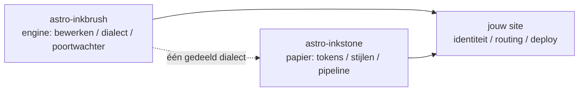

import Callout from 'astro-inkstone/components/Callout.astro';
import Hero from 'astro-inkstone/components/Hero.astro';
import Part from 'astro-inkstone/components/Part.astro';

<Hero kicker="Naslag · de Markdown-pipeline, opgevoerd" title="De staalkaart" tocLabel="Intro · waarom een staalkaart" meta="4 delen · elke schakelaar die deze site aanzet · de afwijzingen van de poortwachter op het eind">
  Elk element van de Markdown-pipeline van deze site treedt op deze pagina één keer op: inline-markeringen, wikilinks, tabellen die kaarten worden, callouts in drie schrijfwijzen, wiskunde, codeframes, diagrammen, emoji-shortcodes, GFM-extra's — en ook de leestijd in de strook hierboven komt uit de pipeline. Dat de pagina überhaupt bouwt ís de demonstratie: de poortwachter wijst elke misvormde schrijfwijze uit de lijst aan het slot af, dus wat je ziet is wat het dialect accepteert. Twee schakelaars die deze site uit laat — de nummeringspreset `sections` en het subpad-voorvoegsel `base` — staan beschreven in [[getting-started|de gids]].
</Hero>

<Part title="Tekst" />

## Inline-markeringen

De nadrukparser is CJK-vriendelijk: **vet sluit zelfs tegen Chinese leestekens aan** — `**报文。**同时` rendert als **报文。**同时, niet als letterlijke sterretjes. *Cursief*, ~~doorhalen~~ en `inline code` werken zoals je gewend bent; met de schakelaar `gemoji` rendert een shortcode als `:sparkles:` als :sparkles:. Tekens binnen inline code doen aan geen enkele parsing mee, dus backticks zijn de veilige manier om syntaxis te *tonen*: `**`, `$…$` en `> [!note]` verschijnen allemaal letterlijk. Wil je een sterretje in lopende tekst laten zien, escape het dan — \*zoals hier\* blijft gewoon staan.

## Wikilinks

Met de schakelaar `wikilinks` aan worden `[[dubbele-blokhaken]]`-links opgelost tegen de notitiecollectie, zoals een wiki dat hoort te doen: op id ([[design-tokens]] — vanuit een Nederlandse spiegelnotitie landt zo'n link eerst op de spiegel in dezelfde taal en pas daarna op het Engelse origineel), op alias ([[boundaries]] bereikt de notitie met id `three-way-split`) en met een label ([[getting-started|de aan-de-slag-gids]]). Een doel dat nergens toe leidt, rendert als een gemarkeerde dode link in plaats van de build te breken — en de CLI `check-wikilinks` van de engine rapporteert hem in CI, waar linkrot thuishoort.

## Tabellen: scrollen als het breed is, kaarten als het smal is

Een tabel met zes of meer kolommen hoort in een smalle container één rij per kaart te hervormen, in plaats van elke cel tot twee tekens samen te persen. Deze tabel met zeven kolommen is tegelijk het spiekbriefje van de callout-varianten én een live test van die hervorming (knijp het venster tot telefoonbreedte):

| Variant | Class | Trefwoorden in de citaatsyntaxis | Rand | Ondergrond | Standaardtitel | Typisch gebruik |
| --- | --- | --- | --- | --- | --- | --- |
| note | `callout` | `note` `info` | 赭 oker `--color-accent3` | wiskundegrond `--color-math-bg` | Note | neutrale kanttekeningen |
| intuition | `callout intuition` | `tip` `intuition` `hint` | 黛 teal `--color-accent2` | wiskundegrond | Intuition | analogieën die intuïtie opbouwen |
| warn | `callout warn` | `warn` `warning` `caution` `danger` | 石 gebrand oranje `--color-accent` | 8% accentmenging | Warning | waarschuwing vóór riskante stappen |
| system | `callout system` | `important` `system` | 紫 violet `--color-accent4` | 8% violetmenging | Important | conventies op systeemniveau |
| abstract | `callout abstract` | `abstract` `summary` `quote` | vale inkt `--color-ink-faint` | zacht oppervlak `--color-bg-soft` | Abstract | samenvattingen aan het begin van een hoofdstuk |
| bad | `callout bad` | (alleen rauwe HTML) | 石 gebrand oranje | 10% accentmenging | — | vastgelegde fouten, verworpen ontwerpen |

De standaardtitels zijn Engels; een site vervangt de hele set via de optie `calloutLabels` van `siteMarkdown`, bijvoorbeeld `calloutLabels: { tip: 'Intuïtie', warn: 'Waarschuwing' }`. Een titel die in de citaatsyntaxis zelf staat (`> [!tip] Mijn titel`) wint altijd.

<Part title="Callouts en wiskunde" />

## Callouts: drie schrijfwijzen

Ten eerste de Obsidian/GitHub-citaatsyntaxis (beschikbaar met `callouts: true`, werkt ook in kale Markdown-bestanden):

> [!tip] Waarom drie schrijfwijzen
> De citaatsyntaxis bedient kale Markdown en via de inbox geïmporteerde notities; het component bedient MDX; rauwe HTML is het gedeelde fundament onder beide — alle drie renderen ze dezelfde `<aside class="callout …">`-markup.

De vouwmarkering van Obsidian wordt gerespecteerd — `> [!note]-` rendert ingevouwen, `> [!note]+` open:

> [!note]- Een ingevouwen notitie
> Klik op de titel om haar te openen. Ingevouwen callouts renderen als `<details>` met de titel als hun `<summary>`.

Ten tweede het pakketcomponent in MDX (`astro-inkstone/components/Callout.astro`, per pad geïmporteerd). Zonder `title` toont het het standaardlabel van de variant, hetzelfde dat de citaatsyntaxis gebruikt:

<Callout variant="warn" title="Componentprops renderen geen markdown">
  De titelprop is een kale string — geen sterretjes of dollartekens erin. De renderedProps-whitelist van de poortwachter bestaat precies om hierop toe te zien.
</Callout>

Ten derde rauwe HTML, alle zes varianten in één keer (één-op-één met de `.callout`-regels van `base.css`):

<div class="callout">
  <div class="callout-title">Notitie</div>
  Een neutrale kanttekening. De onaangepaste <code>.callout</code>-class is precies dit.
</div>

<div class="callout intuition">
  <div class="callout-title">Intuïtie</div>
  Teal linkerrand, voor alinea's over <em>hoe je het moet zien</em> in plaats van <em>wat het is</em>.
</div>

<div class="callout warn">
  <div class="callout-title">Waarschuwing</div>
  Gebrand-oranje linkerrand op een 8% accentgrond — verschijnt vóór de stap die mis kan gaan.
</div>

<div class="callout system">
  <div class="callout-title">Systeem</div>
  Violette linkerrand, voor conventies op systeemniveau: begrijp eerst waarom iets bestaat voordat je het verandert.
</div>

<div class="callout abstract">
  <div class="callout-title">Samenvatting</div>
  Vale-inktrand op het zachte oppervlak, voor het snelle overzicht aan het hoofd van een hoofdstuk.
</div>

<div class="callout bad">
  <div class="callout-title">Fout</div>
  Legt fouten en verworpen implementaties vast. Zonder deze variant verdwijnt het feit dát iets fout is geruisloos.
</div>

## Wiskunde

Inline-formules staan gewoon in de tekst: de optische diepte leest als $\tau = \int \kappa \rho \, \mathrm{d}s$. Display-wiskunde gebruikt de drieregelige vorm (`$$` op eigen regels) — de poortwachter wijst de éénregelige vorm af, die anders geruisloos als kleine inline-formule zou renderen:

$$
\int_0^1 x^2 \, \mathrm{d}x = \frac{1}{3}
$$

De formulegrond is met opzet een ander papier dan dat van de lopende tekst, en wisselt mee met het thema. Escape trouwens dollarprijzen in lopende tekst: deze koffie kost \$3.

<Part title="Code en diagrammen" />

## Codeframes

Een codeblok met `title="…"` krijgt een titelbalk met de bestandsnaam; de kopieerknop in de hoek is site-breed. Regelannotaties `[!code ++]` / `[!code --]` renderen als diff-gronden:

```python title="pipeline.py"
def build_pipeline(opts):
    plugins = [remark_math]  # [!code --]
    plugins = [remark_gemoji, remark_math]  # [!code ++]
    return assemble(plugins, guard=opts.guard)
```

Een frame met de markering `collapse` begint ingevouwen en neemt pas ruimte in zodra je het opent — precies goed voor lange configuratiebestanden:

```yaml title="inkstone.example.yaml" collapse
site:
  markdown:
    numbering: chapters
    math: true
    codeFrame: true
    mermaid: true
    callouts: true
    wikilinks: true
  styles:
    - astro-inkstone/styles/tokens.css
    - astro-inkstone/styles/base.css
```

De highlighting voor beide thema's komt van shiki, dat beide kleursets tegelijk uitschrijft; `base.css` kiest er op één plek één via `data-theme` — geen touwtrekken om specificiteit.

## Mermaid-diagrammen

Een ` ```mermaid `-blok laat bij het bouwen alleen een plaatshouder achter; de renderer wordt dynamisch geladen, uitsluitend op pagina's die een diagram dragen (pagina's zonder betalen niets), en rendert opnieuw wanneer het thema omschakelt:



## GFM-extra's

Taaklijsten en voetnoten liften mee met GFM:

- [x] tokens geïmporteerd
- [x] base.css geïmporteerd
- [ ] identiteitspalet overschreven

Een bewering die een bron verdient, krijgt een voetnoot.[^src]

[^src]: Voetnoten renderen onderaan de pagina met teruglinks, opgemaakt door de inhoudslaag.

<Part title="De poortwachter" />

## Wat de poortwachter op deze pagina afwijst

Dat deze pagina bouwt, is zelf het bewijs dat alles hierboven welgevormd is. De volgende schrijfwijzen zouden de build ter plekke laten stranden (probeer er één, dan `npm run build`):

- een nadrukmarkering die geen paar kan vormen, zoals een `**` die aan het eind van een regel open blijft staan;
- éénregelig `$$x$$` (gebruik de drieregelige vorm);
- handgenummerde koppen — de kop van deze sectie schrijven als `## 9. Wat de poortwachter…` zou botsen met de nummering die de build zelf aanbrengt, en wordt aangemerkt;
- MDX dat je proza-accolades evalueert: `{0,1,2,3}` zou als alleen `3` renderen, dus de poortwachter eist de ge-escapete vorm \{0,1,2,3\};
- een formule die KaTeX niet kan renderen (de poortwachter rendert elke formule opnieuw in strikte modus, in plaats van rode fouttekst te laten uitvaren).
