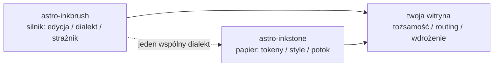

import Callout from 'astro-inkstone/components/Callout.astro';
import Hero from 'astro-inkstone/components/Hero.astro';
import Part from 'astro-inkstone/components/Part.astro';

<Hero kicker="Referencja · potok Markdowna w akcji" title="Wszystko naraz" tocLabel="Wstęp · po co ten pokaz" meta="4 części · każdy przełącznik włączony na tej witrynie · odrzuty strażnika wyliczone na końcu">
  Każdy element potoku Markdowna tej witryny występuje na tej stronie dokładnie raz: znaki w tekście, wikilinki, tabele zamieniające się w karty, callouty w trzech pisowniach, matematyka, ramki kodu, diagramy, skróty emoji, dodatki GFM — a czas czytania w pasku powyżej to też robota potoku. Już to, że strona w ogóle się buduje, jest pokazem: strażnik treści odrzuca każdą zniekształconą pisownię z listy na końcu, więc to, co widzisz, jest tym, co dialekt przyjmuje. Dwa przełączniki, które ta witryna zostawia wyłączone — preset numeracji `sections` i prefiks podścieżki `base` — opisuje [[getting-started|przewodnik]].
</Hero>

<Part title="Tekst" />

## Znaki w tekście

Parser wyróżnień jest przyjazny CJK: **pogrubienie domyka się nawet o chińską interpunkcję** — `**报文。**同时` renderuje się jako **报文。**同时, a nie jako dosłowne gwiazdki. *Kursywa*, ~~przekreślenie~~ i `kod w linii` działają jak zwykle; z włączonym przełącznikiem `gemoji` skrót taki jak `:sparkles:` renderuje się jako :sparkles:. Znaki wewnątrz kodu w linii nie biorą udziału w żadnym parsowaniu, więc grawisy to bezpieczny sposób, by składnię *pokazać*: `**`, `$…$` i `> [!note]` pojawiają się dosłownie. Żeby pokazać gwiazdkę w tekście, poprzedź ją ukośnikiem — \*o tak\* zostaje zwykłym tekstem.

## Wikilinki

Z włączonym przełącznikiem `wikilinks` linki `[[w podwójnych nawiasach]]` rozwiązują się względem kolekcji notatek tak, jak oczekuje tego wiki: po id ([[design-tokens]] — z polskiej strony lustrzanej link trafia najpierw do lustrzanej wersji w tym samym języku, a dopiero gdy jej brak, do angielskiego oryginału), po aliasie ([[boundaries]] dociera do notatki o id `three-way-split`) i z etykietą ([[getting-started|przewodnik pierwszych kroków]]). Cel, który nie rozwiązuje się do niczego, renderuje się jako oznaczony martwy link zamiast wywracać build — a CLI silnika `check-wikilinks` raportuje go w CI, czyli tam, gdzie gnicie linków należy.

## Tabele: przewijanie na szeroko, karty na wąsko

Tabela o sześciu lub więcej kolumnach powinna w wąskim kontenerze przełamać się na jedną kartę na wiersz, zamiast ściskać każdą komórkę do dwóch znaków. Ta siedmiokolumnowa tabela jest zarazem ściągą wariantów calloutów i żywym testem tego przełamania (zwęź okno do szerokości telefonu):

| Wariant | Klasa | Słowa kluczowe składni cytatu | Krawędź | Podłoże | Domyślny tytuł | Typowe użycie |
| --- | --- | --- | --- | --- | --- | --- |
| note | `callout` | `note` `info` | 赭 ochra `--color-accent3` | podłoże matematyki `--color-math-bg` | Note | neutralne uwagi na marginesie |
| intuition | `callout intuition` | `tip` `intuition` `hint` | 黛 morska zieleń `--color-accent2` | podłoże matematyki | Intuition | analogie budujące intuicję |
| warn | `callout warn` | `warn` `warning` `caution` `danger` | 石 palona pomarańcz `--color-accent` | 8% domieszki akcentu | Warning | ostrzeżenie przed ryzykownym krokiem |
| system | `callout system` | `important` `system` | 紫 fiolet `--color-accent4` | 8% domieszki fioletu | Important | konwencje na poziomie systemu |
| abstract | `callout abstract` | `abstract` `summary` `quote` | wyblakły tusz `--color-ink-faint` | miękka powierzchnia `--color-bg-soft` | Abstract | streszczenia otwierające rozdział |
| bad | `callout bad` | (tylko surowy HTML) | 石 palona pomarańcz | 10% domieszki akcentu | — | zapisane pomyłki, odrzucone projekty |

Domyślne tytuły są angielskie; witryna podmienia cały zestaw opcją `calloutLabels` presetu `siteMarkdown`, np. `calloutLabels: { tip: 'Intuicja' }`. Tytuł zapisany w składni cytatu (`> [!tip] Mój tytuł`) zawsze wygrywa.

<Part title="Callouty i matematyka" />

## Callouty: trzy pisownie

Najpierw składnia cytatu znana z Obsidiana/GitHuba (dostępna przy `callouts: true`, działa też w zwykłych plikach Markdowna):

> [!tip] Po co trzy pisownie
> Składnia cytatu obsługuje zwykły Markdown i notatki importowane ze skrzynki; komponent obsługuje MDX; surowy HTML jest wspólnym podglebiem obu — wszystkie trzy renderują ten sam znacznik `<aside class="callout …">`.

Znacznik zwijania z Obsidiana jest honorowany — `> [!note]-` renderuje się zwinięty, `> [!note]+` otwarty:

> [!note]- Zwinięta notatka
> Kliknij tytuł, żeby ją otworzyć. Zwinięte callouty renderują się jako `<details>` z tytułem w roli `<summary>`.

Po drugie, komponent pakietu w MDX (`astro-inkstone/components/Callout.astro`, importowany po ścieżce). Bez `title` pokazuje domyślną etykietę wariantu — tę samą, której używa składnia cytatu:

<Callout variant="warn" title="Propsy komponentów nie renderują Markdowna">
  Props tytułu to zwykły łańcuch znaków — żadnych gwiazdek ani znaków dolara w środku. Biała lista renderedProps strażnika treści istnieje dokładnie po to, by tego pilnować.
</Callout>

Po trzecie, surowy HTML, wszystkie sześć wariantów za jednym zamachem (jeden do jednego z regułami `.callout` w `base.css`):

<div class="callout">
  <div class="callout-title">Notatka</div>
  Neutralna uwaga na marginesie. Niezmodyfikowana klasa <code>.callout</code> to dokładnie to.
</div>

<div class="callout intuition">
  <div class="callout-title">Intuicja</div>
  Morska lewa krawędź, do akapitów o tym, <em>jak o czymś myśleć</em>, a nie <em>czym to jest</em>.
</div>

<div class="callout warn">
  <div class="callout-title">Ostrzeżenie</div>
  Lewa krawędź w palonej pomarańczy na podłożu z 8% domieszką akcentu — pojawia się przed krokiem, który może pójść źle.
</div>

<div class="callout system">
  <div class="callout-title">System</div>
  Fioletowa lewa krawędź, do konwencji na poziomie systemu: zrozum, po co istnieje, zanim ją zmienisz.
</div>

<div class="callout abstract">
  <div class="callout-title">Abstrakt</div>
  Krawędź w wyblakłym tuszu na miękkiej powierzchni, do szybkiego przeglądu na czele rozdziału.
</div>

<div class="callout bad">
  <div class="callout-title">Źle</div>
  Zapisuje pomyłki i odrzucone implementacje. Bez tego wariantu fakt, że coś jest błędne, ginie po cichu.
</div>

## Matematyka

Wzory w linii siedzą w tekście: głębokość optyczna zapisuje się $\tau = \int \kappa \rho \, \mathrm{d}s$. Matematyka wystawowa przyjmuje formę trzyliniową (`$$` w osobnych liniach) — strażnik odrzuca formę jednoliniową, która po cichu wyrenderowałaby się jako mały wzór w linii:

$$
\int_0^1 x^2 \, \mathrm{d}x = \frac{1}{3}
$$

Podłoże wzoru jest celowo innym papierem niż podłoże tekstu i przełącza się razem z motywem. Przy okazji: ceny w dolarach w tekście poprzedzaj ukośnikiem — ta kawa kosztuje \$3.

<Part title="Kod i diagramy" />

## Ramki kodu

Blok z `title="…"` dostaje pasek tytułu z nazwą pliku; przycisk kopiowania w rogu działa w całej witrynie. Adnotacje liniowe `[!code ++]` / `[!code --]` renderują się jako podłoża diffu:

```python title="pipeline.py"
def build_pipeline(opts):
    plugins = [remark_math]  # [!code --]
    plugins = [remark_gemoji, remark_math]  # [!code ++]
    return assemble(plugins, guard=opts.guard)
```

Ramka oznaczona `collapse` startuje zwinięta i zajmuje miejsce dopiero po otwarciu — w sam raz dla długich plików konfiguracji:

```yaml title="inkstone.example.yaml" collapse
site:
  markdown:
    numbering: chapters
    math: true
    codeFrame: true
    mermaid: true
    callouts: true
    wikilinks: true
  styles:
    - astro-inkstone/styles/tokens.css
    - astro-inkstone/styles/base.css
```

Podwójne motywy podświetlania bierze się stąd, że shiki emituje oba zestawy kolorów naraz; `base.css` wybiera jeden po `data-theme` w jednym miejscu — bez przeciągania liny na specyficzność.

## Diagramy Mermaid

Blok ` ```mermaid ` zostawia w czasie budowania tylko miejsce na diagram; renderer ładuje się dynamicznie wyłącznie na stronach, które diagram niosą (strony bez diagramu nie płacą nic), i renderuje od nowa, gdy motyw się przełącza:



## Dodatki GFM

Listy zadań i przypisy jadą razem z GFM:

- [x] tokeny zaimportowane
- [x] base.css zaimportowany
- [ ] paleta tożsamości nadpisana

Twierdzenie warte źródła dostaje przypis.[^src]

[^src]: Przypisy renderują się u stóp strony z linkami powrotnymi, ostylowane przez warstwę treści.

<Part title="Strażnik" />

## Co strażnik odrzuca na tej stronie

To, że ta strona się buduje, samo w sobie dowodzi, że wszystko powyżej jest poprawnie złożone. Poniższe pisownie wywróciłyby build na miejscu (wypróbuj jedną, potem `npm run build`):

- znak wyróżnienia bez pary, jak `**` zostawione niedomknięte na końcu linii;
- jednoliniowe `$$x$$` (użyj formy trzyliniowej);
- ręcznie numerowane nagłówki — zapisanie nagłówka tej sekcji jako `## 9. Co strażnik…` zderzyłoby się z numeracją nadawaną w czasie budowania i zostałoby oflagowane;
- MDX wyliczający klamry w twojej prozie: `{0,1,2,3}` wyrenderowałoby się jako samo `3`, więc strażnik żąda formy z ukośnikami \{0,1,2,3\};
- wzór, którego KaTeX nie umie wyrenderować (strażnik przelicza każdy wzór w trybie ścisłym, zamiast pozwolić czerwonemu tekstowi błędu wypłynąć na produkcję).
