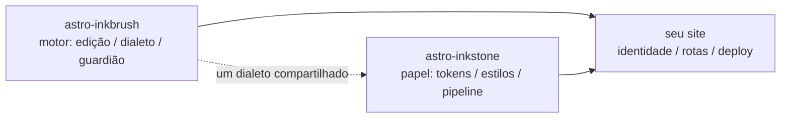

import Callout from 'astro-inkstone/components/Callout.astro';
import Hero from 'astro-inkstone/components/Hero.astro';
import Part from 'astro-inkstone/components/Part.astro';

<Hero kicker="Referência · o pipeline de Markdown em cena" title="Vitrine completa" tocLabel="Introdução · por que uma vitrine" meta="4 partes · cada chave que este site liga · a lista de rejeições do guardião no final">
  Cada elemento do pipeline de Markdown deste site se apresenta uma vez nesta página: marcas inline, wikilinks, tabelas que viram cartões, callouts em três grafias, matemática, molduras de código, diagramas, atalhos de emoji, os extras do GFM — e o tempo de leitura na faixa acima também é obra do pipeline. Que a página sequer compile já é a demonstração: o guardião de conteúdo rejeita cada grafia malformada listada no final, então o que você vê é o que o dialeto aceita. Duas chaves que este site deixa desligadas — o preset de numeração `sections` e o prefixo de subcaminho `base` — estão descritas no [[getting-started|guia de primeiros passos]].
</Hero>

<Part title="Texto" />

## Marcas inline

A análise de ênfase é amigável a CJK: **o negrito fecha mesmo encostado em pontuação chinesa** — `**报文。**同时` renderiza como **报文。**同时, e não como asteriscos literais. *Itálico*, ~~tachado~~ e `código inline` funcionam como de costume; com a chave `gemoji`, um atalho como `:sparkles:` renderiza como :sparkles:. Caracteres dentro de código inline não participam de análise nenhuma, então as crases são o jeito seguro de *mostrar* sintaxe: `**`, `$…$` e `> [!note]` aparecem todos ao pé da letra. Para exibir um asterisco no texto corrido, escape-o — \*assim\* continua texto comum.

## Wikilinks

Com a chave `wikilinks` ligada, links `[[de colchetes duplos]]` resolvem contra a coleção de notas do jeito que um wiki espera: por id ([[design-tokens]] — partindo de uma página espelho em português, o resolvedor prefere o espelho no mesmo idioma e só cai no original em inglês quando a nota não existe aqui), por alias ([[boundaries]] chega à nota cujo id é `three-way-split`), com rótulo ([[getting-started|o guia de primeiros passos]]). Um alvo que não resolve para nada renderiza como link morto marcado, em vez de derrubar o build — e o CLI `check-wikilinks` do motor o relata no CI, que é onde apodrecimento de link pertence.

## Tabelas: rolagem quando largas, cartões quando estreitas

Uma tabela de seis ou mais colunas deve refluir para um cartão por linha num contêiner estreito, em vez de espremer cada célula a dois caracteres. Esta tabela de sete colunas é ao mesmo tempo o guia rápido das variantes de callout e um teste vivo desse refluxo (encolha a janela até a largura de um celular):

| Variante | Classe | Palavras-chave da sintaxe de citação | Borda | Fundo | Título padrão | Uso típico |
| --- | --- | --- | --- | --- | --- | --- |
| note | `callout` | `note` `info` | 赭 ocre `--color-accent3` | fundo de fórmula `--color-math-bg` | Note | apartes neutros |
| intuition | `callout intuition` | `tip` `intuition` `hint` | 黛 verde-azulado `--color-accent2` | fundo de fórmula | Intuition | analogias que constroem intuição |
| warn | `callout warn` | `warn` `warning` `caution` `danger` | 石 laranja-queimado `--color-accent` | mistura de 8% do acento | Warning | aviso antes de passos arriscados |
| system | `callout system` | `important` `system` | 紫 violeta `--color-accent4` | mistura de 8% de violeta | Important | convenções de nível de sistema |
| abstract | `callout abstract` | `abstract` `summary` `quote` | tinta apagada `--color-ink-faint` | superfície macia `--color-bg-soft` | Abstract | resumos de abertura de capítulo |
| bad | `callout bad` | (só HTML cru) | 石 laranja-queimado | mistura de 10% do acento | — | erros registrados, designs rejeitados |

Os títulos padrão são em inglês; um site troca o conjunto inteiro pela opção `calloutLabels` do `siteMarkdown`, por exemplo `calloutLabels: { tip: 'Intuição', warn: 'Aviso' }`. Um título escrito na sintaxe de citação (`> [!tip] Meu título`) sempre vence.

<Part title="Callouts e matemática" />

## Callouts: três grafias

Primeira, a sintaxe de citação do Obsidian/GitHub (disponível com `callouts: true`, funciona também em arquivos Markdown puros):

> [!tip] Por que três grafias
> A sintaxe de citação serve ao Markdown puro e às notas importadas pela caixa de entrada; o componente serve ao MDX; o HTML cru é o substrato comum debaixo dos dois — as três grafias renderizam a mesma marcação `<aside class="callout …">`.

O marcador de dobra do Obsidian é honrado — `> [!note]-` renderiza recolhido, `> [!note]+` aberto:

> [!note]- Uma nota dobrada
> Clique no título para abrir. Callouts dobrados renderizam como `<details>`, com o título fazendo as vezes de `<summary>`.

Segunda, o componente do pacote em MDX (`astro-inkstone/components/Callout.astro`, importado por caminho). Sem um `title`, ele exibe o rótulo padrão da variante, o mesmo que a sintaxe de citação usa:

<Callout variant="warn" title="Props de componente não renderizam markdown">
  A prop title é uma string pura — nada de asteriscos ou cifrões ali dentro. A lista renderedProps do guardião de conteúdo existe exatamente para policiar isso.
</Callout>

Terceira, HTML cru, as seis variantes de uma vez (casando uma a uma com as regras `.callout` do `base.css`):

<div class="callout">
  <div class="callout-title">Nota</div>
  Um aparte neutro. A classe <code>.callout</code> sem modificador é exatamente isto.
</div>

<div class="callout intuition">
  <div class="callout-title">Intuição</div>
  Borda esquerda verde-azulada, para parágrafos sobre <em>como pensar a respeito</em> em vez de <em>o que é</em>.
</div>

<div class="callout warn">
  <div class="callout-title">Aviso</div>
  Borda esquerda laranja-queimado sobre um fundo com 8% do acento — aparece antes do passo que pode dar errado.
</div>

<div class="callout system">
  <div class="callout-title">Sistema</div>
  Borda esquerda violeta, para convenções de nível de sistema: entenda por que ela existe antes de mudá-la.
</div>

<div class="callout abstract">
  <div class="callout-title">Resumo</div>
  Borda de tinta apagada sobre a superfície macia, para a visão rápida na abertura de um capítulo.
</div>

<div class="callout bad">
  <div class="callout-title">Ruim</div>
  Registra erros e implementações rejeitadas. Sem esta variante, o fato de algo estar errado se perde em silêncio.
</div>

## Matemática

Fórmulas inline assentam no texto: a profundidade óptica se escreve $\tau = \int \kappa \rho \, \mathrm{d}s$. Matemática em destaque usa a forma de três linhas (`$$` em linhas próprias) — o guardião rejeita a forma de linha única, que renderizaria em silêncio como uma pequena fórmula inline:

$$
\int_0^1 x^2 \, \mathrm{d}x = \frac{1}{3}
$$

O fundo de fórmula é, de propósito, um papel diferente do corpo, e troca junto com o tema. Aliás, escape preços em dólar no texto corrido: este café custa \$3.

<Part title="Código e diagramas" />

## Molduras de código

Uma cerca com `title="…"` ganha uma barra de título com o nome do arquivo; o botão de copiar no canto vale para o site inteiro. As anotações de linha `[!code ++]` / `[!code --]` renderizam como fundos de diff:

```python title="pipeline.py"
def build_pipeline(opts):
    plugins = [remark_math]  # [!code --]
    plugins = [remark_gemoji, remark_math]  # [!code ++]
    return assemble(plugins, guard=opts.guard)
```

Uma moldura marcada com `collapse` começa dobrada e só ocupa espaço quando aberta — certa para arquivos de configuração longos:

```yaml title="inkstone.example.yaml" collapse
site:
  markdown:
    numbering: chapters
    math: true
    codeFrame: true
    mermaid: true
    callouts: true
    wikilinks: true
  styles:
    - astro-inkstone/styles/tokens.css
    - astro-inkstone/styles/base.css
```

O realce nos dois temas vem do shiki emitindo os dois conjuntos de cores de uma vez; o `base.css` escolhe um por `data-theme` num lugar só — sem cabo de guerra de especificidade.

## Diagramas mermaid

Uma cerca ` ```mermaid ` deixa apenas um marcador de posição no build; o renderizador carrega dinamicamente só nas páginas que trazem um diagrama (as demais não pagam nada) e re-renderiza quando o tema vira:



## Extras do GFM

Listas de tarefas e notas de rodapé vêm de carona com o GFM:

- [x] tokens importados
- [x] base.css importado
- [ ] paleta de identidade sobrescrita

Uma afirmação que merece fonte ganha uma nota de rodapé.[^src]

[^src]: Notas de rodapé renderizam ao pé da página, com links de retorno, estilizadas pela camada de conteúdo.

<Part title="O guardião" />

## O que o guardião rejeita nesta página

Que esta página compile é, por si só, a demonstração de que tudo acima está bem formado. Estas grafias derrubariam o build na hora (experimente uma e rode `npm run build`):

- uma marca de ênfase sem par, como um `**` deixado aberto no fim da linha;
- `$$x$$` em linha única (use a forma de três linhas);
- títulos numerados à mão — escrever o título desta seção como `## 9. O que o guardião…` colidiria com a numeração de build e seria sinalizado;
- o MDX avaliando as chaves da sua prosa: `{0,1,2,3}` renderizaria como um mero `3`, então o guardião exige a forma escapada \{0,1,2,3\};
- uma fórmula que o KaTeX não consegue renderizar (o guardião re-renderiza cada fórmula em modo estrito, em vez de deixar texto vermelho de erro chegar à página).
