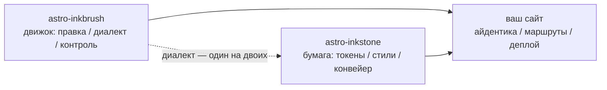

import Callout from 'astro-inkstone/components/Callout.astro';
import Hero from 'astro-inkstone/components/Hero.astro';
import Part from 'astro-inkstone/components/Part.astro';

<Hero kicker="Справочник · конвейер Markdown, показанный в деле" title="Всё и сразу" tocLabel="Вступление · зачем эта страница" meta="4 части · каждый включённый на сайте переключатель · список отказов контроля в конце">
  Каждый элемент Markdown-конвейера этого сайта выступает здесь по одному разу: строчная разметка, вики-ссылки, таблицы, превращающиеся в карточки, callout в трёх написаниях, математика, рамки для кода, диаграммы, эмодзи-шорткоды, дополнения GFM — и время чтения в полосе сверху тоже посчитал конвейер. Сам факт, что страница собирается, и есть демонстрация: контроль контента отклоняет каждое из перечисленных в конце кривых написаний, так что вы видите ровно то, что диалект принимает. Два переключателя, которые этот сайт держит выключенными, — пресет нумерации `sections` и префикс подпути `base` — описаны в [[getting-started|руководстве по быстрому старту]].
</Hero>

<Part title="Текст" />

## Строчная разметка

Разбор выделения дружелюбен к CJK: **жирный закрывается даже вплотную к китайской пунктуации** — `**报文。**同时` отрисовывается как **报文。**同时, а не как буквальные звёздочки. *Курсив*, ~~зачёркивание~~ и `строчный код` работают как обычно; с переключателем `gemoji` шорткод вроде `:sparkles:` превращается в :sparkles:. Символы внутри строчного кода не участвуют ни в каком разборе, поэтому обратные кавычки — безопасный способ *показать* синтаксис: `**`, `$…$` и `> [!note]` появляются буквально. Чтобы показать в прозе саму звёздочку, экранируйте её — \*вот так\* останется просто текстом.

## Вики-ссылки

С включённым переключателем `wikilinks` ссылки `[[в двойных скобках]]` разрешаются по коллекции заметок, как и положено вики: по id ([[design-tokens]] — со страницы русского зеркала ссылка сперва ищет зеркало того же языка и лишь потом падает на английский оригинал), по псевдониму ([[boundaries]] приводит к заметке с id `three-way-split`), с подписью ([[getting-started|руководство по быстрому старту]]). Цель, которая ни во что не разрешилась, отрисовывается помеченной мёртвой ссылкой, а не роняет сборку — о гнили ссылок докладывает движковый `check-wikilinks` в CI, где ей и место.

## Таблицы: в ширину — прокрутка, в узком месте — карточки

Таблица от шести столбцов в узком контейнере должна перекладываться по строке на карточку, а не сжимать каждую ячейку до двух букв. Эта семиколонная таблица — одновременно шпаргалка по вариантам callout и живая проверка той самой переклейки (сузьте окно до ширины телефона):

| Вариант | Класс | Ключевые слова цитатного синтаксиса | Рамка | Фон | Заголовок по умолчанию | Типичное применение |
| --- | --- | --- | --- | --- | --- | --- |
| note | `callout` | `note` `info` | 赭 охра `--color-accent3` | фон формул `--color-math-bg` | Note | нейтральные примечания |
| intuition | `callout intuition` | `tip` `intuition` `hint` | 黛 бирюза `--color-accent2` | фон формул | Intuition | аналогии, строящие интуицию |
| warn | `callout warn` | `warn` `warning` `caution` `danger` | 石 жжёный оранжевый `--color-accent` | смесь 8% акцента | Warning | предупреждение перед рискованным шагом |
| system | `callout system` | `important` `system` | 紫 фиолетовый `--color-accent4` | смесь 8% фиолетового | Important | соглашения системного уровня |
| abstract | `callout abstract` | `abstract` `summary` `quote` | блёклая тушь `--color-ink-faint` | мягкая поверхность `--color-bg-soft` | Abstract | конспект в начале главы |
| bad | `callout bad` | (только сырой HTML) | 石 жжёный оранжевый | смесь 10% акцента | — | зафиксированные ошибки, отвергнутые решения |

Заголовки по умолчанию английские; сайт меняет весь набор через опцию `calloutLabels` в `siteMarkdown`, например `calloutLabels: { tip: 'Интуиция' }`. Заголовок, написанный прямо в цитатном синтаксисе (`> [!tip] Мой заголовок`), побеждает всегда.

<Part title="Callout и математика" />

## Callout: три написания

Первое — цитатный синтаксис в духе Obsidian и GitHub (доступен при `callouts: true`, работает и в чистых Markdown-файлах):

> [!tip] Зачем три написания
> Цитатный синтаксис обслуживает чистый Markdown и заметки, импортированные из инбокса; компонент обслуживает MDX; сырой HTML — общий субстрат под ними обоими. Все три дают одну и ту же разметку `<aside class="callout …">`.

Метка сворачивания из Obsidian тоже работает: `> [!note]-` отрисовывается свёрнутым, `> [!note]+` — раскрытым:

> [!note]- Свёрнутая заметка
> Щёлкните по заголовку, чтобы раскрыть. Свёрнутые callout отрисовываются как `<details>`, а заголовок становится их `<summary>`.

Второе — компонент пакета в MDX (`astro-inkstone/components/Callout.astro`, импорт по пути). Без `title` он показывает подпись варианта по умолчанию — ту же, что у цитатного синтаксиса:

<Callout variant="warn" title="Props компонентов не рендерят markdown">
  Проп title — обычная строка: никаких звёздочек и знаков доллара внутри. Белый список renderedProps у контроля контента существует ровно затем, чтобы за этим следить.
</Callout>

Третье — сырой HTML, все шесть вариантов подряд (один к одному с правилами `.callout` в `base.css`):

<div class="callout">
  <div class="callout-title">Заметка</div>
  Нейтральная ремарка. Класс <code>.callout</code> без модификаторов — ровно это.
</div>

<div class="callout intuition">
  <div class="callout-title">Интуиция</div>
  Бирюзовый левый край — для абзацев о том, <em>как об этом думать</em>, а не <em>что это такое</em>.
</div>

<div class="callout warn">
  <div class="callout-title">Внимание</div>
  Жжёно-оранжевый левый край на фоне с 8% акцента — появляется перед шагом, на котором можно оступиться.
</div>

<div class="callout system">
  <div class="callout-title">Система</div>
  Фиолетовый левый край — для соглашений системного уровня: прежде чем менять, поймите, зачем оно существует.
</div>

<div class="callout abstract">
  <div class="callout-title">Аннотация</div>
  Край блёклой тушью на мягкой поверхности — для беглого обзора в голове главы.
</div>

<div class="callout bad">
  <div class="callout-title">Антипример</div>
  Фиксирует ошибки и отвергнутые реализации. Без этого варианта сам факт «так делать нельзя» теряется молча.
</div>

## Математика

Строчные формулы стоят прямо в тексте: оптическая толща записывается как $\tau = \int \kappa \rho \, \mathrm{d}s$. Выключная математика требует трёхстрочной формы (`$$` на отдельных строках) — однострочную контроль отклоняет: она молча отрисовалась бы мелкой строчной формулой:

$$
\int_0^1 x^2 \, \mathrm{d}x = \frac{1}{3}
$$

Фон формул — нарочно другая бумага, чем у основного текста, и меняется вместе с темой. И к слову: экранируйте долларовые цены в прозе — этот кофе стоит \$3.

<Part title="Код и диаграммы" />

## Рамки для кода

Ограда с `title="…"` получает строку заголовка с именем файла; кнопка копирования в углу — общесайтовая. Построчные пометки `[!code ++]` / `[!code --]` отрисовываются диффными фонами:

```python title="pipeline.py"
def build_pipeline(opts):
    plugins = [remark_math]  # [!code --]
    plugins = [remark_gemoji, remark_math]  # [!code ++]
    return assemble(plugins, guard=opts.guard)
```

Рамка с пометкой `collapse` рождается свёрнутой и занимает место только раскрытой — самое то для длинных конфигов:

```yaml title="inkstone.example.yaml" collapse
site:
  markdown:
    numbering: chapters
    math: true
    codeFrame: true
    mermaid: true
    callouts: true
    wikilinks: true
  styles:
    - astro-inkstone/styles/tokens.css
    - astro-inkstone/styles/base.css
```

Двухтемная подсветка — от shiki, который выдаёт оба набора цветов разом; `base.css` выбирает нужный по `data-theme` в одном-единственном месте, без перетягивания специфичности.

## Диаграммы mermaid

Ограда ` ```mermaid ` на этапе сборки оставляет лишь заглушку; рендерер подгружается динамически и только на страницах с диаграммой (страницы без неё не платят ничего), а при смене темы диаграмма перерисовывается:



## Дополнения GFM

Списки задач и сноски приезжают вместе с GFM:

- [x] токены импортированы
- [x] base.css импортирован
- [ ] палитра айдентики переопределена

Утверждение, которому нужен источник, получает сноску.[^src]

[^src]: Сноски отрисовываются в подвале страницы с обратными переходами; стилизует их слой контента.

<Part title="Контроль" />

## Что контроль отклоняет на этой странице

То, что эта страница собирается, само по себе доказывает: всё показанное выше написано правильно. А вот эти написания уронили бы сборку на месте (попробуйте одно, затем `npm run build`):

- маркер выделения без пары — например, `**`, оставшаяся незакрытой в конце строки;
- однострочный `$$x$$` (нужна трёхстрочная форма);
- ручная нумерация заголовков: назови мы этот раздел `## 9. Что контроль…`, номер столкнулся бы с нумерацией времени сборки и был бы отловлен;
- MDX, вычисляющий фигурные скобки в прозе: `{0,1,2,3}` отрисовался бы просто как 3, поэтому контроль требует экранированной формы \{0,1,2,3\};
- формула, которую KaTeX не может отрисовать (контроль сам прогоняет каждую формулу в строгом режиме, вместо того чтобы выпускать на страницу красный текст ошибки).
