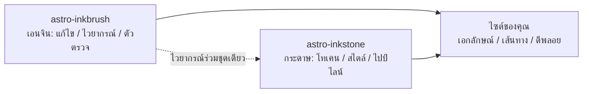

import Callout from 'astro-inkstone/components/Callout.astro';
import Hero from 'astro-inkstone/components/Hero.astro';
import Part from 'astro-inkstone/components/Part.astro';

<Hero kicker="อ้างอิง · ไปป์ไลน์ Markdown ออกแสดงสด" title="รวมทุกองค์ประกอบ" tocLabel="เกริ่น · ทำไมต้องรวมทุกอย่าง" meta="4 ภาค · ทุกสวิตช์ที่ไซต์นี้เปิด · รายการที่ตัวตรวจปัดตกอยู่ท้ายหน้า">
  ทุกองค์ประกอบของไปป์ไลน์ Markdown ของไซต์นี้ออกแสดงในหน้านี้อย่างละหนึ่งครั้ง: เครื่องหมายในบรรทัด วิกิลิงก์ ตารางที่กลายร่างเป็นการ์ด callout สามวิธีเขียน คณิตศาสตร์ กรอบโค้ด ไดอะแกรม ชอร์ตโค้ดอีโมจิ ของแถม GFM — แม้แต่เวลาอ่านในแถบด้านบนก็เป็นผลงานของไปป์ไลน์เช่นกัน การที่หน้านี้บิลด์ผ่านได้เลยนั่นแหละคือการสาธิต: ตัวตรวจเนื้อหาปัดตกทุกรูปเขียนที่ผิดรูปตามรายการท้ายหน้า สิ่งที่คุณเห็นจึงคือสิ่งที่ไวยากรณ์เฉพาะยอมรับพอดี สวิตช์สองตัวที่ไซต์นี้ปิดไว้ — พรีเซ็ตกำหนดเลขแบบ `sections` กับพรีฟิกซ์ซับพาธ `base` — อธิบายอยู่ใน[[getting-started|บทแนะนำ]]
</Hero>

<Part title="ข้อความ" />

## เครื่องหมายในบรรทัด

การแยกวิเคราะห์ตัวเน้นเป็นมิตรกับอักษร CJK: **ตัวหนาปิดตัวเองได้แม้ชนเครื่องหมายวรรคตอนจีน** — `**报文。**同时` เรนเดอร์เป็น **报文。**同时 ไม่ใช่เครื่องหมายดอกจันดิบ ๆ ส่วน *ตัวเอียง* ~~ขีดฆ่า~~ และ `โค้ดในบรรทัด` ทำงานตามปกติ เมื่อเปิดสวิตช์ `gemoji` ชอร์ตโค้ดอย่าง `:sparkles:` จะเรนเดอร์เป็น :sparkles: อักขระในโค้ดในบรรทัดไม่เข้าร่วมการแยกวิเคราะห์ใด ๆ ทั้งสิ้น backtick จึงเป็นวิธีปลอดภัยในการ*โชว์*ไวยากรณ์: `**`, `$…$` และ `> [!note]` ปรากฏตามตัวอักษรทั้งหมด ถ้าอยากแสดงดอกจันในเนื้อความ ให้ escape — \*แบบนี้\* จะคงอยู่เป็นตัวธรรมดา

## วิกิลิงก์

เมื่อเปิดสวิตช์ `wikilinks` ลิงก์ `[[วงเล็บเหลี่ยมคู่]]` จะแก้ปลายทางเทียบกับคอลเลกชันบันทึกตามธรรมเนียมวิกิ: อ้างด้วย id ([[design-tokens]] — เมื่อออกเดินทางจากหน้ามิเรอร์ภาษาไทย ลิงก์จะเข้าหามิเรอร์ภาษาเดียวกันก่อน หน้าไหนไม่มีจึงถอยไปหาต้นฉบับภาษาอังกฤษ) อ้างด้วยนามแฝง ([[boundaries]] พาไปถึงบันทึกที่ id คือ `three-way-split`) และอ้างพร้อมป้ายข้อความ ([[getting-started|บทแนะนำเริ่มต้นใช้งาน]]) เป้าหมายที่แก้ไม่สำเร็จจะเรนเดอร์เป็นลิงก์เสียที่ทำเครื่องหมายไว้ แทนที่จะทำให้บิลด์ล้ม — แล้ว CLI `check-wikilinks` ของเอนจินจะรายงานมันใน CI ซึ่งเป็นที่ที่ลิงก์ผุ ๆ ควรถูกจับ

## ตาราง: กว้างก็เลื่อน แคบก็กลายเป็นการ์ด

ตารางตั้งแต่หกคอลัมน์ขึ้นไปควรพับตัวเป็นการ์ดแถวละใบเมื่ออยู่ในกล่องแคบ แทนที่จะบีบทุกช่องจนเหลือสองตัวอักษร ตารางเจ็ดคอลัมน์ข้างล่างนี้เป็นทั้งตารางสรุป callout ทุกรูปแบบ และการทดสอบการพับตัวนั้นแบบสด ๆ (ลองย่อหน้าต่างให้แคบเท่าจอโทรศัพท์ดู):

| รูปแบบ | คลาส | คีย์เวิร์ดในไวยากรณ์อ้างอิง | เส้นขอบ | พื้น | ชื่อเริ่มต้น | ใช้กับอะไร |
| --- | --- | --- | --- | --- | --- | --- |
| note | `callout` | `note` `info` | 赭 `--color-accent3` | พื้นสูตร `--color-math-bg` | Note | หมายเหตุประกอบทั่วไป |
| intuition | `callout intuition` | `tip` `intuition` `hint` | 黛 `--color-accent2` | พื้นสูตร | Intuition | คำอุปมาที่ช่วยให้เห็นภาพ |
| warn | `callout warn` | `warn` `warning` `caution` `danger` | 石 `--color-accent` | สีเน้นผสม 8% | Warning | คำเตือนก่อนขั้นตอนที่พลาดได้ |
| system | `callout system` | `important` `system` | 紫 `--color-accent4` | สีม่วงผสม 8% | Important | ธรรมเนียมระดับระบบ |
| abstract | `callout abstract` | `abstract` `summary` `quote` | หมึกจาง `--color-ink-faint` | ผิวนุ่ม `--color-bg-soft` | Abstract | บทสรุปเปิดบท |
| bad | `callout bad` | (HTML ดิบเท่านั้น) | 石 ส้มไหม้ | สีเน้นผสม 10% | — | บันทึกความผิดพลาดและแบบที่ถูกปัดตก |

ชื่อเริ่มต้นเป็นภาษาอังกฤษ ไซต์เปลี่ยนทั้งชุดได้ผ่านออปชัน `calloutLabels` ของ `siteMarkdown` เช่น `calloutLabels: { tip: 'เห็นภาพ · Intuition' }` ส่วนชื่อที่เขียนในไวยากรณ์อ้างอิง (`> [!tip] ชื่อของฉัน`) ชนะเสมอ

<Part title="Callout กับคณิตศาสตร์" />

## Callout: สามวิธีเขียน

แบบแรก ไวยากรณ์อ้างอิงสไตล์ Obsidian/GitHub (มากับ `callouts: true` ใช้ในไฟล์ Markdown ธรรมดาได้ด้วย):

> [!tip] ทำไมต้องมีสามวิธีเขียน
> ไวยากรณ์อ้างอิงรับใช้ไฟล์ Markdown ธรรมดาและบันทึกที่นำเข้าจากกล่องขาเข้า คอมโพเนนต์รับใช้ MDX ส่วน HTML ดิบคือฐานร่วมใต้ทั้งสองแบบ — ทั้งสามทางเรนเดอร์ออกมาเป็นมาร์กอัป `<aside class="callout …">` ชุดเดียวกัน

เครื่องหมายพับของ Obsidian ก็ใช้ได้ — `> [!note]-` เรนเดอร์แบบพับไว้ ส่วน `> [!note]+` เปิดอยู่:

> [!note]- โน้ตที่พับไว้
> คลิกที่ชื่อเพื่อเปิด callout ที่พับได้เรนเดอร์เป็น `<details>` โดยชื่อกลายเป็น `<summary>` ของมัน

แบบที่สอง คอมโพเนนต์ของแพ็กเกจใน MDX (`astro-inkstone/components/Callout.astro` นำเข้าตามพาธ) ถ้าไม่ส่ง `title` มันจะแสดงป้ายเริ่มต้นของรูปแบบนั้น ป้ายเดียวกับที่ไวยากรณ์อ้างอิงใช้:

<Callout variant="warn" title="props ของคอมโพเนนต์ไม่เรนเดอร์ markdown">
  prop ชื่อ title เป็นสตริงล้วน — ห้ามมีดอกจันหรือเครื่องหมายดอลลาร์ในนั้น รายการอนุญาต renderedProps ของตัวตรวจเนื้อหามีไว้คุมเรื่องนี้โดยเฉพาะ
</Callout>

แบบที่สาม HTML ดิบ ทั้งหกรูปแบบในชุดเดียว (ตรงกับกฎ `.callout` ใน `base.css` หนึ่งต่อหนึ่ง):

<div class="callout">
  <div class="callout-title">หมายเหตุ</div>
  ข้อความประกอบโทนกลาง ๆ คลาส <code>.callout</code> เพียว ๆ ก็คือแบบนี้เอง
</div>

<div class="callout intuition">
  <div class="callout-title">เห็นภาพ</div>
  ขอบซ้ายสีเขียวหัวเป็ด สำหรับย่อหน้าที่เล่าว่า<em>ควรนึกถึงมันอย่างไร</em> ไม่ใช่<em>มันคืออะไร</em>
</div>

<div class="callout warn">
  <div class="callout-title">คำเตือน</div>
  ขอบซ้ายสีส้มไหม้บนพื้นสีเน้นผสม 8% — โผล่มาก่อนขั้นตอนที่อาจพลาด
</div>

<div class="callout system">
  <div class="callout-title">ระบบ</div>
  ขอบซ้ายสีม่วง สำหรับธรรมเนียมระดับระบบ: เข้าใจก่อนว่ามันมีไว้ทำไม แล้วค่อยแก้
</div>

<div class="callout abstract">
  <div class="callout-title">บทคัดย่อ</div>
  ขอบหมึกจางบนผิวนุ่ม สำหรับภาพรวมสั้น ๆ ที่หัวบท
</div>

<div class="callout bad">
  <div class="callout-title">ตัวอย่างพลาด</div>
  ไว้บันทึกความผิดพลาดและงานที่ถูกปัดตก ถ้าไม่มีรูปแบบนี้ ข้อเท็จจริงว่าอะไรสักอย่างผิด จะเลือนหายไปเงียบ ๆ
</div>

## คณิตศาสตร์

สูตรในบรรทัดนั่งอยู่ในเนื้อความ: ความลึกเชิงแสงอ่านว่า $\tau = \int \kappa \rho \, \mathrm{d}s$ ส่วนสูตรแบบ display ใช้ฟอร์มสามบรรทัด (`$$` อยู่บรรทัดของตัวเอง) — ตัวตรวจปัดตกฟอร์มบรรทัดเดียว ซึ่งจะแอบเรนเดอร์เป็นสูตรในบรรทัดตัวเล็ก ๆ แทน:

$$
\int_0^1 x^2 \, \mathrm{d}x = \frac{1}{3}
$$

พื้นของสูตรจงใจใช้กระดาษคนละผืนกับเนื้อความ และสลับตามธีม อ้อ — ราคาที่เป็นเงินดอลลาร์ในเนื้อความต้อง escape: กาแฟแก้วนี้ราคา \$3

<Part title="โค้ดกับไดอะแกรม" />

## กรอบโค้ด

บล็อกโค้ดที่มี `title="…"` จะได้แถบชื่อไฟล์ ปุ่มคัดลอกที่มุมมีทุกที่ทั้งไซต์ ส่วนบรรทัดกำกับ `[!code ++]` / `[!code --]` เรนเดอร์เป็นพื้นแบบ diff:

```python title="pipeline.py"
def build_pipeline(opts):
    plugins = [remark_math]  # [!code --]
    plugins = [remark_gemoji, remark_math]  # [!code ++]
    return assemble(plugins, guard=opts.guard)
```

กรอบที่ติดป้าย `collapse` เริ่มต้นแบบพับไว้ และกินที่ต่อเมื่อถูกเปิด — เหมาะกับไฟล์คอนฟิกยาว ๆ:

```yaml title="inkstone.example.yaml" collapse
site:
  markdown:
    numbering: chapters
    math: true
    codeFrame: true
    mermaid: true
    callouts: true
    wikilinks: true
  styles:
    - astro-inkstone/styles/tokens.css
    - astro-inkstone/styles/base.css
```

การไฮไลต์รองรับสองธีมเพราะ shiki ปล่อยชุดสีทั้งสองออกมาพร้อมกัน `base.css` เลือกใช้ชุดเดียวตาม `data-theme` ที่จุดเดียว — ไม่มีศึกแย่ง specificity

## ไดอะแกรม Mermaid

บล็อก ` ```mermaid ` ทิ้งไว้แค่ตัวยึดตำแหน่งตอนบิลด์ ตัวเรนเดอร์ถูกโหลดแบบไดนามิกเฉพาะบนหน้าที่มีไดอะแกรม (หน้าที่ไม่มีไม่จ่ายอะไรเลย) และเรนเดอร์ใหม่เมื่อธีมพลิก:



## ของแถมจาก GFM

รายการงานและเชิงอรรถมากับ GFM:

- [x] นำเข้าโทเคนแล้ว
- [x] นำเข้า base.css แล้ว
- [ ] โอเวอร์ไรด์จานสีเอกลักษณ์แล้ว

ข้ออ้างที่ควรมีแหล่งอ้างอิงก็ใส่เชิงอรรถได้[^src]

[^src]: เชิงอรรถเรนเดอร์ที่ท้ายหน้าพร้อมลิงก์ย้อนกลับ จัดสไตล์โดยชั้นเนื้อหา

<Part title="ตัวตรวจ" />

## ตัวตรวจปัดตกอะไรในหน้านี้

การที่หน้านี้บิลด์ผ่าน คือหลักฐานในตัวว่าทุกอย่างข้างบนเขียนถูกรูป ส่วนรูปเขียนต่อไปนี้จะทำให้บิลด์ล้มทันที (ลองสักอัน แล้วรัน `npm run build`):

- เครื่องหมายเน้นที่จับคู่ไม่ได้ เช่น `**` ที่ถูกทิ้งไว้ไม่ปิดตรงท้ายบรรทัด
- `$$x$$` บรรทัดเดียว (ต้องใช้ฟอร์มสามบรรทัด)
- หัวข้อที่พิมพ์เลขเอง — เขียนหัวข้อของส่วนนี้เป็น `## 9. ตัวตรวจปัดตกอะไร…` จะชนกับการกำหนดเลขตอนบิลด์ และถูกตีธง
- ปล่อยให้ MDX ประเมินวงเล็บปีกกาในเนื้อความ: `{0,1,2,3}` จะเรนเดอร์เหลือแค่ `3` ตัวตรวจจึงบังคับรูป escape \{0,1,2,3\}
- สูตรที่ KaTeX เรนเดอร์ไม่ได้ (ตัวตรวจเรนเดอร์ทุกสูตรซ้ำในโหมด strict แทนที่จะปล่อยข้อความแดง ๆ หลุดขึ้นหน้า)
