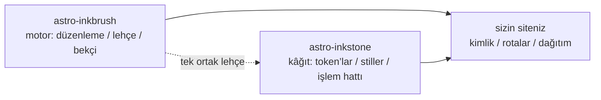

import Callout from 'astro-inkstone/components/Callout.astro';
import Hero from 'astro-inkstone/components/Hero.astro';
import Part from 'astro-inkstone/components/Part.astro';

<Hero kicker="Referans · Markdown işlem hattı, sahnede" title="Hepsi bir arada" tocLabel="Giriş · neden böyle bir sayfa" meta="4 kısım · bu sitenin açtığı her anahtar · bekçinin reddettikleri sonda listeli">
  Bu sitenin Markdown işlem hattındaki her öge bu sayfada birer kez sahne alır: satır içi imler, wikilink’ler, daralınca karta dönüşen tablolar, üç ayrı yazımıyla callout’lar, matematik, kod çerçeveleri, diyagramlar, emoji kısayolları, GFM ekleri — yukarıdaki şeritteki okuma süresi bile işlem hattının işidir. Sayfanın derlenebiliyor olması gösterinin ta kendisidir: içerik bekçisi, sonda listelenen bozuk yazımların hepsini reddeder; gördüğünüz, lehçenin kabul ettiğidir. Bu sitenin kapalı bıraktığı iki anahtar — `sections` numaralandırma ön ayarı ile `base` alt yol öneki — [[getting-started|rehberde]] anlatılır.
</Hero>

<Part title="Metin" />

## Satır içi imler

Vurgu ayrıştırması CJK dostudur: **kalın, Çince noktalama işaretlerine yaslanınca da kapanır** — `**报文。**同时`, iki yalın yıldız olarak değil, **报文。**同时 olarak çizilir. *İtalik*, ~~üstü çizili~~ ve `satır içi kod` her zamanki gibi çalışır; `gemoji` anahtarı açıkken `:sparkles:` gibi bir kısayol :sparkles: olarak görünür. Satır içi kodun içindeki karakterler hiçbir ayrıştırmaya girmez; sözdizimini *göstermenin* güvenli yolu bu yüzden ters tırnaktır: `**`, `$…$` ve `> [!note]` üçü de olduğu gibi görünür. Düz metinde yıldızın kendisini göstermek içinse kaçış kullanın — \*böyle\* yalın kalır.

## Wikilink’ler

`wikilinks` anahtarı açıkken `[[çift köşeli]]` bağlantılar, bir wikinin beklediği gibi not koleksiyonuna karşı çözülür: id ile ([[design-tokens]] — Türkçe bir ayna sayfadan bakınca önce aynı dildeki ayna bulunur, ancak o yoksa İngilizce asıl nota düşülür), takma adla ([[boundaries]], id’si `three-way-split` olan nota ulaşır) ve okunabilir etiketle ([[getting-started|hızlı başlangıç rehberi]]). Hiçbir şeye çözülmeyen bir hedef, derlemeyi düşürmek yerine işaretli bir ölü bağlantı olarak çizilir — motorun `check-wikilinks` CLI’si onu CI’da raporlar; bağlantı çürümesinin yeri orasıdır.

## Tablolar: genişse kaydırma, darsa kart

Altı ve daha çok sütunlu bir tablo, dar bir kapta her hücreyi iki karaktere sıkıştırmak yerine satır başına bir karta dönüşmelidir. Aşağıdaki yedi sütunlu tablo hem callout varyantlarının kopya kâğıdı hem de bu dönüşümün canlı sınamasıdır (pencereyi telefon genişliğine daraltın):

| Varyant | Sınıf | Alıntı sözdizimi anahtar sözcükleri | Kenarlık | Zemin | Varsayılan başlık | Tipik kullanım |
| --- | --- | --- | --- | --- | --- | --- |
| note | `callout` | `note` `info` | 赭 aşı sarısı `--color-accent3` | matematik zemini `--color-math-bg` | Note | nötr kenar notları |
| intuition | `callout intuition` | `tip` `intuition` `hint` | 黛 petrol yeşili `--color-accent2` | matematik zemini | Intuition | sezgi kuran benzetmeler |
| warn | `callout warn` | `warn` `warning` `caution` `danger` | 石 yanık turuncu `--color-accent` | %8 vurgu karışımı | Warning | riskli adımdan önce uyarı |
| system | `callout system` | `important` `system` | 紫 menekşe `--color-accent4` | %8 menekşe karışımı | Important | sistem düzeyi kurallar |
| abstract | `callout abstract` | `abstract` `summary` `quote` | soluk mürekkep `--color-ink-faint` | yumuşak yüzey `--color-bg-soft` | Abstract | bölüm başı özetleri |
| bad | `callout bad` | (yalnızca ham HTML) | 石 yanık turuncu | %10 vurgu karışımı | — | kayda geçen hatalar, elenen tasarımlar |

Varsayılan başlıklar İngilizcedir; bir site bütün takımı `siteMarkdown`’ın `calloutLabels` seçeneğiyle değiştirir, örneğin `calloutLabels: { tip: 'Sezgi · Intuition', warn: 'Uyarı · Warning' }`. Alıntı sözdiziminde yazılan başlık (`> [!tip] Kendi başlığım`) her zaman kazanır.

<Part title="Callout ve matematik" />

## Callout: üç yazım

Birincisi, Obsidian/GitHub alıntı sözdizimi (`callouts: true` ile gelir; düz Markdown dosyalarında da çalışır):

> [!tip] Neden üç yazım
> Alıntı sözdizimi, düz Markdown’a ve gelen kutusundan içe aktarılan notlara hizmet eder; bileşen MDX’e; ham HTML ise ikisinin altındaki ortak taban katmanıdır — üçü de aynı `<aside class="callout …">` işaretlemesini üretir.

Obsidian’ın katlama imi de tanınır — `> [!note]-` katlanmış, `> [!note]+` açık çizilir:

> [!note]- Katlanmış bir not
> Açmak için başlığa tıklayın. Katlanmış callout’lar `<details>` olarak çizilir; başlıkları onların `<summary>` ögesidir.

İkincisi, MDX’te paket bileşeni (`astro-inkstone/components/Callout.astro`, yoldan import edilir). `title` verilmezse varyantın varsayılan etiketini gösterir — alıntı sözdiziminin kullandığının aynısını:

<Callout variant="warn" title="Bileşen prop’ları markdown çizmez">
  title prop’u düz bir dizgedir — içine yıldız ya da dolar işareti girmez. İçerik bekçisinin renderedProps beyaz listesi tam olarak bunu denetlemek için vardır.
</Callout>

Üçüncüsü, ham HTML — altı varyantın hepsi bir arada (`base.css`’in `.callout` kurallarıyla bire bir):

<div class="callout">
  <div class="callout-title">Not</div>
  Nötr bir kenar notu. Yalın <code>.callout</code> sınıfı tam olarak budur.
</div>

<div class="callout intuition">
  <div class="callout-title">Sezgi</div>
  Petrol yeşili sol kenar — <em>bunun ne olduğu</em> değil, <em>nasıl düşünüleceği</em> üzerine paragraflar için.
</div>

<div class="callout warn">
  <div class="callout-title">Uyarı</div>
  %8 vurgu karışımı zemin üzerinde yanık turuncu sol kenar — ters gidebilecek adımın hemen öncesinde belirir.
</div>

<div class="callout system">
  <div class="callout-title">Sistem</div>
  Menekşe sol kenar, sistem düzeyi kurallar için: değiştirmeden önce neden var olduğunu anlayın.
</div>

<div class="callout abstract">
  <div class="callout-title">Özet</div>
  Yumuşak yüzey üzerinde soluk mürekkep kenarı — bir bölümün başındaki hızlı genel bakış için.
</div>

<div class="callout bad">
  <div class="callout-title">Kötü</div>
  Hataları ve elenen gerçekleştirimleri kayda geçirir. Bu varyant olmasa, bir şeyin yanlış olduğu bilgisi sessizce kaybolur.
</div>

## Matematik

Satır içi formüller metnin içinde oturur: optik derinlik $\tau = \int \kappa \rho \, \mathrm{d}s$ diye okunur. Blok matematik üç satırlık biçimi alır (`$$` kendi satırlarında) — bekçi tek satırlık biçimi reddeder, çünkü o biçim sessizce küçük bir satır içi formüle dönüşür:

$$
\int_0^1 x^2 \, \mathrm{d}x = \frac{1}{3}
$$

Formül zemini bilerek gövdeninkinden ayrı bir kâğıttır ve temayla birlikte değişir. Bu arada, düz metindeki dolar fiyatlarını kaçışlayın: bu kahve \$3 eder.

<Part title="Kod ve diyagramlar" />

## Kod çerçeveleri

`title="…"` taşıyan bir kod bloğu dosya adlı bir başlık çubuğu alır; köşedeki kopyalama düğmesi site genelidir. `[!code ++]` / `[!code --]` satır imleri diff zeminleri olarak çizilir:

```python title="pipeline.py"
def build_pipeline(opts):
    plugins = [remark_math]  # [!code --]
    plugins = [remark_gemoji, remark_math]  # [!code ++]
    return assemble(plugins, guard=opts.guard)
```

`collapse` işaretli bir çerçeve katlanmış başlar ve yalnızca açıldığında yer kaplar — uzun yapılandırma dosyaları için biçilmiş kaftan:

```yaml title="inkstone.example.yaml" collapse
site:
  markdown:
    numbering: chapters
    math: true
    codeFrame: true
    mermaid: true
    callouts: true
    wikilinks: true
  styles:
    - astro-inkstone/styles/tokens.css
    - astro-inkstone/styles/base.css
```

Çift temalı vurgulama, shiki’nin iki renk takımını aynı anda üretmesinden gelir; `base.css` hangisinin kullanılacağını `data-theme` üzerinden tek bir yerde seçer — özgüllük çekişmesi yoktur.

## Mermaid diyagramları

Bir ` ```mermaid ` bloğu derleme sırasında yalnızca bir yer tutucu bırakır; çizici, sadece diyagram taşıyan sayfalarda dinamik olarak yüklenir (diyagramsız sayfalar hiçbir bedel ödemez) ve tema değişince yeniden çizer:



## GFM ekleri

Görev listeleri ve dipnotlar GFM ile birlikte gelir:

- [x] token’lar import edildi
- [x] base.css import edildi
- [ ] kimlik paleti geçersiz kılındı

Kaynak göstermeye değer bir iddia dipnot alır.[^src]

[^src]: Dipnotlar sayfa dibinde, geri bağlantılarıyla çizilir; stilleri içerik katmanından gelir.

<Part title="Bekçi" />

## Bekçinin bu sayfada reddettikleri

Bu sayfanın derlenebiliyor olması, yukarıdaki her şeyin düzgün biçimli olduğunun kanıtıdır. Şu yazımlar derlemeyi anında düşürür (birini deneyin, sonra `npm run build` çalıştırın):

- eşleşemeyen bir vurgu imi — satır sonunda açık bırakılmış bir `**` gibi;
- tek satırlık `$$x$$` (üç satırlık biçimi kullanın);
- elle numaralanmış başlıklar — bu bölümün başlığını `## 9. Bekçinin reddettikleri…` diye yazmak, derleme zamanı numaralandırmayla çakışır ve yakalanır;
- düz metindeki süslü ayraçların MDX tarafından değerlendirilmesi: `{0,1,2,3}` yalnızca `3` olarak çizilirdi — bekçi bu yüzden kaçışlı biçimi ister: \{0,1,2,3\};
- KaTeX’in çizemediği bir formül (bekçi her formülü strict kipte yeniden çizer; kırmızı hata metninin yayına çıkmasına izin vermez).
