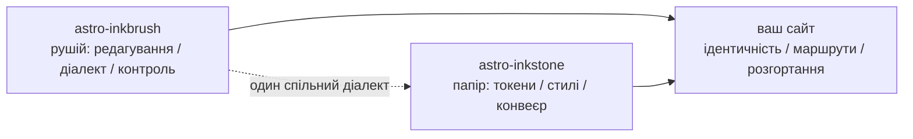

import Callout from 'astro-inkstone/components/Callout.astro';
import Hero from 'astro-inkstone/components/Hero.astro';
import Part from 'astro-inkstone/components/Part.astro';

<Hero kicker="Довідник · конвеєр Markdown у дії" title="Демонстраційний стенд" tocLabel="Вступ · навіщо цей стенд" meta="4 частини · кожен перемикач, який вмикає цей сайт · перелік відмов контролю наприкінці">
  Кожен елемент конвеєра Markdown цього сайту виступає на цій сторінці рівно один раз: рядкові позначки, вікіпосилання, таблиці, що обертаються на картки, callout у трьох написаннях, математика, кодові рамки, діаграми, emoji-шорткоди, додатки GFM — і час читання в смузі вгорі теж порахував конвеєр. Те, що сторінка взагалі збирається, і є демонстрацією: контроль вмісту відкидає кожне зіпсоване написання з переліку наприкінці, тож ви бачите рівно те, що приймає діалект. Два перемикачі, які цей сайт лишає вимкненими, — пресет нумерації `sections` і префікс підшляху `base` — описано в [[getting-started|інструкції]].
</Hero>

<Part title="Текст" />

## Рядкові позначки

Розбір виділення дружній до CJK: **жирний закривається навіть упритул до китайської пунктуації** — `**报文。**同时` рендериться як **报文。**同时, а не як буквальні зірочки. *Курсив*, ~~закреслення~~ та `рядковий код` працюють як завжди; з увімкненим `gemoji` шорткод на кшталт `:sparkles:` рендериться як :sparkles:. Символи всередині рядкового коду не беруть участі в жодному розборі, тож зворотні лапки — безпечний спосіб *показати* синтаксис: `**`, `$…$` і `> [!note]` з’являються буквально. Щоб показати зірочку в тексті, екрануйте її — \*отак\* лишається простим текстом.

## Вікіпосилання

З увімкненим `wikilinks` посилання `[[у подвійних дужках]]` розв’язуються по колекції нотаток так, як і належить вікі: за id ([[design-tokens]] — з українського дзеркала спершу шукається дзеркало тією самою мовою, і лише за його відсутності посилання веде до англійського оригіналу), за псевдонімом ([[boundaries]] досягає нотатки з id `three-way-split`) і з підписом ([[getting-started|інструкція швидкого старту]]). Ціль, яку не вдалося розв’язати, рендериться позначеним мертвим посиланням, а не валить збірку — про неї звітує рушіїв `check-wikilinks` у CI, де гниттю посилань і місце.

## Таблиці: прокручування в широкому контейнері, картки у вузькому

Таблиця на шість і більше колонок у вузькому контейнері має перекладатися по картці на рядок, а не тиснути кожну клітинку до двох символів. Ця семиколонкова таблиця — водночас шпаргалка варіантів callout і жива перевірка того перекладання (звузьте вікно до ширини телефона):

| Варіант | Клас | Ключові слова синтаксису цитат | Рамка | Тло | Типовий заголовок | Типове застосування |
| --- | --- | --- | --- | --- | --- | --- |
| note | `callout` | `note` `info` | 赭 вохра `--color-accent3` | тло формул `--color-math-bg` | Note | нейтральні примітки збоку |
| intuition | `callout intuition` | `tip` `intuition` `hint` | 黛 бірюза `--color-accent2` | тло формул | Intuition | аналогії, що будують інтуїцію |
| warn | `callout warn` | `warn` `warning` `caution` `danger` | 石 палений жовтогарячий `--color-accent` | суміш 8% акценту | Warning | застереження перед ризикованим кроком |
| system | `callout system` | `important` `system` | 紫 фіолет `--color-accent4` | суміш 8% фіолету | Important | системні домовленості |
| abstract | `callout abstract` | `abstract` `summary` `quote` | бліда туш `--color-ink-faint` | м’яка поверхня `--color-bg-soft` | Abstract | стислі огляди на початку розділу |
| bad | `callout bad` | (лише сирий HTML) | 石 палений жовтогарячий | суміш 10% акценту | — | зафіксовані помилки, відхилені рішення |

Типові заголовки — англійські; сайт міняє весь набір через опцію `calloutLabels` у `siteMarkdown`, напр. `calloutLabels: { tip: 'Інтуїція', warn: 'Попередження' }`. Заголовок, написаний у синтаксисі цитат (`> [!tip] Мій заголовок`), завжди переважає.

<Part title="Callout і математика" />

## Callout: три написання

Перше — синтаксис цитат у стилі Obsidian/GitHub (доступний із `callouts: true`, працює й у файлах із чистим Markdown):

> [!tip] Навіщо аж три написання
> Синтаксис цитат обслуговує чистий Markdown і нотатки, імпортовані з вхідних; компонент обслуговує MDX; сирий HTML — спільний ґрунт під обома. Усі три рендерять ту саму розмітку `<aside class="callout …">`.

Позначка згортання з Obsidian теж шанується: `> [!note]-` рендериться згорнутим, `> [!note]+` — розгорнутим:

> [!note]- Згорнута нотатка
> Клацніть заголовок, щоб розгорнути. Згорнуті callout-и рендеряться як `<details>` із заголовком у ролі `<summary>`.

Друге — компонент пакета в MDX (`astro-inkstone/components/Callout.astro`, імпорт за шляхом). Без `title` він показує типовий підпис варіанта — той самий, що й у синтаксису цитат:

<Callout variant="warn" title="Пропси компонента не рендерять markdown">
  Проп title — простий рядок: жодних зірочок чи знаків долара всередині. Білий список renderedProps у контролі вмісту існує саме для того, щоб це пильнувати.
</Callout>

Третє — сирий HTML, усі шість варіантів за один прохід (один в один із правилами `.callout` у `base.css`):

<div class="callout">
  <div class="callout-title">Нотатка</div>
  Нейтральна примітка. Клас <code>.callout</code> без модифікаторів — це саме вона.
</div>

<div class="callout intuition">
  <div class="callout-title">Інтуїція</div>
  Бірюзовий лівий кант — для абзаців про те, <em>як це уявити</em>, а не <em>що це таке</em>.
</div>

<div class="callout warn">
  <div class="callout-title">Попередження</div>
  Лівий кант паленого жовтогарячого над тлом із 8% акценту — з’являється перед кроком, який може піти не так.
</div>

<div class="callout system">
  <div class="callout-title">Система</div>
  Фіолетовий лівий кант — для системних домовленостей: спершу зрозумійте, навіщо вона існує, а вже потім міняйте.
</div>

<div class="callout abstract">
  <div class="callout-title">Анотація</div>
  Кант блідою тушшю на м’якій поверхні — для швидкого огляду на чолі розділу.
</div>

<div class="callout bad">
  <div class="callout-title">Антиприклад</div>
  Фіксує помилки та відхилені реалізації. Без цього варіанта сам факт «це неправильно» губиться мовчки.
</div>

## Математика

Рядкові формули сидять просто в тексті: оптична товща записується як $\tau = \int \kappa \rho \, \mathrm{d}s$. Виносна математика бере трирядкову форму (`$$` на окремих рядках) — однорядкову контроль відкидає, бо вона мовчки відрендерилася б маленькою рядковою формулою:

$$
\int_0^1 x^2 \, \mathrm{d}x = \frac{1}{3}
$$

Тло формул — навмисно інший папір, ніж у тексту, і воно міняється разом із темою. Принагідно: ціни в доларах у тексті екрануйте — ця кава коштує \$3.

<Part title="Код і діаграми" />

## Кодові рамки

Огорожа з `title="…"` дістає смугу заголовка з іменем файлу; кнопка копіювання в кутку єдина на весь сайт. Рядкові анотації `[!code ++]` / `[!code --]` рендеряться тлом diff-а:

```python title="pipeline.py"
def build_pipeline(opts):
    plugins = [remark_math]  # [!code --]
    plugins = [remark_gemoji, remark_math]  # [!code ++]
    return assemble(plugins, guard=opts.guard)
```

Рамка з позначкою `collapse` починає згорнутою і займає місце, лише коли її розгорнуть — саме те для довгих конфігураційних файлів:

```yaml title="inkstone.example.yaml" collapse
site:
  markdown:
    numbering: chapters
    math: true
    codeFrame: true
    mermaid: true
    callouts: true
    wikilinks: true
  styles:
    - astro-inkstone/styles/tokens.css
    - astro-inkstone/styles/base.css
```

Двотемне підсвічування дає shiki, який видає обидва набори кольорів одразу; `base.css` вибирає один за `data-theme` в одному-єдиному місці — без перетягування специфічності.

## Діаграми mermaid

Огорожа ` ```mermaid ` на етапі збірки лишає тільки заглушку; рендерер довантажується динамічно лише на сторінках із діаграмою (сторінки без неї не платять нічого) і перемальовує її, коли перемикається тема:



## Додатки GFM

Списки завдань і виноски їдуть разом із GFM:

- [x] токени імпортовано
- [x] base.css імпортовано
- [ ] палітру ідентичності перевизначено

Твердження, варте джерела, дістає виноску.[^src]

[^src]: Виноски рендеряться внизу сторінки зі зворотними посиланнями; стилі дає шар вмісту.

<Part title="Контроль" />

## Що контроль відкидає на цій сторінці

Те, що ця сторінка збирається, якраз і доводить: усе вище — правильної форми. Ось написання, які завалили б збірку на місці (спробуйте одне, а тоді `npm run build`):

- маркер виділення, якому немає пари, — як-от `**`, покинутий незакритим наприкінці рядка;
- однорядкове `$$x$$` (пишіть трирядкову форму);
- нумерація заголовків руками — запис заголовка цього розділу як `## 9. Що контроль…` зіткнувся б із нумерацією часу збірки й був би відхилений;
- MDX, що обчислює фігурні дужки в тексті: `{0,1,2,3}` відрендерилося б самою лише трійкою, тому контроль вимагає екранованої форми \{0,1,2,3\};
- формула, яку KaTeX не може відрендерити (контроль наново рендерить кожну формулу в суворому режимі, замість пускати на сторінку червоний текст помилки).
