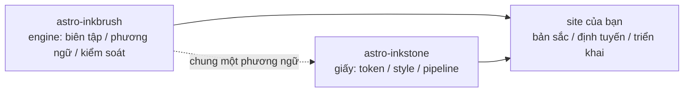

import Callout from 'astro-inkstone/components/Callout.astro';
import Hero from 'astro-inkstone/components/Hero.astro';
import Part from 'astro-inkstone/components/Part.astro';

<Hero kicker="Tham khảo · pipeline Markdown lên sân khấu" title="Trình diễn tổng hợp" tocLabel="Mở đầu · vì sao có trang này" meta="4 phần · mọi công tắc site này bật · các cách viết bị từ chối liệt kê ở cuối">
  Từng yếu tố trong pipeline Markdown của site này lên sân khấu đúng một lần trên trang này: dấu nhấn trong dòng, wikilink, bảng biết biến thành thẻ, callout với ba cách viết, toán, khung mã, sơ đồ, shortcode emoji, các món kèm theo GFM — cả dòng thời gian đọc trên dải phía trên cũng là của pipeline. Việc trang này build được đã tự nó là màn trình diễn: lớp kiểm soát nội dung từ chối mọi cách viết hỏng liệt kê ở cuối trang, nên thứ bạn thấy chính là thứ phương ngữ chấp nhận. Hai công tắc site này để tắt — preset đánh số `sections` và tiền tố đường dẫn con `base` — được mô tả trong [[getting-started|bài hướng dẫn]].
</Hero>

<Part title="Văn bản" />

## Dấu nhấn trong dòng

Phép phân tích nhấn mạnh thân thiện với CJK: **chữ đậm vẫn đóng được ngay sát dấu câu toàn khổ** — `**报文。**同时` render thành **报文。**同时 chứ không phải mấy dấu sao trơ ra. *Nghiêng*, ~~gạch ngang~~ và `mã trong dòng` hoạt động như thường; bật công tắc `gemoji` thì shortcode kiểu `:sparkles:` render thành :sparkles:. Ký tự nằm trong mã trong dòng không tham gia bất kỳ phép phân tích nào, nên cặp backtick là cách an toàn để *trưng* cú pháp: `**`, `$…$` và `> [!note]` đều hiện nguyên văn. Muốn hiện một dấu sao giữa câu văn, hãy thoát nó — \*như thế này\* thì giữ nguyên.

## Wikilink

Bật công tắc `wikilinks`, liên kết `[[hai-ngoặc-vuông]]` phân giải trên tập ghi chú đúng theo lối wiki: theo id ([[design-tokens]] — đi từ trang tiếng Việt, liên kết ưu tiên rơi vào bản dịch cùng ngôn ngữ, thiếu bản dịch mới rơi về bản gốc tiếng Anh), theo bí danh ([[boundaries]] dẫn đến ghi chú có id `three-way-split`), và kèm nhãn đọc được ([[getting-started|bài hướng dẫn bắt đầu sử dụng]]). Đích không phân giải được sẽ render thành liên kết chết có đánh dấu thay vì đánh hỏng bản build — CLI `check-wikilinks` của engine sẽ báo nó trong CI, nơi chuyện liên kết mục nát thuộc về.

## Bảng: rộng thì cuộn, hẹp thì thành thẻ

Bảng từ sáu cột trở lên nên tự xếp lại mỗi hàng thành một thẻ trong khung hẹp, thay vì ép mỗi ô còn hai ký tự. Bảng bảy cột dưới đây vừa là bảng tra nhanh các biến thể callout, vừa là phép thử sống của chính cơ chế xếp thẻ ấy (thu cửa sổ về cỡ điện thoại mà xem):

| Biến thể | Class | Từ khóa cú pháp trích dẫn | Viền | Nền | Tiêu đề mặc định | Dùng khi |
| --- | --- | --- | --- | --- | --- | --- |
| note | `callout` | `note` `info` | 赭 đất son `--color-accent3` | nền toán `--color-math-bg` | Note | lời chú trung tính bên lề |
| intuition | `callout intuition` | `tip` `intuition` `hint` | 黛 xanh cổ vịt `--color-accent2` | nền toán | Intuition | phép ví von gây dựng trực giác |
| warn | `callout warn` | `warn` `warning` `caution` `danger` | 石 cam cháy `--color-accent` | pha 8% màu nhấn | Warning | lời dặn trước bước dễ hỏng |
| system | `callout system` | `important` `system` | 紫 tím `--color-accent4` | pha 8% tím | Important | quy ước ở cấp hệ thống |
| abstract | `callout abstract` | `abstract` `summary` `quote` | mực mờ `--color-ink-faint` | bề mặt mềm `--color-bg-soft` | Abstract | tóm lược mở đầu chương |
| bad | `callout bad` | (chỉ viết bằng HTML thô) | 石 cam cháy | pha 10% màu nhấn | — | sai lầm được ghi sổ, thiết kế bị loại |

Tiêu đề mặc định là tiếng Anh; site thay cả bộ qua tùy chọn `calloutLabels` của `siteMarkdown`, ví dụ `calloutLabels: { tip: 'Trực giác · Intuition' }`. Tiêu đề viết ngay trong cú pháp trích dẫn (`> [!tip] Tiêu đề của tôi`) luôn thắng.

<Part title="Callout và toán" />

## Callout: ba cách viết

Thứ nhất, cú pháp trích dẫn kiểu Obsidian/GitHub (có khi bật `callouts: true`, chạy được cả trong tệp Markdown thuần):

> [!tip] Vì sao lại có ba cách viết
> Cú pháp trích dẫn phục vụ Markdown thuần và ghi chú nhập từ hộp thư nháp; thành phần phục vụ MDX; HTML thô là lớp nền chung bên dưới cả hai — cả ba đều render ra cùng một markup `<aside class="callout …">`.

Dấu gấp của Obsidian được tôn trọng — `> [!note]-` render ở trạng thái gấp, `> [!note]+` ở trạng thái mở:

> [!note]- Một ghi chú được gấp lại
> Bấm vào tiêu đề để mở. Callout gấp render thành `<details>` với tiêu đề làm `<summary>`.

Thứ hai, thành phần của gói trong MDX (`astro-inkstone/components/Callout.astro`, import theo đường dẫn). Không truyền `title` thì nó hiện nhãn mặc định của biến thể, đúng nhãn mà cú pháp trích dẫn dùng:

<Callout variant="warn" title="Props của thành phần không render markdown">
  Prop title là chuỗi trơn — đừng nhét dấu sao hay ký hiệu đô la vào đó. Danh sách trắng renderedProps của lớp kiểm soát nội dung tồn tại chính là để canh chuyện này.
</Callout>

Thứ ba, HTML thô, cả sáu biến thể trong một lượt (khớp một-một với các rule `.callout` trong `base.css`):

<div class="callout">
  <div class="callout-title">Ghi chú</div>
  Một lời chú trung tính. Class <code>.callout</code> để nguyên chính là thế này.
</div>

<div class="callout intuition">
  <div class="callout-title">Trực giác</div>
  Mép trái xanh cổ vịt, cho những đoạn nói về <em>nên hình dung nó thế nào</em> thay vì <em>nó là cái gì</em>.
</div>

<div class="callout warn">
  <div class="callout-title">Cảnh báo</div>
  Mép trái cam cháy trên nền pha 8% màu nhấn — xuất hiện ngay trước bước có thể hỏng.
</div>

<div class="callout system">
  <div class="callout-title">Hệ thống</div>
  Mép trái tím, cho quy ước ở cấp hệ thống: hiểu vì sao nó tồn tại rồi hẵng sửa.
</div>

<div class="callout abstract">
  <div class="callout-title">Tóm lược</div>
  Mép mực mờ trên bề mặt mềm, cho phần lược nhanh ở đầu chương.
</div>

<div class="callout bad">
  <div class="callout-title">Sai lầm</div>
  Ghi sổ sai lầm và những bản cài đặt bị loại. Thiếu biến thể này, việc một thứ là sai sẽ thất lạc trong im lặng.
</div>

## Toán

Công thức trong dòng nằm lẫn vào câu chữ: độ sâu quang học đọc là $\tau = \int \kappa \rho \, \mathrm{d}s$. Công thức tách dòng dùng dạng ba dòng (`$$` đứng riêng mỗi dòng) — lớp kiểm soát từ chối dạng một dòng, thứ sẽ lặng lẽ render thành công thức nhỏ trong dòng:

$$
\int_0^1 x^2 \, \mathrm{d}x = \frac{1}{3}
$$

Nền công thức cố ý là một tờ giấy khác với nền thân bài, và đổi bộ theo giao diện. Tiện thể, giá tiền đô trong câu văn nhớ thoát ký hiệu: ly cà phê này giá \$3.

<Part title="Mã và sơ đồ" />

## Khung mã

Fence có `title="…"` được thanh tiêu đề mang tên tệp; nút sao chép ở góc là thống nhất toàn site. Chú thích dòng `[!code ++]` / `[!code --]` render thành nền diff:

```python title="pipeline.py"
def build_pipeline(opts):
    plugins = [remark_math]  # [!code --]
    plugins = [remark_gemoji, remark_math]  # [!code ++]
    return assemble(plugins, guard=opts.guard)
```

Khung đánh dấu `collapse` khởi đầu ở trạng thái gấp, mở ra mới chiếm chỗ — hợp với tệp cấu hình dài:

```yaml title="inkstone.example.yaml" collapse
site:
  markdown:
    numbering: chapters
    math: true
    codeFrame: true
    mermaid: true
    callouts: true
    wikilinks: true
  styles:
    - astro-inkstone/styles/tokens.css
    - astro-inkstone/styles/base.css
```

Tô sáng hai giao diện là nhờ shiki xuất cả hai bộ màu trong một lần; `base.css` chọn một bộ theo `data-theme` tại đúng một chỗ — không có màn giằng co độ ưu tiên nào.

## Sơ đồ mermaid

Fence ` ```mermaid ` lúc build chỉ để lại chỗ giữ; trình render chỉ được nạp động trên trang có sơ đồ (trang không có thì không trả một xu nào), và tự render lại khi giao diện lật:



## Các món kèm theo GFM

Danh sách việc và cước chú đi cùng chuyến với GFM:

- [x] tokens đã import
- [x] base.css đã import
- [ ] bảng màu bản sắc đã ghi đè

Nhận định nào đáng dẫn nguồn thì gắn cước chú.[^src]

[^src]: Cước chú render ở chân trang kèm liên kết quay ngược, style do lớp nội dung cấp.

<Part title="Lớp kiểm soát" />

## Lớp kiểm soát chặn gì trên trang này

Trang này build qua được, tự nó đã chứng minh mọi thứ phía trên đều hợp lệ. Những cách viết sau sẽ đánh hỏng bản build ngay tại chỗ (muốn tận mắt thấy, thử một cái rồi chạy `npm run build`):

- dấu nhấn mạnh không ghép được cặp, kiểu một `**` bỏ ngỏ ở cuối dòng;
- `$$x$$` viết trên một dòng (phải dùng dạng ba dòng);
- đề mục đánh số tay — viết tiêu đề của mục này thành `## 9. Lớp kiểm soát…` sẽ va vào bộ đánh số lúc build và bị gắn cờ;
- MDX đem ngoặc nhọn trong câu văn ra tính: `{0,1,2,3}` sẽ chỉ còn render ra mỗi `3`, nên lớp kiểm soát đòi dạng thoát \{0,1,2,3\};
- công thức KaTeX không render nổi (lớp kiểm soát render lại từng công thức ở chế độ nghiêm ngặt, thay vì để chữ đỏ báo lỗi lọt lên trang).
