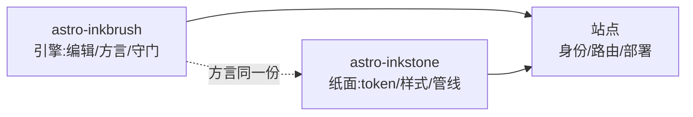

import Callout from 'astro-inkstone/components/Callout.astro';
import Hero from 'astro-inkstone/components/Hero.astro';
import Part from 'astro-inkstone/components/Part.astro';

<Hero kicker="参考 · markdown 管线全要素演示" title="全要素演示" tocLabel="引子 · 为什么要有这一页" meta="4 部 · siteMarkdown 每个开关各演一遍 · 守门拦截清单在最后">
  markdown 管线的每个要素在这一页各演一遍:行内标记、双链、会转卡的表格、三种写法的 callout、数学、代码框、图、GFM 附加件。这一页能构建出来本身就是演示——内容守门把结尾列出的每种坏写法都拦在构建外,你看到的就是方言接受的。
</Hero>

<Part title="文本" />

## 行内标记

正文强调的解析对中文友好:**加粗紧贴中文标点也能闭合**,*斜体*、~~删除线~~、`行内代码`照常;开了 `gemoji` 开关,`:sparkles:` 这样的短代码会渲染成 :sparkles:。行内代码里的字符不参与任何解析,所以讲语法时把语法放进反引号最稳:`**`、`$…$`、`> [!note]` 都能安全地字面出现。要在正文里显示星号本身,用转义——\*这样\*就不会变斜体。

## 双链

`wikilinks` 开关打开后,`[[双方括号]]` 链接按 wiki 的习惯对着笔记集解析:按 id([[design-tokens]],从中文镜像页出发会优先落到同语言镜像——本页没有的才落到英文正主)、按别名([[boundaries]] 会到达 id 为 `three-way-split` 的笔记)、带标签([[getting-started|快速上手指南]])。解析不到的目标渲染成死链标记而不是弄红构建——链接腐坏交给 CI 里的 `check-wikilinks` 报告,那才是它该在的地方。

## 表格:宽容器滚动,窄容器转卡

六列及以上的表格,在窄容器里应当一行转一卡,而不是把每格压成两三个字。下面这张七列表既是 callout 变体速查,也是转卡行为的现场验证(把窗口缩到手机宽度看):

| 变体 | 类名 | 引用语法关键词 | 边框色 | 底色 | 标题默认文案 | 典型用途 |
| --- | --- | --- | --- | --- | --- | --- |
| note | `callout` | `note` `info` | 赭 `--color-accent3` | 公式底 `--color-math-bg` | Note | 一般补充说明 |
| intuition | `callout intuition` | `tip` `intuition` `hint` | 黛 `--color-accent2` | 公式底 | Intuition | 帮助建立直觉的类比 |
| warn | `callout warn` | `warn` `warning` `caution` `danger` | 石 `--color-accent` | 石 8% 调和 | Warning | 会出事的操作前置提醒 |
| system | `callout system` | `important` `system` | 紫 `--color-accent4` | 紫 8% 调和 | Important | 系统级约定与硬规则 |
| abstract | `callout abstract` | `abstract` `summary` `quote` | 淡墨 `--color-ink-faint` | 帛 `--color-bg-soft` | Abstract | 章节开头的内容摘要 |
| bad | `callout bad` | (仅裸 HTML) | 石 | 石 10% 调和 | — | 出错的做法、被推翻的实现 |

默认标题文案是英文;中文站点在 `siteMarkdown` 里用 `calloutLabels` 整组换掉,比如 `calloutLabels: { tip: '直觉 · Intuition', warn: '注意 · Warning' }`。引用语法里自带标题(`> [!tip] 标题`)时,以自带的为准。

<Part title="callout 与数学" />

## Callout:三种写法

第一种,Obsidian/GitHub 风格引用语法(`callouts: true` 时可用,纯 Markdown 文件也能写):

> [!tip] 为什么有三种写法
> 引用语法给纯 Markdown 与收件箱导入的笔记用;组件给 MDX 用;裸 HTML 是它们共同的底层形态——三者渲染出同一套 CSS 类,视觉完全一致。

Obsidian 的折叠标记同样有效——`> [!note]-` 渲染成折叠态,`> [!note]+` 展开:

> [!note]- 一条折叠的说明
> 点标题展开。折叠的 callout 渲染成 `<details>`,标题就是它的 `<summary>`。

第二种,MDX 里用包组件(`astro-inkstone/components/Callout.astro`,按需路径导入):

<Callout variant="warn" title="组件属性不渲染 markdown">
  title 属性是纯字符串,别往里写星号或美元符——内容守门的 renderedProps 白名单机制管的就是这件事。
</Callout>

第三种,裸 HTML,六个变体全量走一遍(与 `base.css` 的 `.callout` 规则一一对应):

<div class="callout">
  <div class="callout-title">Note</div>
  中性补充。不带修饰类的 <code>.callout</code> 就是它。
</div>

<div class="callout intuition">
  <div class="callout-title">直觉 · Intuition</div>
  黛青左边,给「怎么理解」而不是「是什么」的段落。
</div>

<div class="callout warn">
  <div class="callout-title">注意 · Warning</div>
  石色(焦橙)左边,底色带 8% 石色调和——先于出事的操作出现。
</div>

<div class="callout system">
  <div class="callout-title">System</div>
  紫色左边,写系统级约定:改之前先读懂它为什么在。
</div>

<div class="callout abstract">
  <div class="callout-title">摘要 · Abstract</div>
  淡墨左边、帛色底,放章节开头的内容速览。
</div>

<div class="callout bad">
  <div class="callout-title">反例 · Bad</div>
  记录出错的做法与被推翻的实现。缺了这个变体,「这是错的」这层信息会静默丢失。
</div>

## 数学

行内公式排进行文:光深 $\tau = \int \kappa \rho \, \mathrm{d}s$ 这样写。独立公式用三行式(`$$` 各占一行),否则守门会拦下——单行形态会被静默当成行内小公式:

$$
\int_0^1 x^2 \, \mathrm{d}x = \frac{1}{3}
$$

公式底色(笺)与正文纸色有意区分,深色主题下自动换组。顺带一提,正文里的美元价格记得转义:这杯咖啡 \$3。

<Part title="代码与图" />

## 代码框

围栏加 `title="…"` 显示文件名标题栏,右上角复制按钮是全站统一的;`[!code ++]` 与 `[!code --]` 行内标注渲染成 diff 底色:

```python title="pipeline.py"
def build_pipeline(opts):
    plugins = [remark_math]  # [!code --]
    plugins = [remark_gemoji, remark_math]  # [!code ++]
    return assemble(plugins, guard=opts.guard)
```

加 `collapse` 的代码框默认折叠,展开才占版面——放长配置文件正合适:

```yaml title="inkstone.example.yaml" collapse
site:
  markdown:
    numbering: chapters
    math: true
    codeFrame: true
    mermaid: true
    callouts: true
    wikilinks: true
  styles:
    - astro-inkstone/styles/tokens.css
    - astro-inkstone/styles/base.css
```

双主题高亮由 shiki 一次吐出两组颜色变量,`base.css` 按 `data-theme` 单点取用,没有优先级拉锯。

## mermaid 图

` ```mermaid ` 围栏在构建期只留占位,页面存在图时才动态加载渲染器(不看图的页面零开销),且随主题切换重渲:



## GFM 附加件

任务清单与脚注随 GFM 一起可用:

- [x] tokens 已引入
- [x] base.css 已引入
- [ ] 身份色板已覆盖

值得注明出处的断言,加脚注。[^src]

[^src]: 脚注渲染在页脚,带回跳链接,样式来自内容层。

<Part title="守门" />

## 内容守门在这页拦什么

这一页通过构建,恰恰说明上面每个演示都合规。以下写法会让构建当场红掉(想亲眼看,改完跑 `npm run build`):

- 配不上对的强调标记,比如行尾漏了闭合的 `**`;
- 单行 `$$x$$`(该用三行式);
- 标题手写编号,比如把本节标题写成 `## 7. 内容守门…`——编号由构建期按位置注入,手写的会叠成双重编号;
- MDX 把正文花括号当 JS 求值:`{0,1,2,3}` 在页面上只会剩个 3,守门要求写成转义形态 \{0,1,2,3\};
- KaTeX 渲不出来的公式(守门用严格模式真渲一遍,而不是等页面上出红字)。
